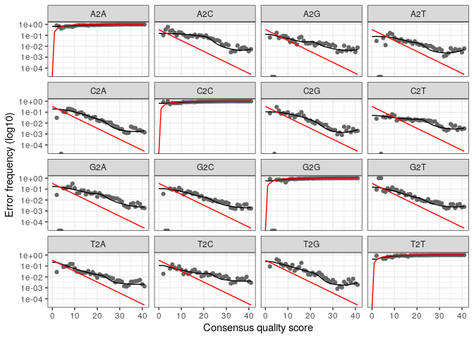

CC3
================

  - [CC3 Logan Mc Teer](#cc3-logan-mc-teer)
      - [Créer le chemin pour trouver les
        données](#créer-le-chemin-pour-trouver-les-données)
      - [Placer nos données dans un seul
        objet](#placer-nos-données-dans-un-seul-objet)
      - [Scores de qualité pour déterminer le seuil ou les erreurs sont
        trop
        fréquentes](#scores-de-qualité-pour-déterminer-le-seuil-ou-les-erreurs-sont-trop-fréquentes)
      - [Filtrage des données](#filtrage-des-données)
      - [Modèle d’erreurs](#modèle-derreurs)
      - [Visualisation des modèles
        d’erreurs](#visualisation-des-modèles-derreurs)
      - [Compilation des filtrés et modèle d’erreurs en un seul
        objet](#compilation-des-filtrés-et-modèle-derreurs-en-un-seul-objet)
      - [Regroupement des données et visualisation du premier
        echantillon](#regroupement-des-données-et-visualisation-du-premier-echantillon)
      - [Faire une table avec ces
        données](#faire-une-table-avec-ces-données)
      - [Suppression des chimères](#suppression-des-chimères)
      - [ratio des séquences non chimériques par rapport aux séquences
        chimériques](#ratio-des-séquences-non-chimériques-par-rapport-aux-séquences-chimériques)
      - [Téléchargement de la base de
        données](#téléchargement-de-la-base-de-données)
      - [Assigner la taxonomie en comparant les reads a Silva
        database](#assigner-la-taxonomie-en-comparant-les-reads-a-silva-database)
      - [Visualisation des taxa sous forme de
        tableau](#visualisation-des-taxa-sous-forme-de-tableau)
  - [Phyloseq](#phyloseq)
      - [Stratification de nos données en fonction de la profondeur et
        la date de
        l’echantillon](#stratification-de-nos-données-en-fonction-de-la-profondeur-et-la-date-de-lechantillon)
  - [Création de plusieurs objets](#création-de-plusieurs-objets)
      - [création de l’objet Ps ( incorporer la table d’otu, les non
        chimériques et les
        taxa)](#création-de-lobjet-ps-incorporer-la-table-dotu-les-non-chimériques-et-les-taxa)
      - [Assigner les données à dna avec le package Biostrings pour
        manipuler les données
        biologiques](#assigner-les-données-à-dna-avec-le-package-biostrings-pour-manipuler-les-données-biologiques)
      - [Manipulation des données pour obtenir une ordination avec les
        distances de
        Bray-curtis](#manipulation-des-données-pour-obtenir-une-ordination-avec-les-distances-de-bray-curtis)
      - [Création de l’ordination](#création-de-lordination)
      - [Visualisation en Bar plot](#visualisation-en-bar-plot)
      - [Abondance des différentes bactéries (famille) en fonction des
        différents placards, dans la même cuisine, il y a donc une
        différence des communautés en fonction des surfaces différentes
        de
        placards.](#abondance-des-différentes-bactéries-famille-en-fonction-des-différents-placards-dans-la-même-cuisine-il-y-a-donc-une-différence-des-communautés-en-fonction-des-surfaces-différentes-de-placards.)
      - [Notons l’abondance des enterobacteries ainsi que la présence de
        staphylococcus au niveau de tous les
        placards.](#notons-labondance-des-enterobacteries-ainsi-que-la-présence-de-staphylococcus-au-niveau-de-tous-les-placards.)

# CC3 Logan Mc Teer

\#\#Charger tous les packages

``` r
library(phyloseq)
library(Biostrings)
```

    ## Loading required package: BiocGenerics

    ## Loading required package: parallel

    ## 
    ## Attaching package: 'BiocGenerics'

    ## The following objects are masked from 'package:parallel':
    ## 
    ##     clusterApply, clusterApplyLB, clusterCall, clusterEvalQ,
    ##     clusterExport, clusterMap, parApply, parCapply, parLapply,
    ##     parLapplyLB, parRapply, parSapply, parSapplyLB

    ## The following objects are masked from 'package:stats':
    ## 
    ##     IQR, mad, sd, var, xtabs

    ## The following objects are masked from 'package:base':
    ## 
    ##     anyDuplicated, append, as.data.frame, basename, cbind, colnames,
    ##     dirname, do.call, duplicated, eval, evalq, Filter, Find, get, grep,
    ##     grepl, intersect, is.unsorted, lapply, Map, mapply, match, mget,
    ##     order, paste, pmax, pmax.int, pmin, pmin.int, Position, rank,
    ##     rbind, Reduce, rownames, sapply, setdiff, sort, table, tapply,
    ##     union, unique, unsplit, which.max, which.min

    ## Loading required package: S4Vectors

    ## Loading required package: stats4

    ## 
    ## Attaching package: 'S4Vectors'

    ## The following object is masked from 'package:base':
    ## 
    ##     expand.grid

    ## Loading required package: IRanges

    ## 
    ## Attaching package: 'IRanges'

    ## The following object is masked from 'package:phyloseq':
    ## 
    ##     distance

    ## Loading required package: XVector

    ## 
    ## Attaching package: 'Biostrings'

    ## The following object is masked from 'package:base':
    ## 
    ##     strsplit

``` r
library(Rcpp)
library(dada2); packageVersion("dada2")
```

    ## [1] '1.18.0'

``` r
library(phangorn)
```

    ## Loading required package: ape

    ## 
    ## Attaching package: 'ape'

    ## The following object is masked from 'package:Biostrings':
    ## 
    ##     complement

``` r
library(DECIPHER)
```

    ## Loading required package: RSQLite

``` r
library(ggplot2)
library(devtools)
```

    ## Loading required package: usethis

## Créer le chemin pour trouver les données

``` r
path<-"~/CC3/data"
list.files(path)
```

    ##  [1] "frigo1.gz"    "frigo10.gz"   "frigo2.gz"    "frigo3.gz"    "frigo4.gz"   
    ##  [6] "frigo5.gz"    "frigo6.gz"    "frigo7.gz"    "frigo8.gz"    "frigo9.gz"   
    ## [11] "placard1.gz"  "placard10.gz" "placard2.gz"  "placard3.gz"  "placard4.gz" 
    ## [16] "placard5.gz"  "placard6.gz"  "placard7.gz"  "placard8.gz"  "placard9.gz"

## Placer nos données dans un seul objet

``` r
fnFRs <- sort(list.files(path, pattern=".gz", full.names = TRUE))


sample.names <- sapply(strsplit(basename(fnFRs), ".fastq.gz "), `[`, 1)
```

## Scores de qualité pour déterminer le seuil ou les erreurs sont trop fréquentes

``` r
plotQualityProfile(fnFRs[1:4])
```

<!-- --> \#\#\# On
constate que le taux d’erreurs est stable et que nous n’avons pas besoin
de tronquer

## Filtrage des données

``` r
filtFRs <- file.path(path, "filtered", paste0(sample.names, "_filt.fastq.gz"))

names(filtFRs) <- sample.names
```

## Modèle d’erreurs

``` r
errFR <- learnErrors(fnFRs, multithread=TRUE)
```

    ## 105900331 total bases in 1188071 reads from 11 samples will be used for learning the error rates.

## Visualisation des modèles d’erreurs

``` r
plotErrors(errFR, nominalQ=TRUE)
```

    ## Warning: Transformation introduced infinite values in continuous y-axis
    
    ## Warning: Transformation introduced infinite values in continuous y-axis

<!-- -->

## Compilation des filtrés et modèle d’erreurs en un seul objet

``` r
dadaFRs <- dada(fnFRs, err=errFR, multithread=TRUE)
```

    ## Sample 1 - 33916 reads in 13735 unique sequences.
    ## Sample 2 - 94006 reads in 24781 unique sequences.
    ## Sample 3 - 88570 reads in 22962 unique sequences.
    ## Sample 4 - 77031 reads in 14259 unique sequences.
    ## Sample 5 - 85226 reads in 21394 unique sequences.
    ## Sample 6 - 121512 reads in 18999 unique sequences.
    ## Sample 7 - 149077 reads in 45558 unique sequences.
    ## Sample 8 - 77556 reads in 29283 unique sequences.
    ## Sample 9 - 164682 reads in 37387 unique sequences.
    ## Sample 10 - 55552 reads in 12839 unique sequences.
    ## Sample 11 - 240943 reads in 104898 unique sequences.
    ## Sample 12 - 70382 reads in 17938 unique sequences.
    ## Sample 13 - 245813 reads in 95180 unique sequences.
    ## Sample 14 - 270145 reads in 78380 unique sequences.
    ## Sample 15 - 68191 reads in 34314 unique sequences.
    ## Sample 16 - 51073 reads in 16903 unique sequences.
    ## Sample 17 - 39002 reads in 14348 unique sequences.
    ## Sample 18 - 99518 reads in 23623 unique sequences.
    ## Sample 19 - 112944 reads in 28062 unique sequences.
    ## Sample 20 - 80916 reads in 19427 unique sequences.

``` r
dadaFRs[[1]]
```

    ## dada-class: object describing DADA2 denoising results
    ## 149 sequence variants were inferred from 13735 input unique sequences.
    ## Key parameters: OMEGA_A = 1e-40, OMEGA_C = 1e-40, BAND_SIZE = 16

## Regroupement des données et visualisation du premier echantillon

``` r
mergers <-dadaFRs
```

## Faire une table avec ces données

``` r
seqtab <- makeSequenceTable(mergers)
dim(seqtab)
```

    ## [1]   20 4654

``` r
table(nchar(getSequences(seqtab)))
```

    ## 
    ##   69   70   72   77   78   80   81   82   83   84   85   86   90 
    ##    1    1    1    1    2    6    1   13    3    4    3    1 4617

## Suppression des chimères

``` r
seqtab.nochim <- removeBimeraDenovo(seqtab, method="consensus", multithread=TRUE, verbose=TRUE)
```

    ## Identified 330 bimeras out of 4654 input sequences.

``` r
dim(seqtab.nochim)
```

    ## [1]   20 4324

## ratio des séquences non chimériques par rapport aux séquences chimériques

``` r
sum(seqtab.nochim)/sum(seqtab)
```

    ## [1] 0.9404716

``` r
dadaFRs
```

    ## $frigo1.gz
    ## dada-class: object describing DADA2 denoising results
    ## 149 sequence variants were inferred from 13735 input unique sequences.
    ## Key parameters: OMEGA_A = 1e-40, OMEGA_C = 1e-40, BAND_SIZE = 16
    ## 
    ## $frigo10.gz
    ## dada-class: object describing DADA2 denoising results
    ## 752 sequence variants were inferred from 24781 input unique sequences.
    ## Key parameters: OMEGA_A = 1e-40, OMEGA_C = 1e-40, BAND_SIZE = 16
    ## 
    ## $frigo2.gz
    ## dada-class: object describing DADA2 denoising results
    ## 510 sequence variants were inferred from 22962 input unique sequences.
    ## Key parameters: OMEGA_A = 1e-40, OMEGA_C = 1e-40, BAND_SIZE = 16
    ## 
    ## $frigo3.gz
    ## dada-class: object describing DADA2 denoising results
    ## 127 sequence variants were inferred from 14259 input unique sequences.
    ## Key parameters: OMEGA_A = 1e-40, OMEGA_C = 1e-40, BAND_SIZE = 16
    ## 
    ## $frigo4.gz
    ## dada-class: object describing DADA2 denoising results
    ## 362 sequence variants were inferred from 21394 input unique sequences.
    ## Key parameters: OMEGA_A = 1e-40, OMEGA_C = 1e-40, BAND_SIZE = 16
    ## 
    ## $frigo5.gz
    ## dada-class: object describing DADA2 denoising results
    ## 157 sequence variants were inferred from 18999 input unique sequences.
    ## Key parameters: OMEGA_A = 1e-40, OMEGA_C = 1e-40, BAND_SIZE = 16
    ## 
    ## $frigo6.gz
    ## dada-class: object describing DADA2 denoising results
    ## 533 sequence variants were inferred from 45558 input unique sequences.
    ## Key parameters: OMEGA_A = 1e-40, OMEGA_C = 1e-40, BAND_SIZE = 16
    ## 
    ## $frigo7.gz
    ## dada-class: object describing DADA2 denoising results
    ## 272 sequence variants were inferred from 29283 input unique sequences.
    ## Key parameters: OMEGA_A = 1e-40, OMEGA_C = 1e-40, BAND_SIZE = 16
    ## 
    ## $frigo8.gz
    ## dada-class: object describing DADA2 denoising results
    ## 430 sequence variants were inferred from 37387 input unique sequences.
    ## Key parameters: OMEGA_A = 1e-40, OMEGA_C = 1e-40, BAND_SIZE = 16
    ## 
    ## $frigo9.gz
    ## dada-class: object describing DADA2 denoising results
    ## 162 sequence variants were inferred from 12839 input unique sequences.
    ## Key parameters: OMEGA_A = 1e-40, OMEGA_C = 1e-40, BAND_SIZE = 16
    ## 
    ## $placard1.gz
    ## dada-class: object describing DADA2 denoising results
    ## 593 sequence variants were inferred from 104898 input unique sequences.
    ## Key parameters: OMEGA_A = 1e-40, OMEGA_C = 1e-40, BAND_SIZE = 16
    ## 
    ## $placard10.gz
    ## dada-class: object describing DADA2 denoising results
    ## 374 sequence variants were inferred from 17938 input unique sequences.
    ## Key parameters: OMEGA_A = 1e-40, OMEGA_C = 1e-40, BAND_SIZE = 16
    ## 
    ## $placard2.gz
    ## dada-class: object describing DADA2 denoising results
    ## 733 sequence variants were inferred from 95180 input unique sequences.
    ## Key parameters: OMEGA_A = 1e-40, OMEGA_C = 1e-40, BAND_SIZE = 16
    ## 
    ## $placard3.gz
    ## dada-class: object describing DADA2 denoising results
    ## 1054 sequence variants were inferred from 78380 input unique sequences.
    ## Key parameters: OMEGA_A = 1e-40, OMEGA_C = 1e-40, BAND_SIZE = 16
    ## 
    ## $placard4.gz
    ## dada-class: object describing DADA2 denoising results
    ## 260 sequence variants were inferred from 34314 input unique sequences.
    ## Key parameters: OMEGA_A = 1e-40, OMEGA_C = 1e-40, BAND_SIZE = 16
    ## 
    ## $placard5.gz
    ## dada-class: object describing DADA2 denoising results
    ## 156 sequence variants were inferred from 16903 input unique sequences.
    ## Key parameters: OMEGA_A = 1e-40, OMEGA_C = 1e-40, BAND_SIZE = 16
    ## 
    ## $placard6.gz
    ## dada-class: object describing DADA2 denoising results
    ## 149 sequence variants were inferred from 14348 input unique sequences.
    ## Key parameters: OMEGA_A = 1e-40, OMEGA_C = 1e-40, BAND_SIZE = 16
    ## 
    ## $placard7.gz
    ## dada-class: object describing DADA2 denoising results
    ## 490 sequence variants were inferred from 23623 input unique sequences.
    ## Key parameters: OMEGA_A = 1e-40, OMEGA_C = 1e-40, BAND_SIZE = 16
    ## 
    ## $placard8.gz
    ## dada-class: object describing DADA2 denoising results
    ## 492 sequence variants were inferred from 28062 input unique sequences.
    ## Key parameters: OMEGA_A = 1e-40, OMEGA_C = 1e-40, BAND_SIZE = 16
    ## 
    ## $placard9.gz
    ## dada-class: object describing DADA2 denoising results
    ## 316 sequence variants were inferred from 19427 input unique sequences.
    ## Key parameters: OMEGA_A = 1e-40, OMEGA_C = 1e-40, BAND_SIZE = 16

``` r
getN <- function(x) sum(getUniques(x))
track <- cbind(sapply(dadaFRs, getN), sapply(mergers, getN), rowSums(seqtab.nochim))

colnames(track) <- c( "filtered", "merged", "nonchim")
rownames(track) <- sample.names
head(track)
```

    ##            filtered merged nonchim
    ## frigo1.gz     33557  33557   33196
    ## frigo10.gz    93290  93290   92139
    ## frigo2.gz     87932  87932   81052
    ## frigo3.gz     76400  76400   74812
    ## frigo4.gz     84929  84929   81121
    ## frigo5.gz    119488 119488  115324

## Téléchargement de la base de données

``` bash
wget https://zenodo.org/record/3986799/files/silva_nr99_v138_train_set.fa.gz
```

    ## --2021-01-14 22:15:00--  https://zenodo.org/record/3986799/files/silva_nr99_v138_train_set.fa.gz
    ## Resolving zenodo.org (zenodo.org)... 137.138.76.77
    ## Connecting to zenodo.org (zenodo.org)|137.138.76.77|:443... connected.
    ## HTTP request sent, awaiting response... 200 OK
    ## Length: 137973851 (132M) [application/octet-stream]
    ## Saving to: ‘silva_nr99_v138_train_set.fa.gz.5’
    ## 
    ##      0K .......... .......... .......... .......... ..........  0% 7.40M 18s
    ##     50K .......... .......... .......... .......... ..........  0% 15.1M 13s
    ##    100K .......... .......... .......... .......... ..........  0% 8.22M 14s
    ##    150K .......... .......... .......... .......... ..........  0% 14.0M 13s
    ##    200K .......... .......... .......... .......... ..........  0% 78.6M 11s
    ##    250K .......... .......... .......... .......... ..........  0% 18.4M 10s
    ##    300K .......... .......... .......... .......... ..........  0% 68.1M 9s
    ##    350K .......... .......... .......... .......... ..........  0% 79.6M 8s
    ##    400K .......... .......... .......... .......... ..........  0% 71.0M 7s
    ##    450K .......... .......... .......... .......... ..........  0% 17.7M 7s
    ##    500K .......... .......... .......... .......... ..........  0% 67.7M 7s
    ##    550K .......... .......... .......... .......... ..........  0% 89.1M 6s
    ##    600K .......... .......... .......... .......... ..........  0% 66.4M 6s
    ##    650K .......... .......... .......... .......... ..........  0% 93.3M 6s
    ##    700K .......... .......... .......... .......... ..........  0% 83.0M 5s
    ##    750K .......... .......... .......... .......... ..........  0% 82.1M 5s
    ##    800K .......... .......... .......... .......... ..........  0% 44.6M 5s
    ##    850K .......... .......... .......... .......... ..........  0% 24.1M 5s
    ##    900K .......... .......... .......... .......... ..........  0% 97.9M 5s
    ##    950K .......... .......... .......... .......... ..........  0%  101M 5s
    ##   1000K .......... .......... .......... .......... ..........  0% 82.9M 5s
    ##   1050K .......... .......... .......... .......... ..........  0%  117M 4s
    ##   1100K .......... .......... .......... .......... ..........  0% 93.3M 4s
    ##   1150K .......... .......... .......... .......... ..........  0% 94.4M 4s
    ##   1200K .......... .......... .......... .......... ..........  0% 9.63M 5s
    ##   1250K .......... .......... .......... .......... ..........  0% 94.3M 4s
    ##   1300K .......... .......... .......... .......... ..........  1% 54.4M 4s
    ##   1350K .......... .......... .......... .......... ..........  1% 90.5M 4s
    ##   1400K .......... .......... .......... .......... ..........  1% 90.6M 4s
    ##   1450K .......... .......... .......... .......... ..........  1% 99.2M 4s
    ##   1500K .......... .......... .......... .......... ..........  1% 74.0M 4s
    ##   1550K .......... .......... .......... .......... ..........  1% 63.4M 4s
    ##   1600K .......... .......... .......... .......... ..........  1% 93.3M 4s
    ##   1650K .......... .......... .......... .......... ..........  1% 64.6M 4s
    ##   1700K .......... .......... .......... .......... ..........  1% 72.7M 4s
    ##   1750K .......... .......... .......... .......... ..........  1% 73.3M 4s
    ##   1800K .......... .......... .......... .......... ..........  1% 88.0M 4s
    ##   1850K .......... .......... .......... .......... ..........  1%  108M 4s
    ##   1900K .......... .......... .......... .......... ..........  1% 90.1M 3s
    ##   1950K .......... .......... .......... .......... ..........  1%  107M 3s
    ##   2000K .......... .......... .......... .......... ..........  1% 74.8M 3s
    ##   2050K .......... .......... .......... .......... ..........  1% 79.0M 3s
    ##   2100K .......... .......... .......... .......... ..........  1% 79.8M 3s
    ##   2150K .......... .......... .......... .......... ..........  1% 90.0M 3s
    ##   2200K .......... .......... .......... .......... ..........  1% 89.7M 3s
    ##   2250K .......... .......... .......... .......... ..........  1% 92.5M 3s
    ##   2300K .......... .......... .......... .......... ..........  1%  113M 3s
    ##   2350K .......... .......... .......... .......... ..........  1% 67.4M 3s
    ##   2400K .......... .......... .......... .......... ..........  1% 90.3M 3s
    ##   2450K .......... .......... .......... .......... ..........  1% 64.2M 3s
    ##   2500K .......... .......... .......... .......... ..........  1% 70.3M 3s
    ##   2550K .......... .......... .......... .......... ..........  1% 71.4M 3s
    ##   2600K .......... .......... .......... .......... ..........  1% 86.1M 3s
    ##   2650K .......... .......... .......... .......... ..........  2% 66.5M 3s
    ##   2700K .......... .......... .......... .......... ..........  2% 76.1M 3s
    ##   2750K .......... .......... .......... .......... ..........  2% 83.0M 3s
    ##   2800K .......... .......... .......... .......... ..........  2% 62.6M 3s
    ##   2850K .......... .......... .......... .......... ..........  2% 77.3M 3s
    ##   2900K .......... .......... .......... .......... ..........  2% 79.9M 3s
    ##   2950K .......... .......... .......... .......... ..........  2% 58.5M 3s
    ##   3000K .......... .......... .......... .......... ..........  2% 77.5M 3s
    ##   3050K .......... .......... .......... .......... ..........  2% 75.6M 3s
    ##   3100K .......... .......... .......... .......... ..........  2% 78.0M 3s
    ##   3150K .......... .......... .......... .......... ..........  2% 95.2M 3s
    ##   3200K .......... .......... .......... .......... ..........  2% 67.9M 3s
    ##   3250K .......... .......... .......... .......... ..........  2% 83.1M 3s
    ##   3300K .......... .......... .......... .......... ..........  2% 90.8M 3s
    ##   3350K .......... .......... .......... .......... ..........  2% 62.9M 3s
    ##   3400K .......... .......... .......... .......... ..........  2% 19.1M 3s
    ##   3450K .......... .......... .......... .......... ..........  2% 72.6M 3s
    ##   3500K .......... .......... .......... .......... ..........  2% 70.8M 3s
    ##   3550K .......... .......... .......... .......... ..........  2% 95.6M 3s
    ##   3600K .......... .......... .......... .......... ..........  2% 99.4M 3s
    ##   3650K .......... .......... .......... .......... ..........  2% 90.2M 3s
    ##   3700K .......... .......... .......... .......... ..........  2% 96.2M 3s
    ##   3750K .......... .......... .......... .......... ..........  2% 69.5M 3s
    ##   3800K .......... .......... .......... .......... ..........  2% 63.1M 3s
    ##   3850K .......... .......... .......... .......... ..........  2% 57.5M 3s
    ##   3900K .......... .......... .......... .......... ..........  2% 68.7M 3s
    ##   3950K .......... .......... .......... .......... ..........  2% 71.4M 3s
    ##   4000K .......... .......... .......... .......... ..........  3%  110M 3s
    ##   4050K .......... .......... .......... .......... ..........  3% 35.7M 3s
    ##   4100K .......... .......... .......... .......... ..........  3% 76.9M 3s
    ##   4150K .......... .......... .......... .......... ..........  3% 84.4M 3s
    ##   4200K .......... .......... .......... .......... ..........  3% 67.7M 3s
    ##   4250K .......... .......... .......... .......... ..........  3% 87.5M 3s
    ##   4300K .......... .......... .......... .......... ..........  3% 92.9M 3s
    ##   4350K .......... .......... .......... .......... ..........  3% 63.6M 2s
    ##   4400K .......... .......... .......... .......... ..........  3% 27.6M 3s
    ##   4450K .......... .......... .......... .......... ..........  3% 99.9M 3s
    ##   4500K .......... .......... .......... .......... ..........  3% 85.3M 2s
    ##   4550K .......... .......... .......... .......... ..........  3% 93.0M 2s
    ##   4600K .......... .......... .......... .......... ..........  3% 83.1M 2s
    ##   4650K .......... .......... .......... .......... ..........  3% 99.6M 2s
    ##   4700K .......... .......... .......... .......... ..........  3% 21.4M 2s
    ##   4750K .......... .......... .......... .......... ..........  3% 79.8M 2s
    ##   4800K .......... .......... .......... .......... ..........  3% 82.9M 2s
    ##   4850K .......... .......... .......... .......... ..........  3%  126M 2s
    ##   4900K .......... .......... .......... .......... ..........  3% 89.1M 2s
    ##   4950K .......... .......... .......... .......... ..........  3% 92.3M 2s
    ##   5000K .......... .......... .......... .......... ..........  3%  105M 2s
    ##   5050K .......... .......... .......... .......... ..........  3% 69.8M 2s
    ##   5100K .......... .......... .......... .......... ..........  3% 71.0M 2s
    ##   5150K .......... .......... .......... .......... ..........  3% 59.0M 2s
    ##   5200K .......... .......... .......... .......... ..........  3% 94.0M 2s
    ##   5250K .......... .......... .......... .......... ..........  3% 49.1M 2s
    ##   5300K .......... .......... .......... .......... ..........  3% 99.2M 2s
    ##   5350K .......... .......... .......... .......... ..........  4% 94.4M 2s
    ##   5400K .......... .......... .......... .......... ..........  4% 82.2M 2s
    ##   5450K .......... .......... .......... .......... ..........  4%  119M 2s
    ##   5500K .......... .......... .......... .......... ..........  4% 43.1M 2s
    ##   5550K .......... .......... .......... .......... ..........  4% 28.0M 2s
    ##   5600K .......... .......... .......... .......... ..........  4% 94.0M 2s
    ##   5650K .......... .......... .......... .......... ..........  4%  115M 2s
    ##   5700K .......... .......... .......... .......... ..........  4% 97.7M 2s
    ##   5750K .......... .......... .......... .......... ..........  4%  130M 2s
    ##   5800K .......... .......... .......... .......... ..........  4%  110M 2s
    ##   5850K .......... .......... .......... .......... ..........  4% 46.4M 2s
    ##   5900K .......... .......... .......... .......... ..........  4% 78.2M 2s
    ##   5950K .......... .......... .......... .......... ..........  4%  109M 2s
    ##   6000K .......... .......... .......... .......... ..........  4% 75.8M 2s
    ##   6050K .......... .......... .......... .......... ..........  4%  109M 2s
    ##   6100K .......... .......... .......... .......... ..........  4%  107M 2s
    ##   6150K .......... .......... .......... .......... ..........  4%  119M 2s
    ##   6200K .......... .......... .......... .......... ..........  4% 39.5M 2s
    ##   6250K .......... .......... .......... .......... ..........  4% 92.2M 2s
    ##   6300K .......... .......... .......... .......... ..........  4% 81.9M 2s
    ##   6350K .......... .......... .......... .......... ..........  4%  110M 2s
    ##   6400K .......... .......... .......... .......... ..........  4% 78.6M 2s
    ##   6450K .......... .......... .......... .......... ..........  4%  113M 2s
    ##   6500K .......... .......... .......... .......... ..........  4%  112M 2s
    ##   6550K .......... .......... .......... .......... ..........  4% 60.3M 2s
    ##   6600K .......... .......... .......... .......... ..........  4% 28.7M 2s
    ##   6650K .......... .......... .......... .......... ..........  4% 93.0M 2s
    ##   6700K .......... .......... .......... .......... ..........  5% 97.8M 2s
    ##   6750K .......... .......... .......... .......... ..........  5%  104M 2s
    ##   6800K .......... .......... .......... .......... ..........  5% 36.0M 2s
    ##   6850K .......... .......... .......... .......... ..........  5% 96.8M 2s
    ##   6900K .......... .......... .......... .......... ..........  5% 82.5M 2s
    ##   6950K .......... .......... .......... .......... ..........  5%  106M 2s
    ##   7000K .......... .......... .......... .......... ..........  5% 92.6M 2s
    ##   7050K .......... .......... .......... .......... ..........  5% 57.9M 2s
    ##   7100K .......... .......... .......... .......... ..........  5%  108M 2s
    ##   7150K .......... .......... .......... .......... ..........  5% 22.2M 2s
    ##   7200K .......... .......... .......... .......... ..........  5% 98.1M 2s
    ##   7250K .......... .......... .......... .......... ..........  5%  116M 2s
    ##   7300K .......... .......... .......... .......... ..........  5%  111M 2s
    ##   7350K .......... .......... .......... .......... ..........  5%  106M 2s
    ##   7400K .......... .......... .......... .......... ..........  5% 16.7M 2s
    ##   7450K .......... .......... .......... .......... ..........  5%  102M 2s
    ##   7500K .......... .......... .......... .......... ..........  5% 95.8M 2s
    ##   7550K .......... .......... .......... .......... ..........  5%  116M 2s
    ##   7600K .......... .......... .......... .......... ..........  5% 13.6M 2s
    ##   7650K .......... .......... .......... .......... ..........  5% 70.0M 2s
    ##   7700K .......... .......... .......... .......... ..........  5% 78.4M 2s
    ##   7750K .......... .......... .......... .......... ..........  5% 97.9M 2s
    ##   7800K .......... .......... .......... .......... ..........  5% 97.7M 2s
    ##   7850K .......... .......... .......... .......... ..........  5%  113M 2s
    ##   7900K .......... .......... .......... .......... ..........  5%  113M 2s
    ##   7950K .......... .......... .......... .......... ..........  5% 30.1M 2s
    ##   8000K .......... .......... .......... .......... ..........  5% 79.6M 2s
    ##   8050K .......... .......... .......... .......... ..........  6%  108M 2s
    ##   8100K .......... .......... .......... .......... ..........  6% 79.7M 2s
    ##   8150K .......... .......... .......... .......... ..........  6%  128M 2s
    ##   8200K .......... .......... .......... .......... ..........  6% 31.0M 2s
    ##   8250K .......... .......... .......... .......... ..........  6% 23.8M 2s
    ##   8300K .......... .......... .......... .......... ..........  6% 27.1M 2s
    ##   8350K .......... .......... .......... .......... ..........  6% 28.8M 2s
    ##   8400K .......... .......... .......... .......... ..........  6% 29.0M 2s
    ##   8450K .......... .......... .......... .......... ..........  6% 25.9M 2s
    ##   8500K .......... .......... .......... .......... ..........  6% 26.8M 2s
    ##   8550K .......... .......... .......... .......... ..........  6% 29.3M 2s
    ##   8600K .......... .......... .......... .......... ..........  6% 25.7M 2s
    ##   8650K .......... .......... .......... .......... ..........  6% 29.3M 2s
    ##   8700K .......... .......... .......... .......... ..........  6% 30.0M 2s
    ##   8750K .......... .......... .......... .......... ..........  6% 27.0M 2s
    ##   8800K .......... .......... .......... .......... ..........  6% 28.7M 2s
    ##   8850K .......... .......... .......... .......... ..........  6% 30.1M 2s
    ##   8900K .......... .......... .......... .......... ..........  6% 28.1M 2s
    ##   8950K .......... .......... .......... .......... ..........  6% 28.5M 2s
    ##   9000K .......... .......... .......... .......... ..........  6% 32.0M 2s
    ##   9050K .......... .......... .......... .......... ..........  6% 30.3M 2s
    ##   9100K .......... .......... .......... .......... ..........  6% 29.9M 2s
    ##   9150K .......... .......... .......... .......... ..........  6% 34.3M 2s
    ##   9200K .......... .......... .......... .......... ..........  6% 28.2M 2s
    ##   9250K .......... .......... .......... .......... ..........  6% 32.1M 2s
    ##   9300K .......... .......... .......... .......... ..........  6% 32.9M 2s
    ##   9350K .......... .......... .......... .......... ..........  6% 30.4M 2s
    ##   9400K .......... .......... .......... .......... ..........  7% 32.0M 2s
    ##   9450K .......... .......... .......... .......... ..........  7% 32.5M 2s
    ##   9500K .......... .......... .......... .......... ..........  7% 29.7M 2s
    ##   9550K .......... .......... .......... .......... ..........  7% 32.5M 2s
    ##   9600K .......... .......... .......... .......... ..........  7% 35.8M 2s
    ##   9650K .......... .......... .......... .......... ..........  7% 30.6M 2s
    ##   9700K .......... .......... .......... .......... ..........  7% 32.9M 2s
    ##   9750K .......... .......... .......... .......... ..........  7% 36.4M 2s
    ##   9800K .......... .......... .......... .......... ..........  7% 29.5M 2s
    ##   9850K .......... .......... .......... .......... ..........  7% 38.0M 2s
    ##   9900K .......... .......... .......... .......... ..........  7% 33.2M 2s
    ##   9950K .......... .......... .......... .......... ..........  7% 36.0M 2s
    ##  10000K .......... .......... .......... .......... ..........  7% 33.1M 2s
    ##  10050K .......... .......... .......... .......... ..........  7% 33.5M 2s
    ##  10100K .......... .......... .......... .......... ..........  7% 34.5M 2s
    ##  10150K .......... .......... .......... .......... ..........  7% 35.0M 3s
    ##  10200K .......... .......... .......... .......... ..........  7% 35.8M 3s
    ##  10250K .......... .......... .......... .......... ..........  7% 37.6M 3s
    ##  10300K .......... .......... .......... .......... ..........  7% 34.5M 3s
    ##  10350K .......... .......... .......... .......... ..........  7% 35.7M 3s
    ##  10400K .......... .......... .......... .......... ..........  7% 35.5M 3s
    ##  10450K .......... .......... .......... .......... ..........  7% 39.0M 3s
    ##  10500K .......... .......... .......... .......... ..........  7% 38.2M 3s
    ##  10550K .......... .......... .......... .......... ..........  7% 38.5M 3s
    ##  10600K .......... .......... .......... .......... ..........  7% 34.9M 3s
    ##  10650K .......... .......... .......... .......... ..........  7% 34.4M 3s
    ##  10700K .......... .......... .......... .......... ..........  7% 32.4M 3s
    ##  10750K .......... .......... .......... .......... ..........  8% 39.8M 3s
    ##  10800K .......... .......... .......... .......... ..........  8% 35.2M 3s
    ##  10850K .......... .......... .......... .......... ..........  8% 34.4M 3s
    ##  10900K .......... .......... .......... .......... ..........  8% 36.8M 3s
    ##  10950K .......... .......... .......... .......... ..........  8% 38.9M 3s
    ##  11000K .......... .......... .......... .......... ..........  8% 34.0M 3s
    ##  11050K .......... .......... .......... .......... ..........  8% 37.1M 3s
    ##  11100K .......... .......... .......... .......... ..........  8% 34.5M 3s
    ##  11150K .......... .......... .......... .......... ..........  8% 37.8M 3s
    ##  11200K .......... .......... .......... .......... ..........  8% 32.6M 3s
    ##  11250K .......... .......... .......... .......... ..........  8% 40.2M 3s
    ##  11300K .......... .......... .......... .......... ..........  8% 34.6M 3s
    ##  11350K .......... .......... .......... .......... ..........  8% 35.1M 3s
    ##  11400K .......... .......... .......... .......... ..........  8% 35.9M 3s
    ##  11450K .......... .......... .......... .......... ..........  8% 35.4M 3s
    ##  11500K .......... .......... .......... .......... ..........  8% 33.0M 3s
    ##  11550K .......... .......... .......... .......... ..........  8% 40.9M 3s
    ##  11600K .......... .......... .......... .......... ..........  8% 36.3M 3s
    ##  11650K .......... .......... .......... .......... ..........  8% 34.3M 3s
    ##  11700K .......... .......... .......... .......... ..........  8% 34.2M 3s
    ##  11750K .......... .......... .......... .......... ..........  8% 36.0M 3s
    ##  11800K .......... .......... .......... .......... ..........  8% 35.6M 3s
    ##  11850K .......... .......... .......... .......... ..........  8% 41.2M 3s
    ##  11900K .......... .......... .......... .......... ..........  8% 36.5M 3s
    ##  11950K .......... .......... .......... .......... ..........  8% 35.3M 3s
    ##  12000K .......... .......... .......... .......... ..........  8% 40.1M 3s
    ##  12050K .......... .......... .......... .......... ..........  8% 36.7M 3s
    ##  12100K .......... .......... .......... .......... ..........  9% 35.0M 3s
    ##  12150K .......... .......... .......... .......... ..........  9% 35.2M 3s
    ##  12200K .......... .......... .......... .......... ..........  9% 32.5M 3s
    ##  12250K .......... .......... .......... .......... ..........  9% 39.9M 3s
    ##  12300K .......... .......... .......... .......... ..........  9% 35.9M 3s
    ##  12350K .......... .......... .......... .......... ..........  9% 40.4M 3s
    ##  12400K .......... .......... .......... .......... ..........  9% 34.2M 3s
    ##  12450K .......... .......... .......... .......... ..........  9% 37.0M 3s
    ##  12500K .......... .......... .......... .......... ..........  9% 34.1M 3s
    ##  12550K .......... .......... .......... .......... ..........  9% 41.6M 3s
    ##  12600K .......... .......... .......... .......... ..........  9% 35.5M 3s
    ##  12650K .......... .......... .......... .......... ..........  9% 39.9M 3s
    ##  12700K .......... .......... .......... .......... ..........  9% 34.1M 3s
    ##  12750K .......... .......... .......... .......... ..........  9% 36.8M 3s
    ##  12800K .......... .......... .......... .......... ..........  9% 35.0M 3s
    ##  12850K .......... .......... .......... .......... ..........  9% 40.2M 3s
    ##  12900K .......... .......... .......... .......... ..........  9% 36.7M 3s
    ##  12950K .......... .......... .......... .......... ..........  9% 41.3M 3s
    ##  13000K .......... .......... .......... .......... ..........  9% 35.4M 3s
    ##  13050K .......... .......... .......... .......... ..........  9% 35.0M 3s
    ##  13100K .......... .......... .......... .......... ..........  9% 35.4M 3s
    ##  13150K .......... .......... .......... .......... ..........  9% 41.3M 3s
    ##  13200K .......... .......... .......... .......... ..........  9% 35.6M 3s
    ##  13250K .......... .......... .......... .......... ..........  9% 40.6M 3s
    ##  13300K .......... .......... .......... .......... ..........  9% 35.0M 3s
    ##  13350K .......... .......... .......... .......... ..........  9% 37.3M 3s
    ##  13400K .......... .......... .......... .......... ..........  9% 34.7M 3s
    ##  13450K .......... .......... .......... .......... .......... 10% 41.8M 3s
    ##  13500K .......... .......... .......... .......... .......... 10% 36.6M 3s
    ##  13550K .......... .......... .......... .......... .......... 10% 41.6M 3s
    ##  13600K .......... .......... .......... .......... .......... 10% 35.7M 3s
    ##  13650K .......... .......... .......... .......... .......... 10% 35.3M 3s
    ##  13700K .......... .......... .......... .......... .......... 10% 35.0M 3s
    ##  13750K .......... .......... .......... .......... .......... 10% 40.4M 3s
    ##  13800K .......... .......... .......... .......... .......... 10% 35.3M 3s
    ##  13850K .......... .......... .......... .......... .......... 10% 39.6M 3s
    ##  13900K .......... .......... .......... .......... .......... 10% 35.3M 3s
    ##  13950K .......... .......... .......... .......... .......... 10% 34.8M 3s
    ##  14000K .......... .......... .......... .......... .......... 10% 34.9M 3s
    ##  14050K .......... .......... .......... .......... .......... 10% 41.7M 3s
    ##  14100K .......... .......... .......... .......... .......... 10% 36.7M 3s
    ##  14150K .......... .......... .......... .......... .......... 10% 38.2M 3s
    ##  14200K .......... .......... .......... .......... .......... 10% 35.4M 3s
    ##  14250K .......... .......... .......... .......... .......... 10% 35.7M 3s
    ##  14300K .......... .......... .......... .......... .......... 10% 33.9M 3s
    ##  14350K .......... .......... .......... .......... .......... 10% 41.7M 3s
    ##  14400K .......... .......... .......... .......... .......... 10% 34.7M 3s
    ##  14450K .......... .......... .......... .......... .......... 10% 40.4M 3s
    ##  14500K .......... .......... .......... .......... .......... 10% 36.7M 3s
    ##  14550K .......... .......... .......... .......... .......... 10% 37.0M 3s
    ##  14600K .......... .......... .......... .......... .......... 10% 36.9M 3s
    ##  14650K .......... .......... .......... .......... .......... 10% 37.0M 3s
    ##  14700K .......... .......... .......... .......... .......... 10% 40.4M 3s
    ##  14750K .......... .......... .......... .......... .......... 10% 33.8M 3s
    ##  14800K .......... .......... .......... .......... .......... 11% 36.6M 3s
    ##  14850K .......... .......... .......... .......... .......... 11% 42.4M 3s
    ##  14900K .......... .......... .......... .......... .......... 11% 34.8M 3s
    ##  14950K .......... .......... .......... .......... .......... 11% 38.2M 3s
    ##  15000K .......... .......... .......... .......... .......... 11% 37.4M 3s
    ##  15050K .......... .......... .......... .......... .......... 11% 34.5M 3s
    ##  15100K .......... .......... .......... .......... .......... 11% 36.2M 3s
    ##  15150K .......... .......... .......... .......... .......... 11% 40.5M 3s
    ##  15200K .......... .......... .......... .......... .......... 11% 33.0M 3s
    ##  15250K .......... .......... .......... .......... .......... 11% 35.5M 3s
    ##  15300K .......... .......... .......... .......... .......... 11% 39.9M 3s
    ##  15350K .......... .......... .......... .......... .......... 11% 32.8M 3s
    ##  15400K .......... .......... .......... .......... .......... 11% 38.6M 3s
    ##  15450K .......... .......... .......... .......... .......... 11% 37.3M 3s
    ##  15500K .......... .......... .......... .......... .......... 11% 34.8M 3s
    ##  15550K .......... .......... .......... .......... .......... 11% 41.0M 3s
    ##  15600K .......... .......... .......... .......... .......... 11% 36.1M 3s
    ##  15650K .......... .......... .......... .......... .......... 11% 38.6M 3s
    ##  15700K .......... .......... .......... .......... .......... 11% 35.1M 3s
    ##  15750K .......... .......... .......... .......... .......... 11% 36.5M 3s
    ##  15800K .......... .......... .......... .......... .......... 11% 32.9M 3s
    ##  15850K .......... .......... .......... .......... .......... 11% 38.6M 3s
    ##  15900K .......... .......... .......... .......... .......... 11% 34.4M 3s
    ##  15950K .......... .......... .......... .......... .......... 11% 40.7M 3s
    ##  16000K .......... .......... .......... .......... .......... 11% 35.0M 3s
    ##  16050K .......... .......... .......... .......... .......... 11% 36.6M 3s
    ##  16100K .......... .......... .......... .......... .......... 11% 36.0M 3s
    ##  16150K .......... .......... .......... .......... .......... 12% 40.4M 3s
    ##  16200K .......... .......... .......... .......... .......... 12% 35.3M 3s
    ##  16250K .......... .......... .......... .......... .......... 12% 40.4M 3s
    ##  16300K .......... .......... .......... .......... .......... 12% 35.9M 3s
    ##  16350K .......... .......... .......... .......... .......... 12% 36.3M 3s
    ##  16400K .......... .......... .......... .......... .......... 12% 34.3M 3s
    ##  16450K .......... .......... .......... .......... .......... 12% 39.8M 3s
    ##  16500K .......... .......... .......... .......... .......... 12% 33.6M 3s
    ##  16550K .......... .......... .......... .......... .......... 12% 40.6M 3s
    ##  16600K .......... .......... .......... .......... .......... 12% 35.7M 3s
    ##  16650K .......... .......... .......... .......... .......... 12% 35.5M 3s
    ##  16700K .......... .......... .......... .......... .......... 12% 33.7M 3s
    ##  16750K .......... .......... .......... .......... .......... 12% 41.8M 3s
    ##  16800K .......... .......... .......... .......... .......... 12% 35.9M 3s
    ##  16850K .......... .......... .......... .......... .......... 12% 39.9M 3s
    ##  16900K .......... .......... .......... .......... .......... 12% 36.0M 3s
    ##  16950K .......... .......... .......... .......... .......... 12% 35.8M 3s
    ##  17000K .......... .......... .......... .......... .......... 12% 36.1M 3s
    ##  17050K .......... .......... .......... .......... .......... 12% 38.9M 3s
    ##  17100K .......... .......... .......... .......... .......... 12% 35.2M 3s
    ##  17150K .......... .......... .......... .......... .......... 12% 39.3M 3s
    ##  17200K .......... .......... .......... .......... .......... 12% 34.1M 3s
    ##  17250K .......... .......... .......... .......... .......... 12% 37.4M 3s
    ##  17300K .......... .......... .......... .......... .......... 12% 35.2M 3s
    ##  17350K .......... .......... .......... .......... .......... 12% 42.1M 3s
    ##  17400K .......... .......... .......... .......... .......... 12% 36.2M 3s
    ##  17450K .......... .......... .......... .......... .......... 12% 41.4M 3s
    ##  17500K .......... .......... .......... .......... .......... 13% 35.3M 3s
    ##  17550K .......... .......... .......... .......... .......... 13% 35.7M 3s
    ##  17600K .......... .......... .......... .......... .......... 13% 35.4M 3s
    ##  17650K .......... .......... .......... .......... .......... 13% 40.2M 3s
    ##  17700K .......... .......... .......... .......... .......... 13% 35.8M 3s
    ##  17750K .......... .......... .......... .......... .......... 13% 42.7M 3s
    ##  17800K .......... .......... .......... .......... .......... 13% 33.4M 3s
    ##  17850K .......... .......... .......... .......... .......... 13% 37.6M 3s
    ##  17900K .......... .......... .......... .......... .......... 13% 36.7M 3s
    ##  17950K .......... .......... .......... .......... .......... 13% 38.8M 3s
    ##  18000K .......... .......... .......... .......... .......... 13% 37.3M 3s
    ##  18050K .......... .......... .......... .......... .......... 13% 42.4M 3s
    ##  18100K .......... .......... .......... .......... .......... 13% 33.8M 3s
    ##  18150K .......... .......... .......... .......... .......... 13% 37.1M 3s
    ##  18200K .......... .......... .......... .......... .......... 13% 38.5M 3s
    ##  18250K .......... .......... .......... .......... .......... 13% 38.5M 3s
    ##  18300K .......... .......... .......... .......... .......... 13% 35.7M 3s
    ##  18350K .......... .......... .......... .......... .......... 13% 35.9M 3s
    ##  18400K .......... .......... .......... .......... .......... 13% 36.3M 3s
    ##  18450K .......... .......... .......... .......... .......... 13% 38.9M 3s
    ##  18500K .......... .......... .......... .......... .......... 13% 38.2M 3s
    ##  18550K .......... .......... .......... .......... .......... 13% 41.2M 3s
    ##  18600K .......... .......... .......... .......... .......... 13% 37.4M 3s
    ##  18650K .......... .......... .......... .......... .......... 13% 35.8M 3s
    ##  18700K .......... .......... .......... .......... .......... 13% 35.0M 3s
    ##  18750K .......... .......... .......... .......... .......... 13% 40.4M 3s
    ##  18800K .......... .......... .......... .......... .......... 13% 36.9M 3s
    ##  18850K .......... .......... .......... .......... .......... 14% 39.5M 3s
    ##  18900K .......... .......... .......... .......... .......... 14% 90.2M 3s
    ##  18950K .......... .......... .......... .......... .......... 14% 86.4M 3s
    ##  19000K .......... .......... .......... .......... .......... 14% 81.9M 3s
    ##  19050K .......... .......... .......... .......... .......... 14% 93.9M 3s
    ##  19100K .......... .......... .......... .......... .......... 14% 87.4M 3s
    ##  19150K .......... .......... .......... .......... .......... 14%  103M 3s
    ##  19200K .......... .......... .......... .......... .......... 14% 84.6M 3s
    ##  19250K .......... .......... .......... .......... .......... 14% 85.1M 3s
    ##  19300K .......... .......... .......... .......... .......... 14% 88.6M 3s
    ##  19350K .......... .......... .......... .......... .......... 14% 97.9M 3s
    ##  19400K .......... .......... .......... .......... .......... 14% 83.9M 3s
    ##  19450K .......... .......... .......... .......... .......... 14% 82.3M 3s
    ##  19500K .......... .......... .......... .......... .......... 14% 73.2M 3s
    ##  19550K .......... .......... .......... .......... .......... 14% 64.7M 3s
    ##  19600K .......... .......... .......... .......... .......... 14% 93.9M 3s
    ##  19650K .......... .......... .......... .......... .......... 14% 77.7M 3s
    ##  19700K .......... .......... .......... .......... .......... 14% 94.8M 3s
    ##  19750K .......... .......... .......... .......... .......... 14% 72.6M 3s
    ##  19800K .......... .......... .......... .......... .......... 14% 73.3M 3s
    ##  19850K .......... .......... .......... .......... .......... 14% 65.6M 3s
    ##  19900K .......... .......... .......... .......... .......... 14% 83.5M 3s
    ##  19950K .......... .......... .......... .......... .......... 14% 80.1M 3s
    ##  20000K .......... .......... .......... .......... .......... 14% 93.0M 3s
    ##  20050K .......... .......... .......... .......... .......... 14%  107M 3s
    ##  20100K .......... .......... .......... .......... .......... 14% 84.3M 3s
    ##  20150K .......... .......... .......... .......... .......... 14% 94.5M 3s
    ##  20200K .......... .......... .......... .......... .......... 15% 97.1M 3s
    ##  20250K .......... .......... .......... .......... .......... 15% 80.8M 3s
    ##  20300K .......... .......... .......... .......... .......... 15%  103M 3s
    ##  20350K .......... .......... .......... .......... .......... 15% 90.5M 3s
    ##  20400K .......... .......... .......... .......... .......... 15% 91.6M 3s
    ##  20450K .......... .......... .......... .......... .......... 15% 75.5M 3s
    ##  20500K .......... .......... .......... .......... .......... 15% 95.7M 3s
    ##  20550K .......... .......... .......... .......... .......... 15%  114M 3s
    ##  20600K .......... .......... .......... .......... .......... 15% 89.0M 3s
    ##  20650K .......... .......... .......... .......... .......... 15% 83.0M 3s
    ##  20700K .......... .......... .......... .......... .......... 15% 98.5M 3s
    ##  20750K .......... .......... .......... .......... .......... 15% 98.6M 3s
    ##  20800K .......... .......... .......... .......... .......... 15%  101M 3s
    ##  20850K .......... .......... .......... .......... .......... 15%  124M 2s
    ##  20900K .......... .......... .......... .......... .......... 15% 92.4M 2s
    ##  20950K .......... .......... .......... .......... .......... 15% 94.7M 2s
    ##  21000K .......... .......... .......... .......... .......... 15% 78.1M 2s
    ##  21050K .......... .......... .......... .......... .......... 15%  123M 2s
    ##  21100K .......... .......... .......... .......... .......... 15% 95.2M 2s
    ##  21150K .......... .......... .......... .......... .......... 15%  132M 2s
    ##  21200K .......... .......... .......... .......... .......... 15%  101M 2s
    ##  21250K .......... .......... .......... .......... .......... 15%  108M 2s
    ##  21300K .......... .......... .......... .......... .......... 15%  103M 2s
    ##  21350K .......... .......... .......... .......... .......... 15%  110M 2s
    ##  21400K .......... .......... .......... .......... .......... 15% 95.4M 2s
    ##  21450K .......... .......... .......... .......... .......... 15%  130M 2s
    ##  21500K .......... .......... .......... .......... .......... 15%  105M 2s
    ##  21550K .......... .......... .......... .......... .......... 16% 96.4M 2s
    ##  21600K .......... .......... .......... .......... .......... 16% 95.0M 2s
    ##  21650K .......... .......... .......... .......... .......... 16% 88.6M 2s
    ##  21700K .......... .......... .......... .......... .......... 16% 90.1M 2s
    ##  21750K .......... .......... .......... .......... .......... 16%  131M 2s
    ##  21800K .......... .......... .......... .......... .......... 16%  107M 2s
    ##  21850K .......... .......... .......... .......... .......... 16%  112M 2s
    ##  21900K .......... .......... .......... .......... .......... 16% 94.0M 2s
    ##  21950K .......... .......... .......... .......... .......... 16% 96.4M 2s
    ##  22000K .......... .......... .......... .......... .......... 16% 86.5M 2s
    ##  22050K .......... .......... .......... .......... .......... 16% 93.7M 2s
    ##  22100K .......... .......... .......... .......... .......... 16% 84.6M 2s
    ##  22150K .......... .......... .......... .......... .......... 16%  126M 2s
    ##  22200K .......... .......... .......... .......... .......... 16%  107M 2s
    ##  22250K .......... .......... .......... .......... .......... 16%  105M 2s
    ##  22300K .......... .......... .......... .......... .......... 16%  112M 2s
    ##  22350K .......... .......... .......... .......... .......... 16%  133M 2s
    ##  22400K .......... .......... .......... .......... .......... 16%  112M 2s
    ##  22450K .......... .......... .......... .......... .......... 16% 93.3M 2s
    ##  22500K .......... .......... .......... .......... .......... 16% 88.4M 2s
    ##  22550K .......... .......... .......... .......... .......... 16%  102M 2s
    ##  22600K .......... .......... .......... .......... .......... 16%  111M 2s
    ##  22650K .......... .......... .......... .......... .......... 16%  138M 2s
    ##  22700K .......... .......... .......... .......... .......... 16%  104M 2s
    ##  22750K .......... .......... .......... .......... .......... 16%  131M 2s
    ##  22800K .......... .......... .......... .......... .......... 16%  106M 2s
    ##  22850K .......... .......... .......... .......... .......... 16%  101M 2s
    ##  22900K .......... .......... .......... .......... .......... 17% 80.2M 2s
    ##  22950K .......... .......... .......... .......... .......... 17%  122M 2s
    ##  23000K .......... .......... .......... .......... .......... 17% 97.8M 2s
    ##  23050K .......... .......... .......... .......... .......... 17% 99.3M 2s
    ##  23100K .......... .......... .......... .......... .......... 17%  104M 2s
    ##  23150K .......... .......... .......... .......... .......... 17%  115M 2s
    ##  23200K .......... .......... .......... .......... .......... 17%  101M 2s
    ##  23250K .......... .......... .......... .......... .......... 17%  108M 2s
    ##  23300K .......... .......... .......... .......... .......... 17%  110M 2s
    ##  23350K .......... .......... .......... .......... .......... 17%  105M 2s
    ##  23400K .......... .......... .......... .......... .......... 17%  105M 2s
    ##  23450K .......... .......... .......... .......... .......... 17%  111M 2s
    ##  23500K .......... .......... .......... .......... .......... 17% 69.8M 2s
    ##  23550K .......... .......... .......... .......... .......... 17%  105M 2s
    ##  23600K .......... .......... .......... .......... .......... 17%  104M 2s
    ##  23650K .......... .......... .......... .......... .......... 17% 69.6M 2s
    ##  23700K .......... .......... .......... .......... .......... 17% 33.8M 2s
    ##  23750K .......... .......... .......... .......... .......... 17% 80.4M 2s
    ##  23800K .......... .......... .......... .......... .......... 17% 74.4M 2s
    ##  23850K .......... .......... .......... .......... .......... 17% 90.4M 2s
    ##  23900K .......... .......... .......... .......... .......... 17% 60.9M 2s
    ##  23950K .......... .......... .......... .......... .......... 17% 25.3M 2s
    ##  24000K .......... .......... .......... .......... .......... 17% 45.8M 2s
    ##  24050K .......... .......... .......... .......... .......... 17%  114M 2s
    ##  24100K .......... .......... .......... .......... .......... 17%  112M 2s
    ##  24150K .......... .......... .......... .......... .......... 17%  155M 2s
    ##  24200K .......... .......... .......... .......... .......... 17% 20.6M 2s
    ##  24250K .......... .......... .......... .......... .......... 18% 16.9M 2s
    ##  24300K .......... .......... .......... .......... .......... 18% 72.8M 2s
    ##  24350K .......... .......... .......... .......... .......... 18% 67.3M 2s
    ##  24400K .......... .......... .......... .......... .......... 18% 82.9M 2s
    ##  24450K .......... .......... .......... .......... .......... 18% 43.6M 2s
    ##  24500K .......... .......... .......... .......... .......... 18% 41.1M 2s
    ##  24550K .......... .......... .......... .......... .......... 18% 83.1M 2s
    ##  24600K .......... .......... .......... .......... .......... 18% 31.2M 2s
    ##  24650K .......... .......... .......... .......... .......... 18%  121M 2s
    ##  24700K .......... .......... .......... .......... .......... 18% 85.8M 2s
    ##  24750K .......... .......... .......... .......... .......... 18%  119M 2s
    ##  24800K .......... .......... .......... .......... .......... 18% 36.5M 2s
    ##  24850K .......... .......... .......... .......... .......... 18% 51.2M 2s
    ##  24900K .......... .......... .......... .......... .......... 18% 90.8M 2s
    ##  24950K .......... .......... .......... .......... .......... 18%  102M 2s
    ##  25000K .......... .......... .......... .......... .......... 18%  102M 2s
    ##  25050K .......... .......... .......... .......... .......... 18% 49.0M 2s
    ##  25100K .......... .......... .......... .......... .......... 18% 22.9M 2s
    ##  25150K .......... .......... .......... .......... .......... 18% 91.2M 2s
    ##  25200K .......... .......... .......... .......... .......... 18%  102M 2s
    ##  25250K .......... .......... .......... .......... .......... 18%  120M 2s
    ##  25300K .......... .......... .......... .......... .......... 18%  104M 2s
    ##  25350K .......... .......... .......... .......... .......... 18% 33.7M 2s
    ##  25400K .......... .......... .......... .......... .......... 18% 88.5M 2s
    ##  25450K .......... .......... .......... .......... .......... 18% 96.6M 2s
    ##  25500K .......... .......... .......... .......... .......... 18%  106M 2s
    ##  25550K .......... .......... .......... .......... .......... 18%  108M 2s
    ##  25600K .......... .......... .......... .......... .......... 19% 34.6M 2s
    ##  25650K .......... .......... .......... .......... .......... 19%  109M 2s
    ##  25700K .......... .......... .......... .......... .......... 19% 53.1M 2s
    ##  25750K .......... .......... .......... .......... .......... 19% 71.0M 2s
    ##  25800K .......... .......... .......... .......... .......... 19%  102M 2s
    ##  25850K .......... .......... .......... .......... .......... 19% 37.7M 2s
    ##  25900K .......... .......... .......... .......... .......... 19% 86.7M 2s
    ##  25950K .......... .......... .......... .......... .......... 19% 32.3M 2s
    ##  26000K .......... .......... .......... .......... .......... 19% 84.1M 2s
    ##  26050K .......... .......... .......... .......... .......... 19%  119M 2s
    ##  26100K .......... .......... .......... .......... .......... 19% 67.2M 2s
    ##  26150K .......... .......... .......... .......... .......... 19% 67.8M 2s
    ##  26200K .......... .......... .......... .......... .......... 19%  106M 2s
    ##  26250K .......... .......... .......... .......... .......... 19% 30.9M 2s
    ##  26300K .......... .......... .......... .......... .......... 19%  103M 2s
    ##  26350K .......... .......... .......... .......... .......... 19% 53.3M 2s
    ##  26400K .......... .......... .......... .......... .......... 19% 56.9M 2s
    ##  26450K .......... .......... .......... .......... .......... 19% 32.1M 2s
    ##  26500K .......... .......... .......... .......... .......... 19%  111M 2s
    ##  26550K .......... .......... .......... .......... .......... 19%  103M 2s
    ##  26600K .......... .......... .......... .......... .......... 19% 75.2M 2s
    ##  26650K .......... .......... .......... .......... .......... 19%  120M 2s
    ##  26700K .......... .......... .......... .......... .......... 19% 41.7M 2s
    ##  26750K .......... .......... .......... .......... .......... 19% 96.2M 2s
    ##  26800K .......... .......... .......... .......... .......... 19% 99.3M 2s
    ##  26850K .......... .......... .......... .......... .......... 19% 41.7M 2s
    ##  26900K .......... .......... .......... .......... .......... 20% 91.9M 2s
    ##  26950K .......... .......... .......... .......... .......... 20% 37.6M 2s
    ##  27000K .......... .......... .......... .......... .......... 20% 49.7M 2s
    ##  27050K .......... .......... .......... .......... .......... 20% 67.6M 2s
    ##  27100K .......... .......... .......... .......... .......... 20% 87.2M 2s
    ##  27150K .......... .......... .......... .......... .......... 20% 84.3M 2s
    ##  27200K .......... .......... .......... .......... .......... 20% 75.8M 2s
    ##  27250K .......... .......... .......... .......... .......... 20% 58.4M 2s
    ##  27300K .......... .......... .......... .......... .......... 20% 55.7M 2s
    ##  27350K .......... .......... .......... .......... .......... 20%  113M 2s
    ##  27400K .......... .......... .......... .......... .......... 20% 25.4M 2s
    ##  27450K .......... .......... .......... .......... .......... 20% 92.9M 2s
    ##  27500K .......... .......... .......... .......... .......... 20% 97.3M 2s
    ##  27550K .......... .......... .......... .......... .......... 20% 67.2M 2s
    ##  27600K .......... .......... .......... .......... .......... 20% 30.9M 2s
    ##  27650K .......... .......... .......... .......... .......... 20% 37.9M 2s
    ##  27700K .......... .......... .......... .......... .......... 20%  115M 2s
    ##  27750K .......... .......... .......... .......... .......... 20%  105M 2s
    ##  27800K .......... .......... .......... .......... .......... 20%  103M 2s
    ##  27850K .......... .......... .......... .......... .......... 20% 97.6M 2s
    ##  27900K .......... .......... .......... .......... .......... 20% 13.0M 2s
    ##  27950K .......... .......... .......... .......... .......... 20%  102M 2s
    ##  28000K .......... .......... .......... .......... .......... 20% 99.5M 2s
    ##  28050K .......... .......... .......... .......... .......... 20%  113M 2s
    ##  28100K .......... .......... .......... .......... .......... 20% 86.7M 2s
    ##  28150K .......... .......... .......... .......... .......... 20% 17.0M 2s
    ##  28200K .......... .......... .......... .......... .......... 20% 44.9M 2s
    ##  28250K .......... .......... .......... .......... .......... 21% 49.4M 2s
    ##  28300K .......... .......... .......... .......... .......... 21% 97.7M 2s
    ##  28350K .......... .......... .......... .......... .......... 21%  118M 2s
    ##  28400K .......... .......... .......... .......... .......... 21% 80.1M 2s
    ##  28450K .......... .......... .......... .......... .......... 21% 28.8M 2s
    ##  28500K .......... .......... .......... .......... .......... 21% 38.8M 2s
    ##  28550K .......... .......... .......... .......... .......... 21% 81.0M 2s
    ##  28600K .......... .......... .......... .......... .......... 21% 82.3M 2s
    ##  28650K .......... .......... .......... .......... .......... 21% 89.4M 2s
    ##  28700K .......... .......... .......... .......... .......... 21% 92.9M 2s
    ##  28750K .......... .......... .......... .......... .......... 21% 32.8M 2s
    ##  28800K .......... .......... .......... .......... .......... 21% 73.3M 2s
    ##  28850K .......... .......... .......... .......... .......... 21% 73.7M 2s
    ##  28900K .......... .......... .......... .......... .......... 21% 69.2M 2s
    ##  28950K .......... .......... .......... .......... .......... 21% 69.5M 2s
    ##  29000K .......... .......... .......... .......... .......... 21%  102M 2s
    ##  29050K .......... .......... .......... .......... .......... 21% 53.8M 2s
    ##  29100K .......... .......... .......... .......... .......... 21% 53.7M 2s
    ##  29150K .......... .......... .......... .......... .......... 21% 63.8M 2s
    ##  29200K .......... .......... .......... .......... .......... 21% 69.6M 2s
    ##  29250K .......... .......... .......... .......... .......... 21%  105M 2s
    ##  29300K .......... .......... .......... .......... .......... 21% 46.7M 2s
    ##  29350K .......... .......... .......... .......... .......... 21% 60.9M 2s
    ##  29400K .......... .......... .......... .......... .......... 21% 54.7M 2s
    ##  29450K .......... .......... .......... .......... .......... 21% 77.9M 2s
    ##  29500K .......... .......... .......... .......... .......... 21% 98.1M 2s
    ##  29550K .......... .......... .......... .......... .......... 21% 34.5M 2s
    ##  29600K .......... .......... .......... .......... .......... 22% 30.2M 2s
    ##  29650K .......... .......... .......... .......... .......... 22% 92.8M 2s
    ##  29700K .......... .......... .......... .......... .......... 22% 79.7M 2s
    ##  29750K .......... .......... .......... .......... .......... 22%  104M 2s
    ##  29800K .......... .......... .......... .......... .......... 22% 50.7M 2s
    ##  29850K .......... .......... .......... .......... .......... 22% 32.7M 2s
    ##  29900K .......... .......... .......... .......... .......... 22% 45.5M 2s
    ##  29950K .......... .......... .......... .......... .......... 22% 41.4M 2s
    ##  30000K .......... .......... .......... .......... .......... 22% 57.8M 2s
    ##  30050K .......... .......... .......... .......... .......... 22% 95.9M 2s
    ##  30100K .......... .......... .......... .......... .......... 22% 51.5M 2s
    ##  30150K .......... .......... .......... .......... .......... 22% 49.1M 2s
    ##  30200K .......... .......... .......... .......... .......... 22% 44.7M 2s
    ##  30250K .......... .......... .......... .......... .......... 22% 85.1M 2s
    ##  30300K .......... .......... .......... .......... .......... 22% 54.8M 2s
    ##  30350K .......... .......... .......... .......... .......... 22% 54.9M 2s
    ##  30400K .......... .......... .......... .......... .......... 22% 61.8M 2s
    ##  30450K .......... .......... .......... .......... .......... 22% 72.3M 2s
    ##  30500K .......... .......... .......... .......... .......... 22% 43.4M 2s
    ##  30550K .......... .......... .......... .......... .......... 22% 78.1M 2s
    ##  30600K .......... .......... .......... .......... .......... 22% 56.3M 2s
    ##  30650K .......... .......... .......... .......... .......... 22%  105M 2s
    ##  30700K .......... .......... .......... .......... .......... 22% 58.8M 2s
    ##  30750K .......... .......... .......... .......... .......... 22% 48.5M 2s
    ##  30800K .......... .......... .......... .......... .......... 22% 79.1M 2s
    ##  30850K .......... .......... .......... .......... .......... 22% 55.5M 2s
    ##  30900K .......... .......... .......... .......... .......... 22% 69.0M 2s
    ##  30950K .......... .......... .......... .......... .......... 23% 79.0M 2s
    ##  31000K .......... .......... .......... .......... .......... 23% 29.4M 2s
    ##  31050K .......... .......... .......... .......... .......... 23% 21.7M 2s
    ##  31100K .......... .......... .......... .......... .......... 23% 80.4M 2s
    ##  31150K .......... .......... .......... .......... .......... 23%  130M 2s
    ##  31200K .......... .......... .......... .......... .......... 23% 95.5M 2s
    ##  31250K .......... .......... .......... .......... .......... 23%  119M 2s
    ##  31300K .......... .......... .......... .......... .......... 23% 70.0M 2s
    ##  31350K .......... .......... .......... .......... .......... 23% 34.0M 2s
    ##  31400K .......... .......... .......... .......... .......... 23% 93.7M 2s
    ##  31450K .......... .......... .......... .......... .......... 23%  119M 2s
    ##  31500K .......... .......... .......... .......... .......... 23% 78.5M 2s
    ##  31550K .......... .......... .......... .......... .......... 23% 74.1M 2s
    ##  31600K .......... .......... .......... .......... .......... 23% 23.5M 2s
    ##  31650K .......... .......... .......... .......... .......... 23% 49.8M 2s
    ##  31700K .......... .......... .......... .......... .......... 23% 96.4M 2s
    ##  31750K .......... .......... .......... .......... .......... 23%  100M 2s
    ##  31800K .......... .......... .......... .......... .......... 23% 22.1M 2s
    ##  31850K .......... .......... .......... .......... .......... 23%  122M 2s
    ##  31900K .......... .......... .......... .......... .......... 23%  101M 2s
    ##  31950K .......... .......... .......... .......... .......... 23% 61.7M 2s
    ##  32000K .......... .......... .......... .......... .......... 23%  108M 2s
    ##  32050K .......... .......... .......... .......... .......... 23% 19.1M 2s
    ##  32100K .......... .......... .......... .......... .......... 23% 59.8M 2s
    ##  32150K .......... .......... .......... .......... .......... 23% 30.6M 2s
    ##  32200K .......... .......... .......... .......... .......... 23% 99.2M 2s
    ##  32250K .......... .......... .......... .......... .......... 23%  122M 2s
    ##  32300K .......... .......... .......... .......... .......... 24%  102M 2s
    ##  32350K .......... .......... .......... .......... .......... 24%  102M 2s
    ##  32400K .......... .......... .......... .......... .......... 24% 30.1M 2s
    ##  32450K .......... .......... .......... .......... .......... 24% 55.6M 2s
    ##  32500K .......... .......... .......... .......... .......... 24% 47.1M 2s
    ##  32550K .......... .......... .......... .......... .......... 24% 89.3M 2s
    ##  32600K .......... .......... .......... .......... .......... 24%  102M 2s
    ##  32650K .......... .......... .......... .......... .......... 24% 23.6M 2s
    ##  32700K .......... .......... .......... .......... .......... 24% 86.6M 2s
    ##  32750K .......... .......... .......... .......... .......... 24%  112M 2s
    ##  32800K .......... .......... .......... .......... .......... 24% 90.2M 2s
    ##  32850K .......... .......... .......... .......... .......... 24%  102M 2s
    ##  32900K .......... .......... .......... .......... .......... 24% 25.2M 2s
    ##  32950K .......... .......... .......... .......... .......... 24% 31.9M 2s
    ##  33000K .......... .......... .......... .......... .......... 24%  111M 2s
    ##  33050K .......... .......... .......... .......... .......... 24%  120M 2s
    ##  33100K .......... .......... .......... .......... .......... 24%  128M 2s
    ##  33150K .......... .......... .......... .......... .......... 24% 48.5M 2s
    ##  33200K .......... .......... .......... .......... .......... 24% 36.5M 2s
    ##  33250K .......... .......... .......... .......... .......... 24% 97.0M 2s
    ##  33300K .......... .......... .......... .......... .......... 24% 33.2M 2s
    ##  33350K .......... .......... .......... .......... .......... 24% 85.9M 2s
    ##  33400K .......... .......... .......... .......... .......... 24% 49.4M 2s
    ##  33450K .......... .......... .......... .......... .......... 24% 42.6M 2s
    ##  33500K .......... .......... .......... .......... .......... 24%  114M 2s
    ##  33550K .......... .......... .......... .......... .......... 24% 26.5M 2s
    ##  33600K .......... .......... .......... .......... .......... 24% 88.1M 2s
    ##  33650K .......... .......... .......... .......... .......... 25%  131M 2s
    ##  33700K .......... .......... .......... .......... .......... 25% 79.1M 2s
    ##  33750K .......... .......... .......... .......... .......... 25% 99.4M 2s
    ##  33800K .......... .......... .......... .......... .......... 25% 51.4M 2s
    ##  33850K .......... .......... .......... .......... .......... 25% 28.9M 2s
    ##  33900K .......... .......... .......... .......... .......... 25% 96.4M 2s
    ##  33950K .......... .......... .......... .......... .......... 25%  124M 2s
    ##  34000K .......... .......... .......... .......... .......... 25% 70.1M 2s
    ##  34050K .......... .......... .......... .......... .......... 25%  102M 2s
    ##  34100K .......... .......... .......... .......... .......... 25% 35.1M 2s
    ##  34150K .......... .......... .......... .......... .......... 25% 72.4M 2s
    ##  34200K .......... .......... .......... .......... .......... 25% 78.3M 2s
    ##  34250K .......... .......... .......... .......... .......... 25%  119M 2s
    ##  34300K .......... .......... .......... .......... .......... 25% 61.9M 2s
    ##  34350K .......... .......... .......... .......... .......... 25% 85.5M 2s
    ##  34400K .......... .......... .......... .......... .......... 25% 35.8M 2s
    ##  34450K .......... .......... .......... .......... .......... 25% 66.6M 2s
    ##  34500K .......... .......... .......... .......... .......... 25% 20.4M 2s
    ##  34550K .......... .......... .......... .......... .......... 25% 97.8M 2s
    ##  34600K .......... .......... .......... .......... .......... 25%  107M 2s
    ##  34650K .......... .......... .......... .......... .......... 25% 99.0M 2s
    ##  34700K .......... .......... .......... .......... .......... 25%  117M 2s
    ##  34750K .......... .......... .......... .......... .......... 25%  132M 2s
    ##  34800K .......... .......... .......... .......... .......... 25% 58.2M 2s
    ##  34850K .......... .......... .......... .......... .......... 25% 16.5M 2s
    ##  34900K .......... .......... .......... .......... .......... 25% 57.0M 2s
    ##  34950K .......... .......... .......... .......... .......... 25% 84.2M 2s
    ##  35000K .......... .......... .......... .......... .......... 26% 90.1M 2s
    ##  35050K .......... .......... .......... .......... .......... 26%  123M 2s
    ##  35100K .......... .......... .......... .......... .......... 26% 31.2M 2s
    ##  35150K .......... .......... .......... .......... .......... 26% 76.7M 2s
    ##  35200K .......... .......... .......... .......... .......... 26% 68.8M 2s
    ##  35250K .......... .......... .......... .......... .......... 26% 45.0M 2s
    ##  35300K .......... .......... .......... .......... .......... 26% 55.7M 2s
    ##  35350K .......... .......... .......... .......... .......... 26% 96.6M 2s
    ##  35400K .......... .......... .......... .......... .......... 26% 53.8M 2s
    ##  35450K .......... .......... .......... .......... .......... 26%  100M 2s
    ##  35500K .......... .......... .......... .......... .......... 26% 28.7M 2s
    ##  35550K .......... .......... .......... .......... .......... 26% 78.6M 2s
    ##  35600K .......... .......... .......... .......... .......... 26% 57.6M 2s
    ##  35650K .......... .......... .......... .......... .......... 26% 94.0M 2s
    ##  35700K .......... .......... .......... .......... .......... 26%  103M 2s
    ##  35750K .......... .......... .......... .......... .......... 26% 30.7M 2s
    ##  35800K .......... .......... .......... .......... .......... 26% 87.4M 2s
    ##  35850K .......... .......... .......... .......... .......... 26% 61.6M 2s
    ##  35900K .......... .......... .......... .......... .......... 26%  100M 2s
    ##  35950K .......... .......... .......... .......... .......... 26%  131M 2s
    ##  36000K .......... .......... .......... .......... .......... 26% 37.7M 2s
    ##  36050K .......... .......... .......... .......... .......... 26% 87.9M 2s
    ##  36100K .......... .......... .......... .......... .......... 26% 85.0M 2s
    ##  36150K .......... .......... .......... .......... .......... 26%  106M 2s
    ##  36200K .......... .......... .......... .......... .......... 26% 92.7M 2s
    ##  36250K .......... .......... .......... .......... .......... 26% 35.5M 2s
    ##  36300K .......... .......... .......... .......... .......... 26%  120M 2s
    ##  36350K .......... .......... .......... .......... .......... 27% 98.8M 2s
    ##  36400K .......... .......... .......... .......... .......... 27% 19.7M 2s
    ##  36450K .......... .......... .......... .......... .......... 27% 47.6M 2s
    ##  36500K .......... .......... .......... .......... .......... 27% 70.6M 2s
    ##  36550K .......... .......... .......... .......... .......... 27% 42.1M 2s
    ##  36600K .......... .......... .......... .......... .......... 27% 88.2M 2s
    ##  36650K .......... .......... .......... .......... .......... 27%  156M 2s
    ##  36700K .......... .......... .......... .......... .......... 27%  107M 2s
    ##  36750K .......... .......... .......... .......... .......... 27% 27.3M 2s
    ##  36800K .......... .......... .......... .......... .......... 27%  105M 2s
    ##  36850K .......... .......... .......... .......... .......... 27%  112M 2s
    ##  36900K .......... .......... .......... .......... .......... 27% 64.6M 2s
    ##  36950K .......... .......... .......... .......... .......... 27% 57.1M 2s
    ##  37000K .......... .......... .......... .......... .......... 27% 10.3M 2s
    ##  37050K .......... .......... .......... .......... .......... 27%  103M 2s
    ##  37100K .......... .......... .......... .......... .......... 27% 26.3M 2s
    ##  37150K .......... .......... .......... .......... .......... 27% 76.7M 2s
    ##  37200K .......... .......... .......... .......... .......... 27%  125M 2s
    ##  37250K .......... .......... .......... .......... .......... 27%  144M 2s
    ##  37300K .......... .......... .......... .......... .......... 27%  121M 2s
    ##  37350K .......... .......... .......... .......... .......... 27% 39.3M 2s
    ##  37400K .......... .......... .......... .......... .......... 27% 35.3M 2s
    ##  37450K .......... .......... .......... .......... .......... 27% 47.0M 2s
    ##  37500K .......... .......... .......... .......... .......... 27% 90.2M 2s
    ##  37550K .......... .......... .......... .......... .......... 27%  141M 2s
    ##  37600K .......... .......... .......... .......... .......... 27% 89.0M 2s
    ##  37650K .......... .......... .......... .......... .......... 27% 40.1M 2s
    ##  37700K .......... .......... .......... .......... .......... 28% 32.7M 2s
    ##  37750K .......... .......... .......... .......... .......... 28%  126M 2s
    ##  37800K .......... .......... .......... .......... .......... 28%  115M 2s
    ##  37850K .......... .......... .......... .......... .......... 28%  124M 2s
    ##  37900K .......... .......... .......... .......... .......... 28%  139M 2s
    ##  37950K .......... .......... .......... .......... .......... 28% 25.5M 2s
    ##  38000K .......... .......... .......... .......... .......... 28% 71.7M 2s
    ##  38050K .......... .......... .......... .......... .......... 28%  109M 2s
    ##  38100K .......... .......... .......... .......... .......... 28% 72.4M 2s
    ##  38150K .......... .......... .......... .......... .......... 28%  131M 2s
    ##  38200K .......... .......... .......... .......... .......... 28%  126M 2s
    ##  38250K .......... .......... .......... .......... .......... 28% 44.8M 2s
    ##  38300K .......... .......... .......... .......... .......... 28% 31.4M 2s
    ##  38350K .......... .......... .......... .......... .......... 28% 84.1M 2s
    ##  38400K .......... .......... .......... .......... .......... 28% 92.7M 2s
    ##  38450K .......... .......... .......... .......... .......... 28%  119M 2s
    ##  38500K .......... .......... .......... .......... .......... 28% 75.9M 2s
    ##  38550K .......... .......... .......... .......... .......... 28% 42.5M 2s
    ##  38600K .......... .......... .......... .......... .......... 28%  107M 2s
    ##  38650K .......... .......... .......... .......... .......... 28% 92.8M 2s
    ##  38700K .......... .......... .......... .......... .......... 28%  115M 2s
    ##  38750K .......... .......... .......... .......... .......... 28% 53.5M 2s
    ##  38800K .......... .......... .......... .......... .......... 28% 59.2M 2s
    ##  38850K .......... .......... .......... .......... .......... 28% 48.8M 2s
    ##  38900K .......... .......... .......... .......... .......... 28% 87.2M 2s
    ##  38950K .......... .......... .......... .......... .......... 28% 96.5M 2s
    ##  39000K .......... .......... .......... .......... .......... 28% 95.5M 2s
    ##  39050K .......... .......... .......... .......... .......... 29% 54.2M 2s
    ##  39100K .......... .......... .......... .......... .......... 29% 29.2M 2s
    ##  39150K .......... .......... .......... .......... .......... 29%  123M 2s
    ##  39200K .......... .......... .......... .......... .......... 29% 98.6M 2s
    ##  39250K .......... .......... .......... .......... .......... 29%  105M 2s
    ##  39300K .......... .......... .......... .......... .......... 29%  113M 2s
    ##  39350K .......... .......... .......... .......... .......... 29% 61.8M 2s
    ##  39400K .......... .......... .......... .......... .......... 29% 48.5M 2s
    ##  39450K .......... .......... .......... .......... .......... 29%  103M 2s
    ##  39500K .......... .......... .......... .......... .......... 29% 76.0M 2s
    ##  39550K .......... .......... .......... .......... .......... 29% 93.0M 2s
    ##  39600K .......... .......... .......... .......... .......... 29% 27.7M 2s
    ##  39650K .......... .......... .......... .......... .......... 29% 74.9M 2s
    ##  39700K .......... .......... .......... .......... .......... 29%  114M 2s
    ##  39750K .......... .......... .......... .......... .......... 29%  116M 2s
    ##  39800K .......... .......... .......... .......... .......... 29% 69.8M 2s
    ##  39850K .......... .......... .......... .......... .......... 29% 12.6M 2s
    ##  39900K .......... .......... .......... .......... .......... 29% 99.1M 2s
    ##  39950K .......... .......... .......... .......... .......... 29%  119M 2s
    ##  40000K .......... .......... .......... .......... .......... 29%  117M 2s
    ##  40050K .......... .......... .......... .......... .......... 29%  130M 2s
    ##  40100K .......... .......... .......... .......... .......... 29%  123M 2s
    ##  40150K .......... .......... .......... .......... .......... 29% 18.5M 2s
    ##  40200K .......... .......... .......... .......... .......... 29%  123M 2s
    ##  40250K .......... .......... .......... .......... .......... 29% 38.3M 2s
    ##  40300K .......... .......... .......... .......... .......... 29% 87.5M 2s
    ##  40350K .......... .......... .......... .......... .......... 29%  122M 2s
    ##  40400K .......... .......... .......... .......... .......... 30%  111M 2s
    ##  40450K .......... .......... .......... .......... .......... 30% 78.3M 2s
    ##  40500K .......... .......... .......... .......... .......... 30% 26.9M 2s
    ##  40550K .......... .......... .......... .......... .......... 30% 88.3M 2s
    ##  40600K .......... .......... .......... .......... .......... 30%  116M 2s
    ##  40650K .......... .......... .......... .......... .......... 30%  124M 2s
    ##  40700K .......... .......... .......... .......... .......... 30%  120M 2s
    ##  40750K .......... .......... .......... .......... .......... 30% 76.0M 2s
    ##  40800K .......... .......... .......... .......... .......... 30% 30.7M 2s
    ##  40850K .......... .......... .......... .......... .......... 30% 93.5M 2s
    ##  40900K .......... .......... .......... .......... .......... 30%  115M 2s
    ##  40950K .......... .......... .......... .......... .......... 30%  128M 2s
    ##  41000K .......... .......... .......... .......... .......... 30% 74.3M 2s
    ##  41050K .......... .......... .......... .......... .......... 30%  111M 2s
    ##  41100K .......... .......... .......... .......... .......... 30% 33.2M 2s
    ##  41150K .......... .......... .......... .......... .......... 30% 92.9M 2s
    ##  41200K .......... .......... .......... .......... .......... 30%  113M 2s
    ##  41250K .......... .......... .......... .......... .......... 30% 94.7M 2s
    ##  41300K .......... .......... .......... .......... .......... 30%  119M 2s
    ##  41350K .......... .......... .......... .......... .......... 30% 53.4M 2s
    ##  41400K .......... .......... .......... .......... .......... 30% 35.3M 2s
    ##  41450K .......... .......... .......... .......... .......... 30%  122M 2s
    ##  41500K .......... .......... .......... .......... .......... 30% 94.9M 2s
    ##  41550K .......... .......... .......... .......... .......... 30%  121M 2s
    ##  41600K .......... .......... .......... .......... .......... 30% 60.9M 2s
    ##  41650K .......... .......... .......... .......... .......... 30% 27.4M 2s
    ##  41700K .......... .......... .......... .......... .......... 30%  123M 2s
    ##  41750K .......... .......... .......... .......... .......... 31%  135M 2s
    ##  41800K .......... .......... .......... .......... .......... 31%  119M 2s
    ##  41850K .......... .......... .......... .......... .......... 31%  102M 2s
    ##  41900K .......... .......... .......... .......... .......... 31% 25.5M 2s
    ##  41950K .......... .......... .......... .......... .......... 31%  109M 2s
    ##  42000K .......... .......... .......... .......... .......... 31%  127M 2s
    ##  42050K .......... .......... .......... .......... .......... 31% 71.5M 2s
    ##  42100K .......... .......... .......... .......... .......... 31%  107M 2s
    ##  42150K .......... .......... .......... .......... .......... 31% 36.4M 2s
    ##  42200K .......... .......... .......... .......... .......... 31% 18.9M 2s
    ##  42250K .......... .......... .......... .......... .......... 31%  101M 2s
    ##  42300K .......... .......... .......... .......... .......... 31% 93.3M 2s
    ##  42350K .......... .......... .......... .......... .......... 31%  133M 2s
    ##  42400K .......... .......... .......... .......... .......... 31%  119M 2s
    ##  42450K .......... .......... .......... .......... .......... 31%  135M 2s
    ##  42500K .......... .......... .......... .......... .......... 31% 36.4M 2s
    ##  42550K .......... .......... .......... .......... .......... 31% 92.8M 2s
    ##  42600K .......... .......... .......... .......... .......... 31% 50.7M 2s
    ##  42650K .......... .......... .......... .......... .......... 31%  113M 2s
    ##  42700K .......... .......... .......... .......... .......... 31%  109M 2s
    ##  42750K .......... .......... .......... .......... .......... 31% 96.5M 2s
    ##  42800K .......... .......... .......... .......... .......... 31% 14.3M 2s
    ##  42850K .......... .......... .......... .......... .......... 31%  107M 2s
    ##  42900K .......... .......... .......... .......... .......... 31%  116M 2s
    ##  42950K .......... .......... .......... .......... .......... 31%  134M 2s
    ##  43000K .......... .......... .......... .......... .......... 31%  117M 2s
    ##  43050K .......... .......... .......... .......... .......... 31%  127M 2s
    ##  43100K .......... .......... .......... .......... .......... 32% 18.5M 2s
    ##  43150K .......... .......... .......... .......... .......... 32%  142M 2s
    ##  43200K .......... .......... .......... .......... .......... 32% 57.6M 2s
    ##  43250K .......... .......... .......... .......... .......... 32%  105M 2s
    ##  43300K .......... .......... .......... .......... .......... 32% 86.9M 2s
    ##  43350K .......... .......... .......... .......... .......... 32%  107M 2s
    ##  43400K .......... .......... .......... .......... .......... 32% 22.5M 2s
    ##  43450K .......... .......... .......... .......... .......... 32%  118M 2s
    ##  43500K .......... .......... .......... .......... .......... 32% 81.1M 2s
    ##  43550K .......... .......... .......... .......... .......... 32%  134M 2s
    ##  43600K .......... .......... .......... .......... .......... 32%  103M 2s
    ##  43650K .......... .......... .......... .......... .......... 32%  133M 2s
    ##  43700K .......... .......... .......... .......... .......... 32% 22.9M 2s
    ##  43750K .......... .......... .......... .......... .......... 32% 80.9M 2s
    ##  43800K .......... .......... .......... .......... .......... 32% 64.0M 2s
    ##  43850K .......... .......... .......... .......... .......... 32%  114M 2s
    ##  43900K .......... .......... .......... .......... .......... 32% 55.0M 2s
    ##  43950K .......... .......... .......... .......... .......... 32%  117M 2s
    ##  44000K .......... .......... .......... .......... .......... 32% 27.5M 2s
    ##  44050K .......... .......... .......... .......... .......... 32%  117M 2s
    ##  44100K .......... .......... .......... .......... .......... 32%  123M 2s
    ##  44150K .......... .......... .......... .......... .......... 32% 73.4M 2s
    ##  44200K .......... .......... .......... .......... .......... 32% 52.5M 2s
    ##  44250K .......... .......... .......... .......... .......... 32%  100M 2s
    ##  44300K .......... .......... .......... .......... .......... 32% 32.6M 2s
    ##  44350K .......... .......... .......... .......... .......... 32%  153M 2s
    ##  44400K .......... .......... .......... .......... .......... 32% 95.1M 2s
    ##  44450K .......... .......... .......... .......... .......... 33% 65.1M 2s
    ##  44500K .......... .......... .......... .......... .......... 33% 57.3M 2s
    ##  44550K .......... .......... .......... .......... .......... 33%  110M 2s
    ##  44600K .......... .......... .......... .......... .......... 33% 69.7M 2s
    ##  44650K .......... .......... .......... .......... .......... 33% 56.8M 2s
    ##  44700K .......... .......... .......... .......... .......... 33% 53.6M 2s
    ##  44750K .......... .......... .......... .......... .......... 33% 13.0M 2s
    ##  44800K .......... .......... .......... .......... .......... 33%  109M 2s
    ##  44850K .......... .......... .......... .......... .......... 33%  130M 2s
    ##  44900K .......... .......... .......... .......... .......... 33%  120M 2s
    ##  44950K .......... .......... .......... .......... .......... 33%  155M 2s
    ##  45000K .......... .......... .......... .......... .......... 33% 91.7M 2s
    ##  45050K .......... .......... .......... .......... .......... 33%  119M 2s
    ##  45100K .......... .......... .......... .......... .......... 33% 44.5M 2s
    ##  45150K .......... .......... .......... .......... .......... 33% 80.5M 2s
    ##  45200K .......... .......... .......... .......... .......... 33% 87.8M 2s
    ##  45250K .......... .......... .......... .......... .......... 33%  159M 2s
    ##  45300K .......... .......... .......... .......... .......... 33% 59.8M 2s
    ##  45350K .......... .......... .......... .......... .......... 33% 60.4M 2s
    ##  45400K .......... .......... .......... .......... .......... 33% 30.5M 2s
    ##  45450K .......... .......... .......... .......... .......... 33%  125M 2s
    ##  45500K .......... .......... .......... .......... .......... 33% 30.2M 2s
    ##  45550K .......... .......... .......... .......... .......... 33%  143M 2s
    ##  45600K .......... .......... .......... .......... .......... 33%  113M 2s
    ##  45650K .......... .......... .......... .......... .......... 33% 41.6M 2s
    ##  45700K .......... .......... .......... .......... .......... 33%  115M 2s
    ##  45750K .......... .......... .......... .......... .......... 33%  134M 2s
    ##  45800K .......... .......... .......... .......... .......... 34%  125M 2s
    ##  45850K .......... .......... .......... .......... .......... 34% 84.8M 2s
    ##  45900K .......... .......... .......... .......... .......... 34% 24.1M 2s
    ##  45950K .......... .......... .......... .......... .......... 34%  155M 2s
    ##  46000K .......... .......... .......... .......... .......... 34%  140M 2s
    ##  46050K .......... .......... .......... .......... .......... 34% 60.6M 2s
    ##  46100K .......... .......... .......... .......... .......... 34%  100M 2s
    ##  46150K .......... .......... .......... .......... .......... 34% 27.8M 2s
    ##  46200K .......... .......... .......... .......... .......... 34%  128M 2s
    ##  46250K .......... .......... .......... .......... .......... 34% 31.5M 2s
    ##  46300K .......... .......... .......... .......... .......... 34%  125M 2s
    ##  46350K .......... .......... .......... .......... .......... 34%  109M 2s
    ##  46400K .......... .......... .......... .......... .......... 34%  108M 2s
    ##  46450K .......... .......... .......... .......... .......... 34%  140M 2s
    ##  46500K .......... .......... .......... .......... .......... 34% 65.1M 2s
    ##  46550K .......... .......... .......... .......... .......... 34% 69.8M 2s
    ##  46600K .......... .......... .......... .......... .......... 34% 77.8M 2s
    ##  46650K .......... .......... .......... .......... .......... 34% 82.5M 2s
    ##  46700K .......... .......... .......... .......... .......... 34% 74.8M 2s
    ##  46750K .......... .......... .......... .......... .......... 34% 24.8M 2s
    ##  46800K .......... .......... .......... .......... .......... 34%  144M 2s
    ##  46850K .......... .......... .......... .......... .......... 34%  122M 2s
    ##  46900K .......... .......... .......... .......... .......... 34% 47.6M 2s
    ##  46950K .......... .......... .......... .......... .......... 34% 76.6M 2s
    ##  47000K .......... .......... .......... .......... .......... 34% 18.1M 2s
    ##  47050K .......... .......... .......... .......... .......... 34%  123M 2s
    ##  47100K .......... .......... .......... .......... .......... 34%  154M 2s
    ##  47150K .......... .......... .......... .......... .......... 35%  134M 2s
    ##  47200K .......... .......... .......... .......... .......... 35%  142M 2s
    ##  47250K .......... .......... .......... .......... .......... 35% 15.0M 2s
    ##  47300K .......... .......... .......... .......... .......... 35% 40.1M 2s
    ##  47350K .......... .......... .......... .......... .......... 35% 55.3M 2s
    ##  47400K .......... .......... .......... .......... .......... 35%  105M 2s
    ##  47450K .......... .......... .......... .......... .......... 35% 92.5M 2s
    ##  47500K .......... .......... .......... .......... .......... 35%  106M 2s
    ##  47550K .......... .......... .......... .......... .......... 35%  146M 2s
    ##  47600K .......... .......... .......... .......... .......... 35% 44.3M 2s
    ##  47650K .......... .......... .......... .......... .......... 35%  108M 2s
    ##  47700K .......... .......... .......... .......... .......... 35% 27.0M 2s
    ##  47750K .......... .......... .......... .......... .......... 35%  113M 2s
    ##  47800K .......... .......... .......... .......... .......... 35%  143M 2s
    ##  47850K .......... .......... .......... .......... .......... 35%  165M 2s
    ##  47900K .......... .......... .......... .......... .......... 35%  130M 2s
    ##  47950K .......... .......... .......... .......... .......... 35%  154M 2s
    ##  48000K .......... .......... .......... .......... .......... 35% 17.0M 2s
    ##  48050K .......... .......... .......... .......... .......... 35%  110M 2s
    ##  48100K .......... .......... .......... .......... .......... 35%  131M 2s
    ##  48150K .......... .......... .......... .......... .......... 35%  164M 2s
    ##  48200K .......... .......... .......... .......... .......... 35%  138M 2s
    ##  48250K .......... .......... .......... .......... .......... 35%  146M 2s
    ##  48300K .......... .......... .......... .......... .......... 35% 29.5M 2s
    ##  48350K .......... .......... .......... .......... .......... 35%  100M 2s
    ##  48400K .......... .......... .......... .......... .......... 35%  128M 2s
    ##  48450K .......... .......... .......... .......... .......... 35% 25.0M 2s
    ##  48500K .......... .......... .......... .......... .......... 36%  113M 2s
    ##  48550K .......... .......... .......... .......... .......... 36%  142M 2s
    ##  48600K .......... .......... .......... .......... .......... 36%  138M 2s
    ##  48650K .......... .......... .......... .......... .......... 36%  118M 2s
    ##  48700K .......... .......... .......... .......... .......... 36% 21.6M 2s
    ##  48750K .......... .......... .......... .......... .......... 36% 39.7M 2s
    ##  48800K .......... .......... .......... .......... .......... 36% 90.7M 2s
    ##  48850K .......... .......... .......... .......... .......... 36%  127M 2s
    ##  48900K .......... .......... .......... .......... .......... 36%  101M 2s
    ##  48950K .......... .......... .......... .......... .......... 36%  135M 2s
    ##  49000K .......... .......... .......... .......... .......... 36% 46.8M 2s
    ##  49050K .......... .......... .......... .......... .......... 36%  103M 2s
    ##  49100K .......... .......... .......... .......... .......... 36% 67.7M 2s
    ##  49150K .......... .......... .......... .......... .......... 36% 86.3M 2s
    ##  49200K .......... .......... .......... .......... .......... 36% 47.9M 2s
    ##  49250K .......... .......... .......... .......... .......... 36% 78.7M 2s
    ##  49300K .......... .......... .......... .......... .......... 36%  132M 2s
    ##  49350K .......... .......... .......... .......... .......... 36% 35.9M 2s
    ##  49400K .......... .......... .......... .......... .......... 36% 88.1M 2s
    ##  49450K .......... .......... .......... .......... .......... 36% 30.3M 2s
    ##  49500K .......... .......... .......... .......... .......... 36%  123M 2s
    ##  49550K .......... .......... .......... .......... .......... 36%  139M 2s
    ##  49600K .......... .......... .......... .......... .......... 36%  141M 2s
    ##  49650K .......... .......... .......... .......... .......... 36% 99.8M 2s
    ##  49700K .......... .......... .......... .......... .......... 36% 84.5M 2s
    ##  49750K .......... .......... .......... .......... .......... 36%  124M 2s
    ##  49800K .......... .......... .......... .......... .......... 36% 13.2M 2s
    ##  49850K .......... .......... .......... .......... .......... 37%  130M 2s
    ##  49900K .......... .......... .......... .......... .......... 37%  102M 2s
    ##  49950K .......... .......... .......... .......... .......... 37%  125M 2s
    ##  50000K .......... .......... .......... .......... .......... 37%  139M 2s
    ##  50050K .......... .......... .......... .......... .......... 37%  136M 2s
    ##  50100K .......... .......... .......... .......... .......... 37% 33.0M 2s
    ##  50150K .......... .......... .......... .......... .......... 37% 69.1M 2s
    ##  50200K .......... .......... .......... .......... .......... 37% 36.0M 2s
    ##  50250K .......... .......... .......... .......... .......... 37%  109M 2s
    ##  50300K .......... .......... .......... .......... .......... 37% 97.5M 2s
    ##  50350K .......... .......... .......... .......... .......... 37%  137M 2s
    ##  50400K .......... .......... .......... .......... .......... 37%  112M 2s
    ##  50450K .......... .......... .......... .......... .......... 37% 42.1M 2s
    ##  50500K .......... .......... .......... .......... .......... 37% 87.4M 2s
    ##  50550K .......... .......... .......... .......... .......... 37% 82.0M 2s
    ##  50600K .......... .......... .......... .......... .......... 37%  110M 2s
    ##  50650K .......... .......... .......... .......... .......... 37%  128M 2s
    ##  50700K .......... .......... .......... .......... .......... 37%  129M 2s
    ##  50750K .......... .......... .......... .......... .......... 37% 83.3M 2s
    ##  50800K .......... .......... .......... .......... .......... 37% 26.3M 2s
    ##  50850K .......... .......... .......... .......... .......... 37%  133M 2s
    ##  50900K .......... .......... .......... .......... .......... 37%  112M 2s
    ##  50950K .......... .......... .......... .......... .......... 37%  128M 2s
    ##  51000K .......... .......... .......... .......... .......... 37%  135M 2s
    ##  51050K .......... .......... .......... .......... .......... 37%  102M 2s
    ##  51100K .......... .......... .......... .......... .......... 37% 32.0M 2s
    ##  51150K .......... .......... .......... .......... .......... 37% 11.3M 2s
    ##  51200K .......... .......... .......... .......... .......... 38%  117M 2s
    ##  51250K .......... .......... .......... .......... .......... 38%  148M 2s
    ##  51300K .......... .......... .......... .......... .......... 38%  141M 2s
    ##  51350K .......... .......... .......... .......... .......... 38%  130M 2s
    ##  51400K .......... .......... .......... .......... .......... 38%  140M 2s
    ##  51450K .......... .......... .......... .......... .......... 38%  153M 2s
    ##  51500K .......... .......... .......... .......... .......... 38% 31.5M 2s
    ##  51550K .......... .......... .......... .......... .......... 38% 34.2M 2s
    ##  51600K .......... .......... .......... .......... .......... 38%  130M 2s
    ##  51650K .......... .......... .......... .......... .......... 38%  131M 2s
    ##  51700K .......... .......... .......... .......... .......... 38%  116M 2s
    ##  51750K .......... .......... .......... .......... .......... 38%  134M 2s
    ##  51800K .......... .......... .......... .......... .......... 38% 59.3M 2s
    ##  51850K .......... .......... .......... .......... .......... 38%  114M 2s
    ##  51900K .......... .......... .......... .......... .......... 38% 53.0M 2s
    ##  51950K .......... .......... .......... .......... .......... 38% 19.3M 2s
    ##  52000K .......... .......... .......... .......... .......... 38%  130M 2s
    ##  52050K .......... .......... .......... .......... .......... 38% 45.9M 2s
    ##  52100K .......... .......... .......... .......... .......... 38%  116M 2s
    ##  52150K .......... .......... .......... .......... .......... 38%  149M 2s
    ##  52200K .......... .......... .......... .......... .......... 38%  136M 2s
    ##  52250K .......... .......... .......... .......... .......... 38%  136M 2s
    ##  52300K .......... .......... .......... .......... .......... 38%  116M 2s
    ##  52350K .......... .......... .......... .......... .......... 38% 12.6M 2s
    ##  52400K .......... .......... .......... .......... .......... 38% 81.4M 2s
    ##  52450K .......... .......... .......... .......... .......... 38%  127M 2s
    ##  52500K .......... .......... .......... .......... .......... 39%  141M 2s
    ##  52550K .......... .......... .......... .......... .......... 39%  152M 2s
    ##  52600K .......... .......... .......... .......... .......... 39%  139M 1s
    ##  52650K .......... .......... .......... .......... .......... 39%  124M 1s
    ##  52700K .......... .......... .......... .......... .......... 39% 35.0M 1s
    ##  52750K .......... .......... .......... .......... .......... 39% 50.6M 1s
    ##  52800K .......... .......... .......... .......... .......... 39% 35.6M 1s
    ##  52850K .......... .......... .......... .......... .......... 39% 80.3M 1s
    ##  52900K .......... .......... .......... .......... .......... 39% 93.6M 1s
    ##  52950K .......... .......... .......... .......... .......... 39%  113M 1s
    ##  53000K .......... .......... .......... .......... .......... 39%  130M 1s
    ##  53050K .......... .......... .......... .......... .......... 39% 31.5M 1s
    ##  53100K .......... .......... .......... .......... .......... 39% 67.3M 1s
    ##  53150K .......... .......... .......... .......... .......... 39%  131M 1s
    ##  53200K .......... .......... .......... .......... .......... 39% 43.5M 1s
    ##  53250K .......... .......... .......... .......... .......... 39%  128M 1s
    ##  53300K .......... .......... .......... .......... .......... 39%  107M 1s
    ##  53350K .......... .......... .......... .......... .......... 39% 78.1M 1s
    ##  53400K .......... .......... .......... .......... .......... 39%  133M 1s
    ##  53450K .......... .......... .......... .......... .......... 39% 50.6M 1s
    ##  53500K .......... .......... .......... .......... .......... 39%  102M 1s
    ##  53550K .......... .......... .......... .......... .......... 39%  144M 1s
    ##  53600K .......... .......... .......... .......... .......... 39% 31.8M 1s
    ##  53650K .......... .......... .......... .......... .......... 39%  104M 1s
    ##  53700K .......... .......... .......... .......... .......... 39% 64.7M 1s
    ##  53750K .......... .......... .......... .......... .......... 39% 47.8M 1s
    ##  53800K .......... .......... .......... .......... .......... 39% 63.7M 1s
    ##  53850K .......... .......... .......... .......... .......... 40% 68.2M 1s
    ##  53900K .......... .......... .......... .......... .......... 40% 45.5M 1s
    ##  53950K .......... .......... .......... .......... .......... 40%  151M 1s
    ##  54000K .......... .......... .......... .......... .......... 40%  135M 1s
    ##  54050K .......... .......... .......... .......... .......... 40% 46.9M 1s
    ##  54100K .......... .......... .......... .......... .......... 40% 18.1M 1s
    ##  54150K .......... .......... .......... .......... .......... 40% 77.1M 1s
    ##  54200K .......... .......... .......... .......... .......... 40% 30.8M 1s
    ##  54250K .......... .......... .......... .......... .......... 40% 75.7M 1s
    ##  54300K .......... .......... .......... .......... .......... 40% 82.4M 1s
    ##  54350K .......... .......... .......... .......... .......... 40%  132M 1s
    ##  54400K .......... .......... .......... .......... .......... 40% 35.0M 1s
    ##  54450K .......... .......... .......... .......... .......... 40%  106M 1s
    ##  54500K .......... .......... .......... .......... .......... 40% 74.9M 1s
    ##  54550K .......... .......... .......... .......... .......... 40% 23.4M 1s
    ##  54600K .......... .......... .......... .......... .......... 40% 44.8M 1s
    ##  54650K .......... .......... .......... .......... .......... 40% 78.6M 1s
    ##  54700K .......... .......... .......... .......... .......... 40% 24.0M 1s
    ##  54750K .......... .......... .......... .......... .......... 40%  110M 1s
    ##  54800K .......... .......... .......... .......... .......... 40%  128M 1s
    ##  54850K .......... .......... .......... .......... .......... 40% 65.5M 1s
    ##  54900K .......... .......... .......... .......... .......... 40% 76.7M 1s
    ##  54950K .......... .......... .......... .......... .......... 40% 25.1M 1s
    ##  55000K .......... .......... .......... .......... .......... 40% 97.6M 1s
    ##  55050K .......... .......... .......... .......... .......... 40%  134M 1s
    ##  55100K .......... .......... .......... .......... .......... 40%  119M 1s
    ##  55150K .......... .......... .......... .......... .......... 40% 93.7M 1s
    ##  55200K .......... .......... .......... .......... .......... 41%  142M 1s
    ##  55250K .......... .......... .......... .......... .......... 41%  111M 1s
    ##  55300K .......... .......... .......... .......... .......... 41% 26.2M 1s
    ##  55350K .......... .......... .......... .......... .......... 41% 54.1M 1s
    ##  55400K .......... .......... .......... .......... .......... 41% 65.6M 1s
    ##  55450K .......... .......... .......... .......... .......... 41% 79.5M 1s
    ##  55500K .......... .......... .......... .......... .......... 41% 23.1M 1s
    ##  55550K .......... .......... .......... .......... .......... 41% 89.2M 1s
    ##  55600K .......... .......... .......... .......... .......... 41%  141M 1s
    ##  55650K .......... .......... .......... .......... .......... 41% 11.4M 1s
    ##  55700K .......... .......... .......... .......... .......... 41%  109M 1s
    ##  55750K .......... .......... .......... .......... .......... 41% 29.6M 1s
    ##  55800K .......... .......... .......... .......... .......... 41% 55.4M 1s
    ##  55850K .......... .......... .......... .......... .......... 41% 99.3M 1s
    ##  55900K .......... .......... .......... .......... .......... 41%  112M 1s
    ##  55950K .......... .......... .......... .......... .......... 41% 50.2M 1s
    ##  56000K .......... .......... .......... .......... .......... 41%  140M 1s
    ##  56050K .......... .......... .......... .......... .......... 41%  120M 1s
    ##  56100K .......... .......... .......... .......... .......... 41% 60.5M 1s
    ##  56150K .......... .......... .......... .......... .......... 41% 53.8M 1s
    ##  56200K .......... .......... .......... .......... .......... 41% 42.9M 1s
    ##  56250K .......... .......... .......... .......... .......... 41% 54.6M 1s
    ##  56300K .......... .......... .......... .......... .......... 41% 91.5M 1s
    ##  56350K .......... .......... .......... .......... .......... 41% 36.2M 1s
    ##  56400K .......... .......... .......... .......... .......... 41%  128M 1s
    ##  56450K .......... .......... .......... .......... .......... 41%  123M 1s
    ##  56500K .......... .......... .......... .......... .......... 41%  159M 1s
    ##  56550K .......... .......... .......... .......... .......... 42% 15.7M 1s
    ##  56600K .......... .......... .......... .......... .......... 42% 84.7M 1s
    ##  56650K .......... .......... .......... .......... .......... 42%  129M 1s
    ##  56700K .......... .......... .......... .......... .......... 42%  127M 1s
    ##  56750K .......... .......... .......... .......... .......... 42%  129M 1s
    ##  56800K .......... .......... .......... .......... .......... 42%  156M 1s
    ##  56850K .......... .......... .......... .......... .......... 42% 74.4M 1s
    ##  56900K .......... .......... .......... .......... .......... 42% 29.3M 1s
    ##  56950K .......... .......... .......... .......... .......... 42% 28.1M 1s
    ##  57000K .......... .......... .......... .......... .......... 42% 86.0M 1s
    ##  57050K .......... .......... .......... .......... .......... 42%  162M 1s
    ##  57100K .......... .......... .......... .......... .......... 42%  136M 1s
    ##  57150K .......... .......... .......... .......... .......... 42% 39.0M 1s
    ##  57200K .......... .......... .......... .......... .......... 42%  144M 1s
    ##  57250K .......... .......... .......... .......... .......... 42% 63.3M 1s
    ##  57300K .......... .......... .......... .......... .......... 42% 84.8M 1s
    ##  57350K .......... .......... .......... .......... .......... 42% 16.3M 1s
    ##  57400K .......... .......... .......... .......... .......... 42%  141M 1s
    ##  57450K .......... .......... .......... .......... .......... 42%  129M 1s
    ##  57500K .......... .......... .......... .......... .......... 42%  139M 1s
    ##  57550K .......... .......... .......... .......... .......... 42%  137M 1s
    ##  57600K .......... .......... .......... .......... .......... 42%  106M 1s
    ##  57650K .......... .......... .......... .......... .......... 42%  153M 1s
    ##  57700K .......... .......... .......... .......... .......... 42% 22.0M 1s
    ##  57750K .......... .......... .......... .......... .......... 42% 42.2M 1s
    ##  57800K .......... .......... .......... .......... .......... 42% 57.4M 1s
    ##  57850K .......... .......... .......... .......... .......... 42% 57.9M 1s
    ##  57900K .......... .......... .......... .......... .......... 43% 97.9M 1s
    ##  57950K .......... .......... .......... .......... .......... 43%  145M 1s
    ##  58000K .......... .......... .......... .......... .......... 43%  179M 1s
    ##  58050K .......... .......... .......... .......... .......... 43% 53.5M 1s
    ##  58100K .......... .......... .......... .......... .......... 43% 82.8M 1s
    ##  58150K .......... .......... .......... .......... .......... 43% 78.9M 1s
    ##  58200K .......... .......... .......... .......... .......... 43% 42.2M 1s
    ##  58250K .......... .......... .......... .......... .......... 43%  118M 1s
    ##  58300K .......... .......... .......... .......... .......... 43%  130M 1s
    ##  58350K .......... .......... .......... .......... .......... 43% 43.9M 1s
    ##  58400K .......... .......... .......... .......... .......... 43%  139M 1s
    ##  58450K .......... .......... .......... .......... .......... 43% 62.4M 1s
    ##  58500K .......... .......... .......... .......... .......... 43%  110M 1s
    ##  58550K .......... .......... .......... .......... .......... 43% 69.3M 1s
    ##  58600K .......... .......... .......... .......... .......... 43% 61.2M 1s
    ##  58650K .......... .......... .......... .......... .......... 43%  121M 1s
    ##  58700K .......... .......... .......... .......... .......... 43%  111M 1s
    ##  58750K .......... .......... .......... .......... .......... 43% 50.2M 1s
    ##  58800K .......... .......... .......... .......... .......... 43% 62.2M 1s
    ##  58850K .......... .......... .......... .......... .......... 43% 70.6M 1s
    ##  58900K .......... .......... .......... .......... .......... 43% 87.9M 1s
    ##  58950K .......... .......... .......... .......... .......... 43% 28.1M 1s
    ##  59000K .......... .......... .......... .......... .......... 43%  137M 1s
    ##  59050K .......... .......... .......... .......... .......... 43% 55.0M 1s
    ##  59100K .......... .......... .......... .......... .......... 43% 95.4M 1s
    ##  59150K .......... .......... .......... .......... .......... 43% 80.7M 1s
    ##  59200K .......... .......... .......... .......... .......... 43%  147M 1s
    ##  59250K .......... .......... .......... .......... .......... 44% 31.9M 1s
    ##  59300K .......... .......... .......... .......... .......... 44%  167M 1s
    ##  59350K .......... .......... .......... .......... .......... 44% 19.0M 1s
    ##  59400K .......... .......... .......... .......... .......... 44%  141M 1s
    ##  59450K .......... .......... .......... .......... .......... 44%  185M 1s
    ##  59500K .......... .......... .......... .......... .......... 44%  159M 1s
    ##  59550K .......... .......... .......... .......... .......... 44% 81.4M 1s
    ##  59600K .......... .......... .......... .......... .......... 44% 80.4M 1s
    ##  59650K .......... .......... .......... .......... .......... 44% 21.3M 1s
    ##  59700K .......... .......... .......... .......... .......... 44%  142M 1s
    ##  59750K .......... .......... .......... .......... .......... 44%  137M 1s
    ##  59800K .......... .......... .......... .......... .......... 44%  167M 1s
    ##  59850K .......... .......... .......... .......... .......... 44%  139M 1s
    ##  59900K .......... .......... .......... .......... .......... 44%  124M 1s
    ##  59950K .......... .......... .......... .......... .......... 44% 22.7M 1s
    ##  60000K .......... .......... .......... .......... .......... 44%  132M 1s
    ##  60050K .......... .......... .......... .......... .......... 44% 26.3M 1s
    ##  60100K .......... .......... .......... .......... .......... 44% 72.3M 1s
    ##  60150K .......... .......... .......... .......... .......... 44%  166M 1s
    ##  60200K .......... .......... .......... .......... .......... 44%  148M 1s
    ##  60250K .......... .......... .......... .......... .......... 44% 12.3M 1s
    ##  60300K .......... .......... .......... .......... .......... 44%  148M 1s
    ##  60350K .......... .......... .......... .......... .......... 44%  150M 1s
    ##  60400K .......... .......... .......... .......... .......... 44%  150M 1s
    ##  60450K .......... .......... .......... .......... .......... 44%  166M 1s
    ##  60500K .......... .......... .......... .......... .......... 44%  101M 1s
    ##  60550K .......... .......... .......... .......... .......... 44% 18.6M 1s
    ##  60600K .......... .......... .......... .......... .......... 45%  135M 1s
    ##  60650K .......... .......... .......... .......... .......... 45%  112M 1s
    ##  60700K .......... .......... .......... .......... .......... 45% 54.2M 1s
    ##  60750K .......... .......... .......... .......... .......... 45%  100M 1s
    ##  60800K .......... .......... .......... .......... .......... 45% 68.1M 1s
    ##  60850K .......... .......... .......... .......... .......... 45%  138M 1s
    ##  60900K .......... .......... .......... .......... .......... 45% 47.4M 1s
    ##  60950K .......... .......... .......... .......... .......... 45%  124M 1s
    ##  61000K .......... .......... .......... .......... .......... 45% 59.3M 1s
    ##  61050K .......... .......... .......... .......... .......... 45%  146M 1s
    ##  61100K .......... .......... .......... .......... .......... 45% 40.3M 1s
    ##  61150K .......... .......... .......... .......... .......... 45% 39.7M 1s
    ##  61200K .......... .......... .......... .......... .......... 45%  123M 1s
    ##  61250K .......... .......... .......... .......... .......... 45%  114M 1s
    ##  61300K .......... .......... .......... .......... .......... 45%  115M 1s
    ##  61350K .......... .......... .......... .......... .......... 45%  153M 1s
    ##  61400K .......... .......... .......... .......... .......... 45% 20.4M 1s
    ##  61450K .......... .......... .......... .......... .......... 45%  119M 1s
    ##  61500K .......... .......... .......... .......... .......... 45% 33.2M 1s
    ##  61550K .......... .......... .......... .......... .......... 45%  105M 1s
    ##  61600K .......... .......... .......... .......... .......... 45% 75.7M 1s
    ##  61650K .......... .......... .......... .......... .......... 45%  146M 1s
    ##  61700K .......... .......... .......... .......... .......... 45%  143M 1s
    ##  61750K .......... .......... .......... .......... .......... 45%  146M 1s
    ##  61800K .......... .......... .......... .......... .......... 45%  144M 1s
    ##  61850K .......... .......... .......... .......... .......... 45% 30.5M 1s
    ##  61900K .......... .......... .......... .......... .......... 45%  135M 1s
    ##  61950K .......... .......... .......... .......... .......... 46%  159M 1s
    ##  62000K .......... .......... .......... .......... .......... 46% 91.4M 1s
    ##  62050K .......... .......... .......... .......... .......... 46%  110M 1s
    ##  62100K .......... .......... .......... .......... .......... 46%  122M 1s
    ##  62150K .......... .......... .......... .......... .......... 46% 33.0M 1s
    ##  62200K .......... .......... .......... .......... .......... 46% 40.6M 1s
    ##  62250K .......... .......... .......... .......... .......... 46% 29.6M 1s
    ##  62300K .......... .......... .......... .......... .......... 46%  137M 1s
    ##  62350K .......... .......... .......... .......... .......... 46%  172M 1s
    ##  62400K .......... .......... .......... .......... .......... 46%  123M 1s
    ##  62450K .......... .......... .......... .......... .......... 46%  141M 1s
    ##  62500K .......... .......... .......... .......... .......... 46%  163M 1s
    ##  62550K .......... .......... .......... .......... .......... 46% 81.4M 1s
    ##  62600K .......... .......... .......... .......... .......... 46% 49.4M 1s
    ##  62650K .......... .......... .......... .......... .......... 46% 31.2M 1s
    ##  62700K .......... .......... .......... .......... .......... 46% 19.2M 1s
    ##  62750K .......... .......... .......... .......... .......... 46%  130M 1s
    ##  62800K .......... .......... .......... .......... .......... 46%  155M 1s
    ##  62850K .......... .......... .......... .......... .......... 46%  172M 1s
    ##  62900K .......... .......... .......... .......... .......... 46% 43.7M 1s
    ##  62950K .......... .......... .......... .......... .......... 46%  137M 1s
    ##  63000K .......... .......... .......... .......... .......... 46%  135M 1s
    ##  63050K .......... .......... .......... .......... .......... 46%  107M 1s
    ##  63100K .......... .......... .......... .......... .......... 46%  167M 1s
    ##  63150K .......... .......... .......... .......... .......... 46% 23.8M 1s
    ##  63200K .......... .......... .......... .......... .......... 46%  140M 1s
    ##  63250K .......... .......... .......... .......... .......... 46% 42.4M 1s
    ##  63300K .......... .......... .......... .......... .......... 47%  112M 1s
    ##  63350K .......... .......... .......... .......... .......... 47%  120M 1s
    ##  63400K .......... .......... .......... .......... .......... 47%  144M 1s
    ##  63450K .......... .......... .......... .......... .......... 47% 63.2M 1s
    ##  63500K .......... .......... .......... .......... .......... 47% 45.3M 1s
    ##  63550K .......... .......... .......... .......... .......... 47%  102M 1s
    ##  63600K .......... .......... .......... .......... .......... 47% 42.5M 1s
    ##  63650K .......... .......... .......... .......... .......... 47% 47.7M 1s
    ##  63700K .......... .......... .......... .......... .......... 47%  127M 1s
    ##  63750K .......... .......... .......... .......... .......... 47% 28.9M 1s
    ##  63800K .......... .......... .......... .......... .......... 47%  130M 1s
    ##  63850K .......... .......... .......... .......... .......... 47%  171M 1s
    ##  63900K .......... .......... .......... .......... .......... 47%  149M 1s
    ##  63950K .......... .......... .......... .......... .......... 47% 37.5M 1s
    ##  64000K .......... .......... .......... .......... .......... 47%  138M 1s
    ##  64050K .......... .......... .......... .......... .......... 47% 59.7M 1s
    ##  64100K .......... .......... .......... .......... .......... 47% 32.7M 1s
    ##  64150K .......... .......... .......... .......... .......... 47%  113M 1s
    ##  64200K .......... .......... .......... .......... .......... 47%  147M 1s
    ##  64250K .......... .......... .......... .......... .......... 47% 20.8M 1s
    ##  64300K .......... .......... .......... .......... .......... 47%  157M 1s
    ##  64350K .......... .......... .......... .......... .......... 47%  163M 1s
    ##  64400K .......... .......... .......... .......... .......... 47%  138M 1s
    ##  64450K .......... .......... .......... .......... .......... 47% 12.0M 1s
    ##  64500K .......... .......... .......... .......... .......... 47%  141M 1s
    ##  64550K .......... .......... .......... .......... .......... 47%  135M 1s
    ##  64600K .......... .......... .......... .......... .......... 47%  157M 1s
    ##  64650K .......... .......... .......... .......... .......... 48%  139M 1s
    ##  64700K .......... .......... .......... .......... .......... 48%  132M 1s
    ##  64750K .......... .......... .......... .......... .......... 48%  162M 1s
    ##  64800K .......... .......... .......... .......... .......... 48% 24.5M 1s
    ##  64850K .......... .......... .......... .......... .......... 48% 44.9M 1s
    ##  64900K .......... .......... .......... .......... .......... 48% 34.4M 1s
    ##  64950K .......... .......... .......... .......... .......... 48%  129M 1s
    ##  65000K .......... .......... .......... .......... .......... 48% 87.8M 1s
    ##  65050K .......... .......... .......... .......... .......... 48%  122M 1s
    ##  65100K .......... .......... .......... .......... .......... 48%  144M 1s
    ##  65150K .......... .......... .......... .......... .......... 48%  117M 1s
    ##  65200K .......... .......... .......... .......... .......... 48% 25.4M 1s
    ##  65250K .......... .......... .......... .......... .......... 48%  130M 1s
    ##  65300K .......... .......... .......... .......... .......... 48%  128M 1s
    ##  65350K .......... .......... .......... .......... .......... 48% 51.3M 1s
    ##  65400K .......... .......... .......... .......... .......... 48% 96.0M 1s
    ##  65450K .......... .......... .......... .......... .......... 48% 74.3M 1s
    ##  65500K .......... .......... .......... .......... .......... 48% 27.7M 1s
    ##  65550K .......... .......... .......... .......... .......... 48%  126M 1s
    ##  65600K .......... .......... .......... .......... .......... 48%  133M 1s
    ##  65650K .......... .......... .......... .......... .......... 48%  136M 1s
    ##  65700K .......... .......... .......... .......... .......... 48% 55.3M 1s
    ##  65750K .......... .......... .......... .......... .......... 48%  114M 1s
    ##  65800K .......... .......... .......... .......... .......... 48% 9.49M 1s
    ##  65850K .......... .......... .......... .......... .......... 48%  176M 1s
    ##  65900K .......... .......... .......... .......... .......... 48%  142M 1s
    ##  65950K .......... .......... .......... .......... .......... 48%  148M 1s
    ##  66000K .......... .......... .......... .......... .......... 49%  145M 1s
    ##  66050K .......... .......... .......... .......... .......... 49%  166M 1s
    ##  66100K .......... .......... .......... .......... .......... 49% 20.9M 1s
    ##  66150K .......... .......... .......... .......... .......... 49% 49.0M 1s
    ##  66200K .......... .......... .......... .......... .......... 49% 28.7M 1s
    ##  66250K .......... .......... .......... .......... .......... 49% 97.3M 1s
    ##  66300K .......... .......... .......... .......... .......... 49%  102M 1s
    ##  66350K .......... .......... .......... .......... .......... 49%  112M 1s
    ##  66400K .......... .......... .......... .......... .......... 49%  134M 1s
    ##  66450K .......... .......... .......... .......... .......... 49%  186M 1s
    ##  66500K .......... .......... .......... .......... .......... 49% 32.8M 1s
    ##  66550K .......... .......... .......... .......... .......... 49% 98.2M 1s
    ##  66600K .......... .......... .......... .......... .......... 49% 39.7M 1s
    ##  66650K .......... .......... .......... .......... .......... 49% 77.6M 1s
    ##  66700K .......... .......... .......... .......... .......... 49% 55.6M 1s
    ##  66750K .......... .......... .......... .......... .......... 49%  103M 1s
    ##  66800K .......... .......... .......... .......... .......... 49%  116M 1s
    ##  66850K .......... .......... .......... .......... .......... 49% 82.7M 1s
    ##  66900K .......... .......... .......... .......... .......... 49%  118M 1s
    ##  66950K .......... .......... .......... .......... .......... 49% 55.2M 1s
    ##  67000K .......... .......... .......... .......... .......... 49%  109M 1s
    ##  67050K .......... .......... .......... .......... .......... 49% 50.3M 1s
    ##  67100K .......... .......... .......... .......... .......... 49% 31.6M 1s
    ##  67150K .......... .......... .......... .......... .......... 49%  131M 1s
    ##  67200K .......... .......... .......... .......... .......... 49%  104M 1s
    ##  67250K .......... .......... .......... .......... .......... 49% 60.1M 1s
    ##  67300K .......... .......... .......... .......... .......... 49% 52.4M 1s
    ##  67350K .......... .......... .......... .......... .......... 50% 91.6M 1s
    ##  67400K .......... .......... .......... .......... .......... 50% 45.4M 1s
    ##  67450K .......... .......... .......... .......... .......... 50%  122M 1s
    ##  67500K .......... .......... .......... .......... .......... 50% 54.4M 1s
    ##  67550K .......... .......... .......... .......... .......... 50% 53.5M 1s
    ##  67600K .......... .......... .......... .......... .......... 50% 60.9M 1s
    ##  67650K .......... .......... .......... .......... .......... 50% 70.3M 1s
    ##  67700K .......... .......... .......... .......... .......... 50%  105M 1s
    ##  67750K .......... .......... .......... .......... .......... 50% 80.6M 1s
    ##  67800K .......... .......... .......... .......... .......... 50% 54.3M 1s
    ##  67850K .......... .......... .......... .......... .......... 50% 66.3M 1s
    ##  67900K .......... .......... .......... .......... .......... 50% 55.0M 1s
    ##  67950K .......... .......... .......... .......... .......... 50%  112M 1s
    ##  68000K .......... .......... .......... .......... .......... 50% 61.0M 1s
    ##  68050K .......... .......... .......... .......... .......... 50% 63.3M 1s
    ##  68100K .......... .......... .......... .......... .......... 50% 56.3M 1s
    ##  68150K .......... .......... .......... .......... .......... 50%  106M 1s
    ##  68200K .......... .......... .......... .......... .......... 50% 60.9M 1s
    ##  68250K .......... .......... .......... .......... .......... 50% 48.9M 1s
    ##  68300K .......... .......... .......... .......... .......... 50% 89.8M 1s
    ##  68350K .......... .......... .......... .......... .......... 50% 87.6M 1s
    ##  68400K .......... .......... .......... .......... .......... 50%  104M 1s
    ##  68450K .......... .......... .......... .......... .......... 50% 62.4M 1s
    ##  68500K .......... .......... .......... .......... .......... 50% 72.7M 1s
    ##  68550K .......... .......... .......... .......... .......... 50% 77.1M 1s
    ##  68600K .......... .......... .......... .......... .......... 50% 59.3M 1s
    ##  68650K .......... .......... .......... .......... .......... 50%  121M 1s
    ##  68700K .......... .......... .......... .......... .......... 51% 46.4M 1s
    ##  68750K .......... .......... .......... .......... .......... 51% 95.4M 1s
    ##  68800K .......... .......... .......... .......... .......... 51% 59.4M 1s
    ##  68850K .......... .......... .......... .......... .......... 51%  151M 1s
    ##  68900K .......... .......... .......... .......... .......... 51% 60.6M 1s
    ##  68950K .......... .......... .......... .......... .......... 51% 79.7M 1s
    ##  69000K .......... .......... .......... .......... .......... 51% 54.3M 1s
    ##  69050K .......... .......... .......... .......... .......... 51% 82.1M 1s
    ##  69100K .......... .......... .......... .......... .......... 51%  110M 1s
    ##  69150K .......... .......... .......... .......... .......... 51% 50.3M 1s
    ##  69200K .......... .......... .......... .......... .......... 51% 95.0M 1s
    ##  69250K .......... .......... .......... .......... .......... 51%  116M 1s
    ##  69300K .......... .......... .......... .......... .......... 51% 71.9M 1s
    ##  69350K .......... .......... .......... .......... .......... 51%  109M 1s
    ##  69400K .......... .......... .......... .......... .......... 51% 76.4M 1s
    ##  69450K .......... .......... .......... .......... .......... 51% 58.4M 1s
    ##  69500K .......... .......... .......... .......... .......... 51% 94.1M 1s
    ##  69550K .......... .......... .......... .......... .......... 51% 59.8M 1s
    ##  69600K .......... .......... .......... .......... .......... 51%  113M 1s
    ##  69650K .......... .......... .......... .......... .......... 51% 69.8M 1s
    ##  69700K .......... .......... .......... .......... .......... 51% 92.2M 1s
    ##  69750K .......... .......... .......... .......... .......... 51% 71.6M 1s
    ##  69800K .......... .......... .......... .......... .......... 51%  110M 1s
    ##  69850K .......... .......... .......... .......... .......... 51% 69.6M 1s
    ##  69900K .......... .......... .......... .......... .......... 51% 94.8M 1s
    ##  69950K .......... .......... .......... .......... .......... 51% 66.5M 1s
    ##  70000K .......... .......... .......... .......... .......... 51% 96.2M 1s
    ##  70050K .......... .......... .......... .......... .......... 52%  115M 1s
    ##  70100K .......... .......... .......... .......... .......... 52% 75.7M 1s
    ##  70150K .......... .......... .......... .......... .......... 52% 73.7M 1s
    ##  70200K .......... .......... .......... .......... .......... 52% 87.2M 1s
    ##  70250K .......... .......... .......... .......... .......... 52%  132M 1s
    ##  70300K .......... .......... .......... .......... .......... 52% 66.1M 1s
    ##  70350K .......... .......... .......... .......... .......... 52% 12.3M 1s
    ##  70400K .......... .......... .......... .......... .......... 52%  148M 1s
    ##  70450K .......... .......... .......... .......... .......... 52%  131M 1s
    ##  70500K .......... .......... .......... .......... .......... 52%  147M 1s
    ##  70550K .......... .......... .......... .......... .......... 52%  159M 1s
    ##  70600K .......... .......... .......... .......... .......... 52%  126M 1s
    ##  70650K .......... .......... .......... .......... .......... 52%  157M 1s
    ##  70700K .......... .......... .......... .......... .......... 52% 11.1M 1s
    ##  70750K .......... .......... .......... .......... .......... 52% 84.5M 1s
    ##  70800K .......... .......... .......... .......... .......... 52%  127M 1s
    ##  70850K .......... .......... .......... .......... .......... 52%  132M 1s
    ##  70900K .......... .......... .......... .......... .......... 52%  124M 1s
    ##  70950K .......... .......... .......... .......... .......... 52%  156M 1s
    ##  71000K .......... .......... .......... .......... .......... 52%  148M 1s
    ##  71050K .......... .......... .......... .......... .......... 52% 22.1M 1s
    ##  71100K .......... .......... .......... .......... .......... 52%  113M 1s
    ##  71150K .......... .......... .......... .......... .......... 52% 21.2M 1s
    ##  71200K .......... .......... .......... .......... .......... 52%  129M 1s
    ##  71250K .......... .......... .......... .......... .......... 52% 24.6M 1s
    ##  71300K .......... .......... .......... .......... .......... 52%  155M 1s
    ##  71350K .......... .......... .......... .......... .......... 52%  128M 1s
    ##  71400K .......... .......... .......... .......... .......... 53%  127M 1s
    ##  71450K .......... .......... .......... .......... .......... 53%  161M 1s
    ##  71500K .......... .......... .......... .......... .......... 53%  104M 1s
    ##  71550K .......... .......... .......... .......... .......... 53%  154M 1s
    ##  71600K .......... .......... .......... .......... .......... 53% 43.1M 1s
    ##  71650K .......... .......... .......... .......... .......... 53% 19.9M 1s
    ##  71700K .......... .......... .......... .......... .......... 53% 87.0M 1s
    ##  71750K .......... .......... .......... .......... .......... 53%  156M 1s
    ##  71800K .......... .......... .......... .......... .......... 53%  139M 1s
    ##  71850K .......... .......... .......... .......... .......... 53%  161M 1s
    ##  71900K .......... .......... .......... .......... .......... 53% 33.5M 1s
    ##  71950K .......... .......... .......... .......... .......... 53%  102M 1s
    ##  72000K .......... .......... .......... .......... .......... 53%  127M 1s
    ##  72050K .......... .......... .......... .......... .......... 53%  158M 1s
    ##  72100K .......... .......... .......... .......... .......... 53% 36.8M 1s
    ##  72150K .......... .......... .......... .......... .......... 53% 78.2M 1s
    ##  72200K .......... .......... .......... .......... .......... 53%  144M 1s
    ##  72250K .......... .......... .......... .......... .......... 53% 23.6M 1s
    ##  72300K .......... .......... .......... .......... .......... 53%  114M 1s
    ##  72350K .......... .......... .......... .......... .......... 53%  121M 1s
    ##  72400K .......... .......... .......... .......... .......... 53% 81.6M 1s
    ##  72450K .......... .......... .......... .......... .......... 53% 73.4M 1s
    ##  72500K .......... .......... .......... .......... .......... 53% 73.7M 1s
    ##  72550K .......... .......... .......... .......... .......... 53%  107M 1s
    ##  72600K .......... .......... .......... .......... .......... 53% 27.4M 1s
    ##  72650K .......... .......... .......... .......... .......... 53%  157M 1s
    ##  72700K .......... .......... .......... .......... .......... 53%  135M 1s
    ##  72750K .......... .......... .......... .......... .......... 54% 45.7M 1s
    ##  72800K .......... .......... .......... .......... .......... 54%  148M 1s
    ##  72850K .......... .......... .......... .......... .......... 54%  125M 1s
    ##  72900K .......... .......... .......... .......... .......... 54%  129M 1s
    ##  72950K .......... .......... .......... .......... .......... 54% 69.6M 1s
    ##  73000K .......... .......... .......... .......... .......... 54% 99.1M 1s
    ##  73050K .......... .......... .......... .......... .......... 54%  149M 1s
    ##  73100K .......... .......... .......... .......... .......... 54% 24.9M 1s
    ##  73150K .......... .......... .......... .......... .......... 54% 47.7M 1s
    ##  73200K .......... .......... .......... .......... .......... 54% 93.5M 1s
    ##  73250K .......... .......... .......... .......... .......... 54% 35.4M 1s
    ##  73300K .......... .......... .......... .......... .......... 54%  129M 1s
    ##  73350K .......... .......... .......... .......... .......... 54% 47.9M 1s
    ##  73400K .......... .......... .......... .......... .......... 54% 40.8M 1s
    ##  73450K .......... .......... .......... .......... .......... 54%  147M 1s
    ##  73500K .......... .......... .......... .......... .......... 54%  130M 1s
    ##  73550K .......... .......... .......... .......... .......... 54% 12.0M 1s
    ##  73600K .......... .......... .......... .......... .......... 54%  114M 1s
    ##  73650K .......... .......... .......... .......... .......... 54%  115M 1s
    ##  73700K .......... .......... .......... .......... .......... 54%  162M 1s
    ##  73750K .......... .......... .......... .......... .......... 54%  162M 1s
    ##  73800K .......... .......... .......... .......... .......... 54% 41.7M 1s
    ##  73850K .......... .......... .......... .......... .......... 54% 82.3M 1s
    ##  73900K .......... .......... .......... .......... .......... 54% 26.0M 1s
    ##  73950K .......... .......... .......... .......... .......... 54% 42.6M 1s
    ##  74000K .......... .......... .......... .......... .......... 54% 38.2M 1s
    ##  74050K .......... .......... .......... .......... .......... 54%  139M 1s
    ##  74100K .......... .......... .......... .......... .......... 55%  140M 1s
    ##  74150K .......... .......... .......... .......... .......... 55%  137M 1s
    ##  74200K .......... .......... .......... .......... .......... 55%  120M 1s
    ##  74250K .......... .......... .......... .......... .......... 55%  138M 1s
    ##  74300K .......... .......... .......... .......... .......... 55%  115M 1s
    ##  74350K .......... .......... .......... .......... .......... 55% 29.3M 1s
    ##  74400K .......... .......... .......... .......... .......... 55%  116M 1s
    ##  74450K .......... .......... .......... .......... .......... 55%  122M 1s
    ##  74500K .......... .......... .......... .......... .......... 55% 86.6M 1s
    ##  74550K .......... .......... .......... .......... .......... 55% 88.1M 1s
    ##  74600K .......... .......... .......... .......... .......... 55% 29.7M 1s
    ##  74650K .......... .......... .......... .......... .......... 55%  107M 1s
    ##  74700K .......... .......... .......... .......... .......... 55% 50.2M 1s
    ##  74750K .......... .......... .......... .......... .......... 55%  119M 1s
    ##  74800K .......... .......... .......... .......... .......... 55%  138M 1s
    ##  74850K .......... .......... .......... .......... .......... 55%  162M 1s
    ##  74900K .......... .......... .......... .......... .......... 55% 49.2M 1s
    ##  74950K .......... .......... .......... .......... .......... 55%  124M 1s
    ##  75000K .......... .......... .......... .......... .......... 55%  100M 1s
    ##  75050K .......... .......... .......... .......... .......... 55% 35.2M 1s
    ##  75100K .......... .......... .......... .......... .......... 55% 34.1M 1s
    ##  75150K .......... .......... .......... .......... .......... 55% 95.2M 1s
    ##  75200K .......... .......... .......... .......... .......... 55%  106M 1s
    ##  75250K .......... .......... .......... .......... .......... 55% 31.6M 1s
    ##  75300K .......... .......... .......... .......... .......... 55%  124M 1s
    ##  75350K .......... .......... .......... .......... .......... 55%  139M 1s
    ##  75400K .......... .......... .......... .......... .......... 55%  127M 1s
    ##  75450K .......... .......... .......... .......... .......... 56% 33.6M 1s
    ##  75500K .......... .......... .......... .......... .......... 56%  157M 1s
    ##  75550K .......... .......... .......... .......... .......... 56%  152M 1s
    ##  75600K .......... .......... .......... .......... .......... 56% 39.9M 1s
    ##  75650K .......... .......... .......... .......... .......... 56% 95.9M 1s
    ##  75700K .......... .......... .......... .......... .......... 56% 68.4M 1s
    ##  75750K .......... .......... .......... .......... .......... 56%  117M 1s
    ##  75800K .......... .......... .......... .......... .......... 56% 29.3M 1s
    ##  75850K .......... .......... .......... .......... .......... 56% 70.4M 1s
    ##  75900K .......... .......... .......... .......... .......... 56% 32.9M 1s
    ##  75950K .......... .......... .......... .......... .......... 56%  132M 1s
    ##  76000K .......... .......... .......... .......... .......... 56%  140M 1s
    ##  76050K .......... .......... .......... .......... .......... 56% 13.6M 1s
    ##  76100K .......... .......... .......... .......... .......... 56%  145M 1s
    ##  76150K .......... .......... .......... .......... .......... 56%  152M 1s
    ##  76200K .......... .......... .......... .......... .......... 56%  141M 1s
    ##  76250K .......... .......... .......... .......... .......... 56%  137M 1s
    ##  76300K .......... .......... .......... .......... .......... 56%  124M 1s
    ##  76350K .......... .......... .......... .......... .......... 56%  159M 1s
    ##  76400K .......... .......... .......... .......... .......... 56% 37.4M 1s
    ##  76450K .......... .......... .......... .......... .......... 56% 46.1M 1s
    ##  76500K .......... .......... .......... .......... .......... 56% 44.8M 1s
    ##  76550K .......... .......... .......... .......... .......... 56% 78.4M 1s
    ##  76600K .......... .......... .......... .......... .......... 56%  116M 1s
    ##  76650K .......... .......... .......... .......... .......... 56%  131M 1s
    ##  76700K .......... .......... .......... .......... .......... 56% 45.9M 1s
    ##  76750K .......... .......... .......... .......... .......... 56%  151M 1s
    ##  76800K .......... .......... .......... .......... .......... 57% 80.4M 1s
    ##  76850K .......... .......... .......... .......... .......... 57% 35.4M 1s
    ##  76900K .......... .......... .......... .......... .......... 57% 92.7M 1s
    ##  76950K .......... .......... .......... .......... .......... 57% 40.8M 1s
    ##  77000K .......... .......... .......... .......... .......... 57% 65.3M 1s
    ##  77050K .......... .......... .......... .......... .......... 57%  156M 1s
    ##  77100K .......... .......... .......... .......... .......... 57%  141M 1s
    ##  77150K .......... .......... .......... .......... .......... 57% 81.0M 1s
    ##  77200K .......... .......... .......... .......... .......... 57%  131M 1s
    ##  77250K .......... .......... .......... .......... .......... 57%  138M 1s
    ##  77300K .......... .......... .......... .......... .......... 57% 32.1M 1s
    ##  77350K .......... .......... .......... .......... .......... 57% 74.3M 1s
    ##  77400K .......... .......... .......... .......... .......... 57% 93.7M 1s
    ##  77450K .......... .......... .......... .......... .......... 57% 91.0M 1s
    ##  77500K .......... .......... .......... .......... .......... 57%  108M 1s
    ##  77550K .......... .......... .......... .......... .......... 57% 54.0M 1s
    ##  77600K .......... .......... .......... .......... .......... 57% 29.1M 1s
    ##  77650K .......... .......... .......... .......... .......... 57% 76.1M 1s
    ##  77700K .......... .......... .......... .......... .......... 57%  147M 1s
    ##  77750K .......... .......... .......... .......... .......... 57%  143M 1s
    ##  77800K .......... .......... .......... .......... .......... 57%  133M 1s
    ##  77850K .......... .......... .......... .......... .......... 57%  151M 1s
    ##  77900K .......... .......... .......... .......... .......... 57% 51.9M 1s
    ##  77950K .......... .......... .......... .......... .......... 57%  158M 1s
    ##  78000K .......... .......... .......... .......... .......... 57% 41.3M 1s
    ##  78050K .......... .......... .......... .......... .......... 57% 67.6M 1s
    ##  78100K .......... .......... .......... .......... .......... 58% 82.2M 1s
    ##  78150K .......... .......... .......... .......... .......... 58%  110M 1s
    ##  78200K .......... .......... .......... .......... .......... 58% 65.4M 1s
    ##  78250K .......... .......... .......... .......... .......... 58% 69.6M 1s
    ##  78300K .......... .......... .......... .......... .......... 58%  107M 1s
    ##  78350K .......... .......... .......... .......... .......... 58% 92.6M 1s
    ##  78400K .......... .......... .......... .......... .......... 58%  109M 1s
    ##  78450K .......... .......... .......... .......... .......... 58%  134M 1s
    ##  78500K .......... .......... .......... .......... .......... 58%  117M 1s
    ##  78550K .......... .......... .......... .......... .......... 58%  162M 1s
    ##  78600K .......... .......... .......... .......... .......... 58% 28.9M 1s
    ##  78650K .......... .......... .......... .......... .......... 58%  131M 1s
    ##  78700K .......... .......... .......... .......... .......... 58%  126M 1s
    ##  78750K .......... .......... .......... .......... .......... 58%  139M 1s
    ##  78800K .......... .......... .......... .......... .......... 58%  161M 1s
    ##  78850K .......... .......... .......... .......... .......... 58% 63.1M 1s
    ##  78900K .......... .......... .......... .......... .......... 58% 66.6M 1s
    ##  78950K .......... .......... .......... .......... .......... 58% 38.6M 1s
    ##  79000K .......... .......... .......... .......... .......... 58% 97.8M 1s
    ##  79050K .......... .......... .......... .......... .......... 58%  102M 1s
    ##  79100K .......... .......... .......... .......... .......... 58%  163M 1s
    ##  79150K .......... .......... .......... .......... .......... 58%  158M 1s
    ##  79200K .......... .......... .......... .......... .......... 58% 96.5M 1s
    ##  79250K .......... .......... .......... .......... .......... 58%  118M 1s
    ##  79300K .......... .......... .......... .......... .......... 58%  120M 1s
    ##  79350K .......... .......... .......... .......... .......... 58% 6.60M 1s
    ##  79400K .......... .......... .......... .......... .......... 58% 35.8M 1s
    ##  79450K .......... .......... .......... .......... .......... 59%  111M 1s
    ##  79500K .......... .......... .......... .......... .......... 59%  125M 1s
    ##  79550K .......... .......... .......... .......... .......... 59%  157M 1s
    ##  79600K .......... .......... .......... .......... .......... 59%  146M 1s
    ##  79650K .......... .......... .......... .......... .......... 59%  142M 1s
    ##  79700K .......... .......... .......... .......... .......... 59%  147M 1s
    ##  79750K .......... .......... .......... .......... .......... 59% 29.8M 1s
    ##  79800K .......... .......... .......... .......... .......... 59%  105M 1s
    ##  79850K .......... .......... .......... .......... .......... 59%  111M 1s
    ##  79900K .......... .......... .......... .......... .......... 59%  110M 1s
    ##  79950K .......... .......... .......... .......... .......... 59%  113M 1s
    ##  80000K .......... .......... .......... .......... .......... 59%  115M 1s
    ##  80050K .......... .......... .......... .......... .......... 59% 13.5M 1s
    ##  80100K .......... .......... .......... .......... .......... 59% 15.2M 1s
    ##  80150K .......... .......... .......... .......... .......... 59%  121M 1s
    ##  80200K .......... .......... .......... .......... .......... 59%  135M 1s
    ##  80250K .......... .......... .......... .......... .......... 59%  141M 1s
    ##  80300K .......... .......... .......... .......... .......... 59% 94.3M 1s
    ##  80350K .......... .......... .......... .......... .......... 59% 49.7M 1s
    ##  80400K .......... .......... .......... .......... .......... 59%  136M 1s
    ##  80450K .......... .......... .......... .......... .......... 59%  138M 1s
    ##  80500K .......... .......... .......... .......... .......... 59% 36.0M 1s
    ##  80550K .......... .......... .......... .......... .......... 59%  122M 1s
    ##  80600K .......... .......... .......... .......... .......... 59%  118M 1s
    ##  80650K .......... .......... .......... .......... .......... 59%  135M 1s
    ##  80700K .......... .......... .......... .......... .......... 59%  139M 1s
    ##  80750K .......... .......... .......... .......... .......... 59%  129M 1s
    ##  80800K .......... .......... .......... .......... .......... 60%  162M 1s
    ##  80850K .......... .......... .......... .......... .......... 60% 39.4M 1s
    ##  80900K .......... .......... .......... .......... .......... 60% 36.0M 1s
    ##  80950K .......... .......... .......... .......... .......... 60%  119M 1s
    ##  81000K .......... .......... .......... .......... .......... 60%  123M 1s
    ##  81050K .......... .......... .......... .......... .......... 60%  146M 1s
    ##  81100K .......... .......... .......... .......... .......... 60%  166M 1s
    ##  81150K .......... .......... .......... .......... .......... 60%  156M 1s
    ##  81200K .......... .......... .......... .......... .......... 60% 87.5M 1s
    ##  81250K .......... .......... .......... .......... .......... 60% 44.4M 1s
    ##  81300K .......... .......... .......... .......... .......... 60% 41.2M 1s
    ##  81350K .......... .......... .......... .......... .......... 60% 30.1M 1s
    ##  81400K .......... .......... .......... .......... .......... 60%  152M 1s
    ##  81450K .......... .......... .......... .......... .......... 60%  147M 1s
    ##  81500K .......... .......... .......... .......... .......... 60% 30.4M 1s
    ##  81550K .......... .......... .......... .......... .......... 60%  136M 1s
    ##  81600K .......... .......... .......... .......... .......... 60%  144M 1s
    ##  81650K .......... .......... .......... .......... .......... 60%  141M 1s
    ##  81700K .......... .......... .......... .......... .......... 60% 52.8M 1s
    ##  81750K .......... .......... .......... .......... .......... 60%  147M 1s
    ##  81800K .......... .......... .......... .......... .......... 60%  142M 1s
    ##  81850K .......... .......... .......... .......... .......... 60% 67.9M 1s
    ##  81900K .......... .......... .......... .......... .......... 60%  126M 1s
    ##  81950K .......... .......... .......... .......... .......... 60% 30.6M 1s
    ##  82000K .......... .......... .......... .......... .......... 60%  160M 1s
    ##  82050K .......... .......... .......... .......... .......... 60%  115M 1s
    ##  82100K .......... .......... .......... .......... .......... 60% 99.4M 1s
    ##  82150K .......... .......... .......... .......... .......... 61%  141M 1s
    ##  82200K .......... .......... .......... .......... .......... 61% 48.0M 1s
    ##  82250K .......... .......... .......... .......... .......... 61%  128M 1s
    ##  82300K .......... .......... .......... .......... .......... 61%  161M 1s
    ##  82350K .......... .......... .......... .......... .......... 61% 22.5M 1s
    ##  82400K .......... .......... .......... .......... .......... 61%  106M 1s
    ##  82450K .......... .......... .......... .......... .......... 61%  167M 1s
    ##  82500K .......... .......... .......... .......... .......... 61% 54.9M 1s
    ##  82550K .......... .......... .......... .......... .......... 61%  104M 1s
    ##  82600K .......... .......... .......... .......... .......... 61% 44.3M 1s
    ##  82650K .......... .......... .......... .......... .......... 61%  139M 1s
    ##  82700K .......... .......... .......... .......... .......... 61%  122M 1s
    ##  82750K .......... .......... .......... .......... .......... 61%  160M 1s
    ##  82800K .......... .......... .......... .......... .......... 61%  112M 1s
    ##  82850K .......... .......... .......... .......... .......... 61% 31.5M 1s
    ##  82900K .......... .......... .......... .......... .......... 61%  153M 1s
    ##  82950K .......... .......... .......... .......... .......... 61%  160M 1s
    ##  83000K .......... .......... .......... .......... .......... 61%  148M 1s
    ##  83050K .......... .......... .......... .......... .......... 61% 67.0M 1s
    ##  83100K .......... .......... .......... .......... .......... 61%  148M 1s
    ##  83150K .......... .......... .......... .......... .......... 61% 74.3M 1s
    ##  83200K .......... .......... .......... .......... .......... 61% 76.3M 1s
    ##  83250K .......... .......... .......... .......... .......... 61%  140M 1s
    ##  83300K .......... .......... .......... .......... .......... 61%  122M 1s
    ##  83350K .......... .......... .......... .......... .......... 61% 46.5M 1s
    ##  83400K .......... .......... .......... .......... .......... 61% 36.3M 1s
    ##  83450K .......... .......... .......... .......... .......... 61%  102M 1s
    ##  83500K .......... .......... .......... .......... .......... 62%  117M 1s
    ##  83550K .......... .......... .......... .......... .......... 62% 50.4M 1s
    ##  83600K .......... .......... .......... .......... .......... 62% 72.2M 1s
    ##  83650K .......... .......... .......... .......... .......... 62%  116M 1s
    ##  83700K .......... .......... .......... .......... .......... 62% 33.5M 1s
    ##  83750K .......... .......... .......... .......... .......... 62%  147M 1s
    ##  83800K .......... .......... .......... .......... .......... 62%  114M 1s
    ##  83850K .......... .......... .......... .......... .......... 62%  147M 1s
    ##  83900K .......... .......... .......... .......... .......... 62% 53.6M 1s
    ##  83950K .......... .......... .......... .......... .......... 62%  111M 1s
    ##  84000K .......... .......... .......... .......... .......... 62%  142M 1s
    ##  84050K .......... .......... .......... .......... .......... 62% 26.2M 1s
    ##  84100K .......... .......... .......... .......... .......... 62%  102M 1s
    ##  84150K .......... .......... .......... .......... .......... 62% 48.7M 1s
    ##  84200K .......... .......... .......... .......... .......... 62% 67.6M 1s
    ##  84250K .......... .......... .......... .......... .......... 62% 91.3M 1s
    ##  84300K .......... .......... .......... .......... .......... 62% 69.4M 1s
    ##  84350K .......... .......... .......... .......... .......... 62%  136M 1s
    ##  84400K .......... .......... .......... .......... .......... 62% 74.6M 1s
    ##  84450K .......... .......... .......... .......... .......... 62%  124M 1s
    ##  84500K .......... .......... .......... .......... .......... 62% 82.4M 1s
    ##  84550K .......... .......... .......... .......... .......... 62% 66.5M 1s
    ##  84600K .......... .......... .......... .......... .......... 62% 59.2M 1s
    ##  84650K .......... .......... .......... .......... .......... 62% 62.1M 1s
    ##  84700K .......... .......... .......... .......... .......... 62% 97.8M 1s
    ##  84750K .......... .......... .......... .......... .......... 62% 78.6M 1s
    ##  84800K .......... .......... .......... .......... .......... 62% 52.6M 1s
    ##  84850K .......... .......... .......... .......... .......... 63%  103M 1s
    ##  84900K .......... .......... .......... .......... .......... 63%  117M 1s
    ##  84950K .......... .......... .......... .......... .......... 63%  119M 1s
    ##  85000K .......... .......... .......... .......... .......... 63% 68.7M 1s
    ##  85050K .......... .......... .......... .......... .......... 63% 60.5M 1s
    ##  85100K .......... .......... .......... .......... .......... 63% 63.8M 1s
    ##  85150K .......... .......... .......... .......... .......... 63%  134M 1s
    ##  85200K .......... .......... .......... .......... .......... 63% 56.0M 1s
    ##  85250K .......... .......... .......... .......... .......... 63%  101M 1s
    ##  85300K .......... .......... .......... .......... .......... 63% 78.3M 1s
    ##  85350K .......... .......... .......... .......... .......... 63%  139M 1s
    ##  85400K .......... .......... .......... .......... .......... 63% 72.0M 1s
    ##  85450K .......... .......... .......... .......... .......... 63% 52.5M 1s
    ##  85500K .......... .......... .......... .......... .......... 63%  106M 1s
    ##  85550K .......... .......... .......... .......... .......... 63% 54.6M 1s
    ##  85600K .......... .......... .......... .......... .......... 63% 98.6M 1s
    ##  85650K .......... .......... .......... .......... .......... 63%  145M 1s
    ##  85700K .......... .......... .......... .......... .......... 63% 92.3M 1s
    ##  85750K .......... .......... .......... .......... .......... 63% 98.7M 1s
    ##  85800K .......... .......... .......... .......... .......... 63% 57.8M 1s
    ##  85850K .......... .......... .......... .......... .......... 63%  129M 1s
    ##  85900K .......... .......... .......... .......... .......... 63%  101M 1s
    ##  85950K .......... .......... .......... .......... .......... 63% 55.2M 1s
    ##  86000K .......... .......... .......... .......... .......... 63% 90.5M 1s
    ##  86050K .......... .......... .......... .......... .......... 63% 64.2M 1s
    ##  86100K .......... .......... .......... .......... .......... 63% 89.4M 1s
    ##  86150K .......... .......... .......... .......... .......... 63%  108M 1s
    ##  86200K .......... .......... .......... .......... .......... 64% 71.1M 1s
    ##  86250K .......... .......... .......... .......... .......... 64% 74.0M 1s
    ##  86300K .......... .......... .......... .......... .......... 64% 78.9M 1s
    ##  86350K .......... .......... .......... .......... .......... 64%  109M 1s
    ##  86400K .......... .......... .......... .......... .......... 64%  100M 1s
    ##  86450K .......... .......... .......... .......... .......... 64% 93.2M 1s
    ##  86500K .......... .......... .......... .......... .......... 64%  118M 1s
    ##  86550K .......... .......... .......... .......... .......... 64%  134M 1s
    ##  86600K .......... .......... .......... .......... .......... 64% 54.5M 1s
    ##  86650K .......... .......... .......... .......... .......... 64%  107M 1s
    ##  86700K .......... .......... .......... .......... .......... 64% 87.4M 1s
    ##  86750K .......... .......... .......... .......... .......... 64% 75.5M 1s
    ##  86800K .......... .......... .......... .......... .......... 64%  104M 1s
    ##  86850K .......... .......... .......... .......... .......... 64% 64.6M 1s
    ##  86900K .......... .......... .......... .......... .......... 64%  109M 1s
    ##  86950K .......... .......... .......... .......... .......... 64% 90.7M 1s
    ##  87000K .......... .......... .......... .......... .......... 64% 78.4M 1s
    ##  87050K .......... .......... .......... .......... .......... 64%  117M 1s
    ##  87100K .......... .......... .......... .......... .......... 64% 72.3M 1s
    ##  87150K .......... .......... .......... .......... .......... 64%  128M 1s
    ##  87200K .......... .......... .......... .......... .......... 64% 56.6M 1s
    ##  87250K .......... .......... .......... .......... .......... 64%  117M 1s
    ##  87300K .......... .......... .......... .......... .......... 64% 74.3M 1s
    ##  87350K .......... .......... .......... .......... .......... 64%  121M 1s
    ##  87400K .......... .......... .......... .......... .......... 64% 72.5M 1s
    ##  87450K .......... .......... .......... .......... .......... 64%  111M 1s
    ##  87500K .......... .......... .......... .......... .......... 64%  101M 1s
    ##  87550K .......... .......... .......... .......... .......... 65% 97.3M 1s
    ##  87600K .......... .......... .......... .......... .......... 65% 66.8M 1s
    ##  87650K .......... .......... .......... .......... .......... 65% 56.4M 1s
    ##  87700K .......... .......... .......... .......... .......... 65% 71.1M 1s
    ##  87750K .......... .......... .......... .......... .......... 65% 41.3M 1s
    ##  87800K .......... .......... .......... .......... .......... 65% 17.9M 1s
    ##  87850K .......... .......... .......... .......... .......... 65%  139M 1s
    ##  87900K .......... .......... .......... .......... .......... 65%  144M 1s
    ##  87950K .......... .......... .......... .......... .......... 65%  166M 1s
    ##  88000K .......... .......... .......... .......... .......... 65%  111M 1s
    ##  88050K .......... .......... .......... .......... .......... 65%  171M 1s
    ##  88100K .......... .......... .......... .......... .......... 65% 84.6M 1s
    ##  88150K .......... .......... .......... .......... .......... 65%  144M 1s
    ##  88200K .......... .......... .......... .......... .......... 65% 10.6M 1s
    ##  88250K .......... .......... .......... .......... .......... 65%  168M 1s
    ##  88300K .......... .......... .......... .......... .......... 65% 37.8M 1s
    ##  88350K .......... .......... .......... .......... .......... 65% 81.6M 1s
    ##  88400K .......... .......... .......... .......... .......... 65% 97.2M 1s
    ##  88450K .......... .......... .......... .......... .......... 65%  106M 1s
    ##  88500K .......... .......... .......... .......... .......... 65%  142M 1s
    ##  88550K .......... .......... .......... .......... .......... 65% 55.7M 1s
    ##  88600K .......... .......... .......... .......... .......... 65%  146M 1s
    ##  88650K .......... .......... .......... .......... .......... 65% 49.5M 1s
    ##  88700K .......... .......... .......... .......... .......... 65%  133M 1s
    ##  88750K .......... .......... .......... .......... .......... 65% 58.9M 1s
    ##  88800K .......... .......... .......... .......... .......... 65% 34.5M 1s
    ##  88850K .......... .......... .......... .......... .......... 65%  125M 1s
    ##  88900K .......... .......... .......... .......... .......... 66%  116M 1s
    ##  88950K .......... .......... .......... .......... .......... 66%  175M 1s
    ##  89000K .......... .......... .......... .......... .......... 66%  128M 1s
    ##  89050K .......... .......... .......... .......... .......... 66%  118M 1s
    ##  89100K .......... .......... .......... .......... .......... 66% 50.3M 1s
    ##  89150K .......... .......... .......... .......... .......... 66% 27.4M 1s
    ##  89200K .......... .......... .......... .......... .......... 66% 68.2M 1s
    ##  89250K .......... .......... .......... .......... .......... 66%  166M 1s
    ##  89300K .......... .......... .......... .......... .......... 66%  137M 1s
    ##  89350K .......... .......... .......... .......... .......... 66%  150M 1s
    ##  89400K .......... .......... .......... .......... .......... 66%  139M 1s
    ##  89450K .......... .......... .......... .......... .......... 66%  120M 1s
    ##  89500K .......... .......... .......... .......... .......... 66% 33.0M 1s
    ##  89550K .......... .......... .......... .......... .......... 66%  105M 1s
    ##  89600K .......... .......... .......... .......... .......... 66% 82.1M 1s
    ##  89650K .......... .......... .......... .......... .......... 66%  109M 1s
    ##  89700K .......... .......... .......... .......... .......... 66% 96.2M 1s
    ##  89750K .......... .......... .......... .......... .......... 66% 36.4M 1s
    ##  89800K .......... .......... .......... .......... .......... 66%  101M 1s
    ##  89850K .......... .......... .......... .......... .......... 66%  115M 1s
    ##  89900K .......... .......... .......... .......... .......... 66% 31.7M 1s
    ##  89950K .......... .......... .......... .......... .......... 66% 65.0M 1s
    ##  90000K .......... .......... .......... .......... .......... 66% 71.1M 1s
    ##  90050K .......... .......... .......... .......... .......... 66% 13.8M 1s
    ##  90100K .......... .......... .......... .......... .......... 66%  122M 1s
    ##  90150K .......... .......... .......... .......... .......... 66%  178M 1s
    ##  90200K .......... .......... .......... .......... .......... 66%  140M 1s
    ##  90250K .......... .......... .......... .......... .......... 67%  146M 1s
    ##  90300K .......... .......... .......... .......... .......... 67%  120M 1s
    ##  90350K .......... .......... .......... .......... .......... 67%  156M 1s
    ##  90400K .......... .......... .......... .......... .......... 67% 11.8M 1s
    ##  90450K .......... .......... .......... .......... .......... 67%  165M 1s
    ##  90500K .......... .......... .......... .......... .......... 67%  140M 1s
    ##  90550K .......... .......... .......... .......... .......... 67%  132M 1s
    ##  90600K .......... .......... .......... .......... .......... 67%  136M 1s
    ##  90650K .......... .......... .......... .......... .......... 67%  168M 1s
    ##  90700K .......... .......... .......... .......... .......... 67% 17.0M 1s
    ##  90750K .......... .......... .......... .......... .......... 67% 43.7M 1s
    ##  90800K .......... .......... .......... .......... .......... 67% 42.1M 1s
    ##  90850K .......... .......... .......... .......... .......... 67%  124M 1s
    ##  90900K .......... .......... .......... .......... .......... 67% 70.0M 1s
    ##  90950K .......... .......... .......... .......... .......... 67% 99.1M 1s
    ##  91000K .......... .......... .......... .......... .......... 67%  141M 1s
    ##  91050K .......... .......... .......... .......... .......... 67%  121M 1s
    ##  91100K .......... .......... .......... .......... .......... 67%  141M 1s
    ##  91150K .......... .......... .......... .......... .......... 67% 40.1M 1s
    ##  91200K .......... .......... .......... .......... .......... 67%  102M 1s
    ##  91250K .......... .......... .......... .......... .......... 67% 58.9M 1s
    ##  91300K .......... .......... .......... .......... .......... 67%  113M 1s
    ##  91350K .......... .......... .......... .......... .......... 67% 40.3M 1s
    ##  91400K .......... .......... .......... .......... .......... 67% 76.8M 1s
    ##  91450K .......... .......... .......... .......... .......... 67%  107M 1s
    ##  91500K .......... .......... .......... .......... .......... 67% 22.6M 1s
    ##  91550K .......... .......... .......... .......... .......... 67% 80.6M 1s
    ##  91600K .......... .......... .......... .......... .......... 68%  139M 1s
    ##  91650K .......... .......... .......... .......... .......... 68%  154M 1s
    ##  91700K .......... .......... .......... .......... .......... 68%  132M 1s
    ##  91750K .......... .......... .......... .......... .......... 68%  165M 1s
    ##  91800K .......... .......... .......... .......... .......... 68% 17.7M 1s
    ##  91850K .......... .......... .......... .......... .......... 68%  144M 1s
    ##  91900K .......... .......... .......... .......... .......... 68%  103M 1s
    ##  91950K .......... .......... .......... .......... .......... 68%  176M 1s
    ##  92000K .......... .......... .......... .......... .......... 68%  143M 1s
    ##  92050K .......... .......... .......... .......... .......... 68% 13.0M 1s
    ##  92100K .......... .......... .......... .......... .......... 68%  125M 1s
    ##  92150K .......... .......... .......... .......... .......... 68%  117M 1s
    ##  92200K .......... .......... .......... .......... .......... 68%  139M 1s
    ##  92250K .......... .......... .......... .......... .......... 68%  151M 1s
    ##  92300K .......... .......... .......... .......... .......... 68%  112M 1s
    ##  92350K .......... .......... .......... .......... .......... 68%  115M 1s
    ##  92400K .......... .......... .......... .......... .......... 68%  123M 1s
    ##  92450K .......... .......... .......... .......... .......... 68% 21.4M 1s
    ##  92500K .......... .......... .......... .......... .......... 68% 41.5M 1s
    ##  92550K .......... .......... .......... .......... .......... 68% 74.2M 1s
    ##  92600K .......... .......... .......... .......... .......... 68% 25.2M 1s
    ##  92650K .......... .......... .......... .......... .......... 68% 73.6M 1s
    ##  92700K .......... .......... .......... .......... .......... 68%  124M 1s
    ##  92750K .......... .......... .......... .......... .......... 68%  148M 1s
    ##  92800K .......... .......... .......... .......... .......... 68%  135M 1s
    ##  92850K .......... .......... .......... .......... .......... 68%  178M 1s
    ##  92900K .......... .......... .......... .......... .......... 68%  131M 1s
    ##  92950K .......... .......... .......... .......... .......... 69%  102M 1s
    ##  93000K .......... .......... .......... .......... .......... 69%  138M 1s
    ##  93050K .......... .......... .......... .......... .......... 69%  142M 1s
    ##  93100K .......... .......... .......... .......... .......... 69% 35.3M 1s
    ##  93150K .......... .......... .......... .......... .......... 69%  121M 1s
    ##  93200K .......... .......... .......... .......... .......... 69%  136M 1s
    ##  93250K .......... .......... .......... .......... .......... 69% 39.7M 1s
    ##  93300K .......... .......... .......... .......... .......... 69%  113M 1s
    ##  93350K .......... .......... .......... .......... .......... 69%  125M 1s
    ##  93400K .......... .......... .......... .......... .......... 69%  101M 1s
    ##  93450K .......... .......... .......... .......... .......... 69%  124M 1s
    ##  93500K .......... .......... .......... .......... .......... 69% 41.9M 1s
    ##  93550K .......... .......... .......... .......... .......... 69%  102M 1s
    ##  93600K .......... .......... .......... .......... .......... 69% 60.5M 1s
    ##  93650K .......... .......... .......... .......... .......... 69% 30.2M 1s
    ##  93700K .......... .......... .......... .......... .......... 69%  150M 1s
    ##  93750K .......... .......... .......... .......... .......... 69%  157M 1s
    ##  93800K .......... .......... .......... .......... .......... 69%  140M 1s
    ##  93850K .......... .......... .......... .......... .......... 69% 48.3M 1s
    ##  93900K .......... .......... .......... .......... .......... 69%  114M 1s
    ##  93950K .......... .......... .......... .......... .......... 69%  146M 1s
    ##  94000K .......... .......... .......... .......... .......... 69% 54.1M 1s
    ##  94050K .......... .......... .......... .......... .......... 69% 84.6M 1s
    ##  94100K .......... .......... .......... .......... .......... 69% 15.1M 1s
    ##  94150K .......... .......... .......... .......... .......... 69% 56.1M 1s
    ##  94200K .......... .......... .......... .......... .......... 69% 90.8M 1s
    ##  94250K .......... .......... .......... .......... .......... 69% 63.5M 1s
    ##  94300K .......... .......... .......... .......... .......... 70% 77.7M 1s
    ##  94350K .......... .......... .......... .......... .......... 70%  105M 1s
    ##  94400K .......... .......... .......... .......... .......... 70% 81.9M 1s
    ##  94450K .......... .......... .......... .......... .......... 70% 91.8M 1s
    ##  94500K .......... .......... .......... .......... .......... 70% 85.8M 1s
    ##  94550K .......... .......... .......... .......... .......... 70% 68.2M 1s
    ##  94600K .......... .......... .......... .......... .......... 70% 72.5M 1s
    ##  94650K .......... .......... .......... .......... .......... 70% 88.7M 1s
    ##  94700K .......... .......... .......... .......... .......... 70% 61.1M 1s
    ##  94750K .......... .......... .......... .......... .......... 70% 94.2M 1s
    ##  94800K .......... .......... .......... .......... .......... 70% 95.8M 1s
    ##  94850K .......... .......... .......... .......... .......... 70%  107M 1s
    ##  94900K .......... .......... .......... .......... .......... 70% 20.8M 1s
    ##  94950K .......... .......... .......... .......... .......... 70%  101M 1s
    ##  95000K .......... .......... .......... .......... .......... 70% 93.6M 1s
    ##  95050K .......... .......... .......... .......... .......... 70% 77.7M 1s
    ##  95100K .......... .......... .......... .......... .......... 70% 93.9M 1s
    ##  95150K .......... .......... .......... .......... .......... 70%  109M 1s
    ##  95200K .......... .......... .......... .......... .......... 70% 87.6M 1s
    ##  95250K .......... .......... .......... .......... .......... 70% 22.1M 1s
    ##  95300K .......... .......... .......... .......... .......... 70% 54.9M 1s
    ##  95350K .......... .......... .......... .......... .......... 70% 71.3M 1s
    ##  95400K .......... .......... .......... .......... .......... 70% 71.6M 1s
    ##  95450K .......... .......... .......... .......... .......... 70% 72.0M 1s
    ##  95500K .......... .......... .......... .......... .......... 70% 49.6M 1s
    ##  95550K .......... .......... .......... .......... .......... 70% 99.0M 1s
    ##  95600K .......... .......... .......... .......... .......... 70% 10.6M 1s
    ##  95650K .......... .......... .......... .......... .......... 71% 71.8M 1s
    ##  95700K .......... .......... .......... .......... .......... 71% 82.6M 1s
    ##  95750K .......... .......... .......... .......... .......... 71%  101M 1s
    ##  95800K .......... .......... .......... .......... .......... 71% 91.7M 1s
    ##  95850K .......... .......... .......... .......... .......... 71% 90.6M 1s
    ##  95900K .......... .......... .......... .......... .......... 71%  105M 1s
    ##  95950K .......... .......... .......... .......... .......... 71% 97.2M 1s
    ##  96000K .......... .......... .......... .......... .......... 71%  102M 1s
    ##  96050K .......... .......... .......... .......... .......... 71%  103M 1s
    ##  96100K .......... .......... .......... .......... .......... 71% 19.7M 1s
    ##  96150K .......... .......... .......... .......... .......... 71% 99.8M 1s
    ##  96200K .......... .......... .......... .......... .......... 71% 79.1M 1s
    ##  96250K .......... .......... .......... .......... .......... 71% 71.8M 1s
    ##  96300K .......... .......... .......... .......... .......... 71% 72.7M 1s
    ##  96350K .......... .......... .......... .......... .......... 71% 97.9M 1s
    ##  96400K .......... .......... .......... .......... .......... 71% 96.9M 1s
    ##  96450K .......... .......... .......... .......... .......... 71%  112M 1s
    ##  96500K .......... .......... .......... .......... .......... 71%  101M 1s
    ##  96550K .......... .......... .......... .......... .......... 71% 93.7M 1s
    ##  96600K .......... .......... .......... .......... .......... 71% 71.3M 1s
    ##  96650K .......... .......... .......... .......... .......... 71% 87.8M 1s
    ##  96700K .......... .......... .......... .......... .......... 71% 92.8M 1s
    ##  96750K .......... .......... .......... .......... .......... 71% 82.4M 1s
    ##  96800K .......... .......... .......... .......... .......... 71% 30.4M 1s
    ##  96850K .......... .......... .......... .......... .......... 71% 81.3M 1s
    ##  96900K .......... .......... .......... .......... .......... 71%  109M 1s
    ##  96950K .......... .......... .......... .......... .......... 71%  118M 1s
    ##  97000K .......... .......... .......... .......... .......... 72% 86.8M 1s
    ##  97050K .......... .......... .......... .......... .......... 72%  112M 1s
    ##  97100K .......... .......... .......... .......... .......... 72% 80.1M 1s
    ##  97150K .......... .......... .......... .......... .......... 72% 80.8M 1s
    ##  97200K .......... .......... .......... .......... .......... 72% 74.0M 1s
    ##  97250K .......... .......... .......... .......... .......... 72% 74.3M 1s
    ##  97300K .......... .......... .......... .......... .......... 72% 63.4M 1s
    ##  97350K .......... .......... .......... .......... .......... 72% 44.4M 1s
    ##  97400K .......... .......... .......... .......... .......... 72% 99.2M 1s
    ##  97450K .......... .......... .......... .......... .......... 72% 37.4M 1s
    ##  97500K .......... .......... .......... .......... .......... 72%  110M 1s
    ##  97550K .......... .......... .......... .......... .......... 72% 77.9M 1s
    ##  97600K .......... .......... .......... .......... .......... 72% 74.8M 1s
    ##  97650K .......... .......... .......... .......... .......... 72% 90.4M 1s
    ##  97700K .......... .......... .......... .......... .......... 72% 18.2M 1s
    ##  97750K .......... .......... .......... .......... .......... 72%  105M 1s
    ##  97800K .......... .......... .......... .......... .......... 72%  112M 1s
    ##  97850K .......... .......... .......... .......... .......... 72% 78.7M 1s
    ##  97900K .......... .......... .......... .......... .......... 72%  114M 1s
    ##  97950K .......... .......... .......... .......... .......... 72%  125M 1s
    ##  98000K .......... .......... .......... .......... .......... 72%  100M 1s
    ##  98050K .......... .......... .......... .......... .......... 72% 96.2M 1s
    ##  98100K .......... .......... .......... .......... .......... 72% 98.2M 1s
    ##  98150K .......... .......... .......... .......... .......... 72% 43.8M 1s
    ##  98200K .......... .......... .......... .......... .......... 72% 63.6M 1s
    ##  98250K .......... .......... .......... .......... .......... 72% 33.7M 1s
    ##  98300K .......... .......... .......... .......... .......... 72% 82.1M 1s
    ##  98350K .......... .......... .......... .......... .......... 73% 90.7M 1s
    ##  98400K .......... .......... .......... .......... .......... 73%  107M 1s
    ##  98450K .......... .......... .......... .......... .......... 73% 55.3M 1s
    ##  98500K .......... .......... .......... .......... .......... 73%  110M 1s
    ##  98550K .......... .......... .......... .......... .......... 73%  111M 1s
    ##  98600K .......... .......... .......... .......... .......... 73% 39.3M 1s
    ##  98650K .......... .......... .......... .......... .......... 73% 55.1M 1s
    ##  98700K .......... .......... .......... .......... .......... 73% 95.0M 1s
    ##  98750K .......... .......... .......... .......... .......... 73% 32.1M 1s
    ##  98800K .......... .......... .......... .......... .......... 73%  102M 1s
    ##  98850K .......... .......... .......... .......... .......... 73% 98.5M 1s
    ##  98900K .......... .......... .......... .......... .......... 73% 83.5M 1s
    ##  98950K .......... .......... .......... .......... .......... 73% 84.9M 1s
    ##  99000K .......... .......... .......... .......... .......... 73%  107M 1s
    ##  99050K .......... .......... .......... .......... .......... 73% 72.1M 1s
    ##  99100K .......... .......... .......... .......... .......... 73% 33.9M 1s
    ##  99150K .......... .......... .......... .......... .......... 73%  111M 1s
    ##  99200K .......... .......... .......... .......... .......... 73%  112M 1s
    ##  99250K .......... .......... .......... .......... .......... 73%  111M 1s
    ##  99300K .......... .......... .......... .......... .......... 73% 90.2M 1s
    ##  99350K .......... .......... .......... .......... .......... 73%  109M 1s
    ##  99400K .......... .......... .......... .......... .......... 73%  102M 1s
    ##  99450K .......... .......... .......... .......... .......... 73% 96.9M 1s
    ##  99500K .......... .......... .......... .......... .......... 73% 92.4M 1s
    ##  99550K .......... .......... .......... .......... .......... 73%  114M 1s
    ##  99600K .......... .......... .......... .......... .......... 73% 48.1M 1s
    ##  99650K .......... .......... .......... .......... .......... 73% 29.5M 1s
    ##  99700K .......... .......... .......... .......... .......... 74% 41.7M 1s
    ##  99750K .......... .......... .......... .......... .......... 74% 17.9M 1s
    ##  99800K .......... .......... .......... .......... .......... 74% 84.9M 1s
    ##  99850K .......... .......... .......... .......... .......... 74%  135M 1s
    ##  99900K .......... .......... .......... .......... .......... 74%  121M 1s
    ##  99950K .......... .......... .......... .......... .......... 74%  111M 1s
    ## 100000K .......... .......... .......... .......... .......... 74%  129M 1s
    ## 100050K .......... .......... .......... .......... .......... 74%  126M 1s
    ## 100100K .......... .......... .......... .......... .......... 74% 97.9M 1s
    ## 100150K .......... .......... .......... .......... .......... 74%  137M 1s
    ## 100200K .......... .......... .......... .......... .......... 74% 72.0M 1s
    ## 100250K .......... .......... .......... .......... .......... 74% 43.5M 1s
    ## 100300K .......... .......... .......... .......... .......... 74% 65.8M 1s
    ## 100350K .......... .......... .......... .......... .......... 74% 86.4M 1s
    ## 100400K .......... .......... .......... .......... .......... 74% 84.7M 1s
    ## 100450K .......... .......... .......... .......... .......... 74%  143M 1s
    ## 100500K .......... .......... .......... .......... .......... 74% 17.9M 1s
    ## 100550K .......... .......... .......... .......... .......... 74%  114M 1s
    ## 100600K .......... .......... .......... .......... .......... 74%  116M 1s
    ## 100650K .......... .......... .......... .......... .......... 74%  130M 1s
    ## 100700K .......... .......... .......... .......... .......... 74%  118M 1s
    ## 100750K .......... .......... .......... .......... .......... 74%  147M 1s
    ## 100800K .......... .......... .......... .......... .......... 74%  113M 1s
    ## 100850K .......... .......... .......... .......... .......... 74% 35.8M 1s
    ## 100900K .......... .......... .......... .......... .......... 74%  108M 1s
    ## 100950K .......... .......... .......... .......... .......... 74% 26.8M 1s
    ## 101000K .......... .......... .......... .......... .......... 74% 89.8M 1s
    ## 101050K .......... .......... .......... .......... .......... 75% 43.7M 1s
    ## 101100K .......... .......... .......... .......... .......... 75% 49.9M 1s
    ## 101150K .......... .......... .......... .......... .......... 75% 34.6M 1s
    ## 101200K .......... .......... .......... .......... .......... 75%  113M 1s
    ## 101250K .......... .......... .......... .......... .......... 75% 21.4M 1s
    ## 101300K .......... .......... .......... .......... .......... 75%  116M 1s
    ## 101350K .......... .......... .......... .......... .......... 75%  139M 1s
    ## 101400K .......... .......... .......... .......... .......... 75%  130M 1s
    ## 101450K .......... .......... .......... .......... .......... 75% 77.9M 1s
    ## 101500K .......... .......... .......... .......... .......... 75%  107M 1s
    ## 101550K .......... .......... .......... .......... .......... 75%  104M 1s
    ## 101600K .......... .......... .......... .......... .......... 75%  104M 1s
    ## 101650K .......... .......... .......... .......... .......... 75%  109M 1s
    ## 101700K .......... .......... .......... .......... .......... 75%  129M 1s
    ## 101750K .......... .......... .......... .......... .......... 75%  125M 1s
    ## 101800K .......... .......... .......... .......... .......... 75%  137M 1s
    ## 101850K .......... .......... .......... .......... .......... 75%  122M 1s
    ## 101900K .......... .......... .......... .......... .......... 75% 72.6M 1s
    ## 101950K .......... .......... .......... .......... .......... 75%  141M 1s
    ## 102000K .......... .......... .......... .......... .......... 75% 44.4M 1s
    ## 102050K .......... .......... .......... .......... .......... 75%  135M 1s
    ## 102100K .......... .......... .......... .......... .......... 75%  120M 1s
    ## 102150K .......... .......... .......... .......... .......... 75%  110M 1s
    ## 102200K .......... .......... .......... .......... .......... 75% 68.0M 1s
    ## 102250K .......... .......... .......... .......... .......... 75%  111M 1s
    ## 102300K .......... .......... .......... .......... .......... 75%  103M 1s
    ## 102350K .......... .......... .......... .......... .......... 75% 25.9M 1s
    ## 102400K .......... .......... .......... .......... .......... 76%  111M 1s
    ## 102450K .......... .......... .......... .......... .......... 76% 48.2M 1s
    ## 102500K .......... .......... .......... .......... .......... 76% 84.4M 1s
    ## 102550K .......... .......... .......... .......... .......... 76%  111M 1s
    ## 102600K .......... .......... .......... .......... .......... 76%  122M 1s
    ## 102650K .......... .......... .......... .......... .......... 76%  157M 1s
    ## 102700K .......... .......... .......... .......... .......... 76% 22.4M 1s
    ## 102750K .......... .......... .......... .......... .......... 76% 95.8M 1s
    ## 102800K .......... .......... .......... .......... .......... 76% 27.8M 1s
    ## 102850K .......... .......... .......... .......... .......... 76% 82.4M 1s
    ## 102900K .......... .......... .......... .......... .......... 76% 87.5M 1s
    ## 102950K .......... .......... .......... .......... .......... 76%  119M 1s
    ## 103000K .......... .......... .......... .......... .......... 76% 90.1M 1s
    ## 103050K .......... .......... .......... .......... .......... 76%  126M 1s
    ## 103100K .......... .......... .......... .......... .......... 76% 26.1M 1s
    ## 103150K .......... .......... .......... .......... .......... 76%  144M 1s
    ## 103200K .......... .......... .......... .......... .......... 76%  126M 1s
    ## 103250K .......... .......... .......... .......... .......... 76% 9.92M 1s
    ## 103300K .......... .......... .......... .......... .......... 76% 96.0M 1s
    ## 103350K .......... .......... .......... .......... .......... 76%  122M 1s
    ## 103400K .......... .......... .......... .......... .......... 76%  112M 1s
    ## 103450K .......... .......... .......... .......... .......... 76%  142M 1s
    ## 103500K .......... .......... .......... .......... .......... 76%  124M 1s
    ## 103550K .......... .......... .......... .......... .......... 76%  141M 1s
    ## 103600K .......... .......... .......... .......... .......... 76%  124M 1s
    ## 103650K .......... .......... .......... .......... .......... 76%  125M 1s
    ## 103700K .......... .......... .......... .......... .......... 77% 27.5M 1s
    ## 103750K .......... .......... .......... .......... .......... 77%  141M 1s
    ## 103800K .......... .......... .......... .......... .......... 77% 49.3M 1s
    ## 103850K .......... .......... .......... .......... .......... 77%  104M 1s
    ## 103900K .......... .......... .......... .......... .......... 77% 99.1M 1s
    ## 103950K .......... .......... .......... .......... .......... 77% 92.6M 1s
    ## 104000K .......... .......... .......... .......... .......... 77%  111M 1s
    ## 104050K .......... .......... .......... .......... .......... 77%  142M 1s
    ## 104100K .......... .......... .......... .......... .......... 77% 23.0M 1s
    ## 104150K .......... .......... .......... .......... .......... 77%  123M 1s
    ## 104200K .......... .......... .......... .......... .......... 77%  109M 1s
    ## 104250K .......... .......... .......... .......... .......... 77%  115M 1s
    ## 104300K .......... .......... .......... .......... .......... 77% 25.5M 1s
    ## 104350K .......... .......... .......... .......... .......... 77% 58.5M 1s
    ## 104400K .......... .......... .......... .......... .......... 77% 89.5M 1s
    ## 104450K .......... .......... .......... .......... .......... 77%  155M 1s
    ## 104500K .......... .......... .......... .......... .......... 77%  112M 1s
    ## 104550K .......... .......... .......... .......... .......... 77% 39.2M 1s
    ## 104600K .......... .......... .......... .......... .......... 77% 13.4M 1s
    ## 104650K .......... .......... .......... .......... .......... 77% 99.5M 1s
    ## 104700K .......... .......... .......... .......... .......... 77%  105M 1s
    ## 104750K .......... .......... .......... .......... .......... 77%  142M 0s
    ## 104800K .......... .......... .......... .......... .......... 77%  144M 0s
    ## 104850K .......... .......... .......... .......... .......... 77%  112M 0s
    ## 104900K .......... .......... .......... .......... .......... 77%  116M 0s
    ## 104950K .......... .......... .......... .......... .......... 77%  153M 0s
    ## 105000K .......... .......... .......... .......... .......... 77%  117M 0s
    ## 105050K .......... .......... .......... .......... .......... 78% 18.2M 0s
    ## 105100K .......... .......... .......... .......... .......... 78%  115M 0s
    ## 105150K .......... .......... .......... .......... .......... 78%  115M 0s
    ## 105200K .......... .......... .......... .......... .......... 78%  116M 0s
    ## 105250K .......... .......... .......... .......... .......... 78%  116M 0s
    ## 105300K .......... .......... .......... .......... .......... 78% 79.5M 0s
    ## 105350K .......... .......... .......... .......... .......... 78%  112M 0s
    ## 105400K .......... .......... .......... .......... .......... 78% 91.0M 0s
    ## 105450K .......... .......... .......... .......... .......... 78%  130M 0s
    ## 105500K .......... .......... .......... .......... .......... 78%  135M 0s
    ## 105550K .......... .......... .......... .......... .......... 78% 67.9M 0s
    ## 105600K .......... .......... .......... .......... .......... 78% 64.1M 0s
    ## 105650K .......... .......... .......... .......... .......... 78%  121M 0s
    ## 105700K .......... .......... .......... .......... .......... 78% 30.7M 0s
    ## 105750K .......... .......... .......... .......... .......... 78% 24.9M 0s
    ## 105800K .......... .......... .......... .......... .......... 78% 95.2M 0s
    ## 105850K .......... .......... .......... .......... .......... 78% 27.7M 0s
    ## 105900K .......... .......... .......... .......... .......... 78%  116M 0s
    ## 105950K .......... .......... .......... .......... .......... 78%  146M 0s
    ## 106000K .......... .......... .......... .......... .......... 78%  139M 0s
    ## 106050K .......... .......... .......... .......... .......... 78%  118M 0s
    ## 106100K .......... .......... .......... .......... .......... 78%  108M 0s
    ## 106150K .......... .......... .......... .......... .......... 78%  136M 0s
    ## 106200K .......... .......... .......... .......... .......... 78%  109M 0s
    ## 106250K .......... .......... .......... .......... .......... 78%  109M 0s
    ## 106300K .......... .......... .......... .......... .......... 78%  129M 0s
    ## 106350K .......... .......... .......... .......... .......... 78% 44.7M 0s
    ## 106400K .......... .......... .......... .......... .......... 79% 90.1M 0s
    ## 106450K .......... .......... .......... .......... .......... 79% 28.8M 0s
    ## 106500K .......... .......... .......... .......... .......... 79% 36.0M 0s
    ## 106550K .......... .......... .......... .......... .......... 79%  104M 0s
    ## 106600K .......... .......... .......... .......... .......... 79%  135M 0s
    ## 106650K .......... .......... .......... .......... .......... 79%  119M 0s
    ## 106700K .......... .......... .......... .......... .......... 79%  121M 0s
    ## 106750K .......... .......... .......... .......... .......... 79%  145M 0s
    ## 106800K .......... .......... .......... .......... .......... 79%  135M 0s
    ## 106850K .......... .......... .......... .......... .......... 79% 43.1M 0s
    ## 106900K .......... .......... .......... .......... .......... 79% 97.4M 0s
    ## 106950K .......... .......... .......... .......... .......... 79% 28.3M 0s
    ## 107000K .......... .......... .......... .......... .......... 79%  103M 0s
    ## 107050K .......... .......... .......... .......... .......... 79% 45.3M 0s
    ## 107100K .......... .......... .......... .......... .......... 79% 93.5M 0s
    ## 107150K .......... .......... .......... .......... .......... 79%  122M 0s
    ## 107200K .......... .......... .......... .......... .......... 79%  136M 0s
    ## 107250K .......... .......... .......... .......... .......... 79% 86.2M 0s
    ## 107300K .......... .......... .......... .......... .......... 79%  122M 0s
    ## 107350K .......... .......... .......... .......... .......... 79% 65.2M 0s
    ## 107400K .......... .......... .......... .......... .......... 79% 47.9M 0s
    ## 107450K .......... .......... .......... .......... .......... 79% 35.1M 0s
    ## 107500K .......... .......... .......... .......... .......... 79% 76.4M 0s
    ## 107550K .......... .......... .......... .......... .......... 79% 97.6M 0s
    ## 107600K .......... .......... .......... .......... .......... 79% 81.9M 0s
    ## 107650K .......... .......... .......... .......... .......... 79% 56.2M 0s
    ## 107700K .......... .......... .......... .......... .......... 79%  111M 0s
    ## 107750K .......... .......... .......... .......... .......... 80%  102M 0s
    ## 107800K .......... .......... .......... .......... .......... 80%  106M 0s
    ## 107850K .......... .......... .......... .......... .......... 80% 59.7M 0s
    ## 107900K .......... .......... .......... .......... .......... 80% 47.0M 0s
    ## 107950K .......... .......... .......... .......... .......... 80%  104M 0s
    ## 108000K .......... .......... .......... .......... .......... 80%  114M 0s
    ## 108050K .......... .......... .......... .......... .......... 80% 39.1M 0s
    ## 108100K .......... .......... .......... .......... .......... 80% 99.3M 0s
    ## 108150K .......... .......... .......... .......... .......... 80% 92.2M 0s
    ## 108200K .......... .......... .......... .......... .......... 80% 41.1M 0s
    ## 108250K .......... .......... .......... .......... .......... 80%  114M 0s
    ## 108300K .......... .......... .......... .......... .......... 80%  114M 0s
    ## 108350K .......... .......... .......... .......... .......... 80% 82.2M 0s
    ## 108400K .......... .......... .......... .......... .......... 80% 50.8M 0s
    ## 108450K .......... .......... .......... .......... .......... 80% 98.1M 0s
    ## 108500K .......... .......... .......... .......... .......... 80%  129M 0s
    ## 108550K .......... .......... .......... .......... .......... 80% 69.4M 0s
    ## 108600K .......... .......... .......... .......... .......... 80% 62.5M 0s
    ## 108650K .......... .......... .......... .......... .......... 80% 94.3M 0s
    ## 108700K .......... .......... .......... .......... .......... 80%  123M 0s
    ## 108750K .......... .......... .......... .......... .......... 80% 87.1M 0s
    ## 108800K .......... .......... .......... .......... .......... 80% 66.0M 0s
    ## 108850K .......... .......... .......... .......... .......... 80%  108M 0s
    ## 108900K .......... .......... .......... .......... .......... 80% 50.7M 0s
    ## 108950K .......... .......... .......... .......... .......... 80% 81.0M 0s
    ## 109000K .......... .......... .......... .......... .......... 80% 90.2M 0s
    ## 109050K .......... .......... .......... .......... .......... 80% 44.1M 0s
    ## 109100K .......... .......... .......... .......... .......... 81% 86.2M 0s
    ## 109150K .......... .......... .......... .......... .......... 81% 92.2M 0s
    ## 109200K .......... .......... .......... .......... .......... 81% 81.8M 0s
    ## 109250K .......... .......... .......... .......... .......... 81%  103M 0s
    ## 109300K .......... .......... .......... .......... .......... 81% 74.2M 0s
    ## 109350K .......... .......... .......... .......... .......... 81% 56.4M 0s
    ## 109400K .......... .......... .......... .......... .......... 81%  103M 0s
    ## 109450K .......... .......... .......... .......... .......... 81%  115M 0s
    ## 109500K .......... .......... .......... .......... .......... 81%  124M 0s
    ## 109550K .......... .......... .......... .......... .......... 81% 63.4M 0s
    ## 109600K .......... .......... .......... .......... .......... 81%  110M 0s
    ## 109650K .......... .......... .......... .......... .......... 81% 64.5M 0s
    ## 109700K .......... .......... .......... .......... .......... 81% 96.3M 0s
    ## 109750K .......... .......... .......... .......... .......... 81% 54.8M 0s
    ## 109800K .......... .......... .......... .......... .......... 81% 83.4M 0s
    ## 109850K .......... .......... .......... .......... .......... 81%  138M 0s
    ## 109900K .......... .......... .......... .......... .......... 81% 46.5M 0s
    ## 109950K .......... .......... .......... .......... .......... 81%  120M 0s
    ## 110000K .......... .......... .......... .......... .......... 81%  126M 0s
    ## 110050K .......... .......... .......... .......... .......... 81% 82.1M 0s
    ## 110100K .......... .......... .......... .......... .......... 81%  108M 0s
    ## 110150K .......... .......... .......... .......... .......... 81%  103M 0s
    ## 110200K .......... .......... .......... .......... .......... 81% 50.4M 0s
    ## 110250K .......... .......... .......... .......... .......... 81%  115M 0s
    ## 110300K .......... .......... .......... .......... .......... 81%  105M 0s
    ## 110350K .......... .......... .......... .......... .......... 81% 89.7M 0s
    ## 110400K .......... .......... .......... .......... .......... 81%  121M 0s
    ## 110450K .......... .......... .......... .......... .......... 82% 58.7M 0s
    ## 110500K .......... .......... .......... .......... .......... 82% 91.3M 0s
    ## 110550K .......... .......... .......... .......... .......... 82%  105M 0s
    ## 110600K .......... .......... .......... .......... .......... 82% 89.3M 0s
    ## 110650K .......... .......... .......... .......... .......... 82%  106M 0s
    ## 110700K .......... .......... .......... .......... .......... 82% 56.7M 0s
    ## 110750K .......... .......... .......... .......... .......... 82%  116M 0s
    ## 110800K .......... .......... .......... .......... .......... 82% 72.4M 0s
    ## 110850K .......... .......... .......... .......... .......... 82%  121M 0s
    ## 110900K .......... .......... .......... .......... .......... 82%  109M 0s
    ## 110950K .......... .......... .......... .......... .......... 82% 79.1M 0s
    ## 111000K .......... .......... .......... .......... .......... 82%  110M 0s
    ## 111050K .......... .......... .......... .......... .......... 82% 66.6M 0s
    ## 111100K .......... .......... .......... .......... .......... 82% 99.7M 0s
    ## 111150K .......... .......... .......... .......... .......... 82%  102M 0s
    ## 111200K .......... .......... .......... .......... .......... 82% 74.8M 0s
    ## 111250K .......... .......... .......... .......... .......... 82%  116M 0s
    ## 111300K .......... .......... .......... .......... .......... 82%  128M 0s
    ## 111350K .......... .......... .......... .......... .......... 82% 67.0M 0s
    ## 111400K .......... .......... .......... .......... .......... 82%  113M 0s
    ## 111450K .......... .......... .......... .......... .......... 82% 73.4M 0s
    ## 111500K .......... .......... .......... .......... .......... 82% 77.2M 0s
    ## 111550K .......... .......... .......... .......... .......... 82%  140M 0s
    ## 111600K .......... .......... .......... .......... .......... 82% 92.3M 0s
    ## 111650K .......... .......... .......... .......... .......... 82%  107M 0s
    ## 111700K .......... .......... .......... .......... .......... 82% 82.2M 0s
    ## 111750K .......... .......... .......... .......... .......... 82% 82.6M 0s
    ## 111800K .......... .......... .......... .......... .......... 83%  125M 0s
    ## 111850K .......... .......... .......... .......... .......... 83% 74.7M 0s
    ## 111900K .......... .......... .......... .......... .......... 83%  104M 0s
    ## 111950K .......... .......... .......... .......... .......... 83%  109M 0s
    ## 112000K .......... .......... .......... .......... .......... 83% 70.7M 0s
    ## 112050K .......... .......... .......... .......... .......... 83% 98.0M 0s
    ## 112100K .......... .......... .......... .......... .......... 83% 94.0M 0s
    ## 112150K .......... .......... .......... .......... .......... 83%  102M 0s
    ## 112200K .......... .......... .......... .......... .......... 83%  114M 0s
    ## 112250K .......... .......... .......... .......... .......... 83% 67.2M 0s
    ## 112300K .......... .......... .......... .......... .......... 83% 95.7M 0s
    ## 112350K .......... .......... .......... .......... .......... 83%  114M 0s
    ## 112400K .......... .......... .......... .......... .......... 83%  126M 0s
    ## 112450K .......... .......... .......... .......... .......... 83% 90.4M 0s
    ## 112500K .......... .......... .......... .......... .......... 83%  122M 0s
    ## 112550K .......... .......... .......... .......... .......... 83% 90.6M 0s
    ## 112600K .......... .......... .......... .......... .......... 83%  103M 0s
    ## 112650K .......... .......... .......... .......... .......... 83% 71.7M 0s
    ## 112700K .......... .......... .......... .......... .......... 83% 97.5M 0s
    ## 112750K .......... .......... .......... .......... .......... 83%  121M 0s
    ## 112800K .......... .......... .......... .......... .......... 83%  110M 0s
    ## 112850K .......... .......... .......... .......... .......... 83% 61.6M 0s
    ## 112900K .......... .......... .......... .......... .......... 83% 95.6M 0s
    ## 112950K .......... .......... .......... .......... .......... 83%  134M 0s
    ## 113000K .......... .......... .......... .......... .......... 83%  122M 0s
    ## 113050K .......... .......... .......... .......... .......... 83%  115M 0s
    ## 113100K .......... .......... .......... .......... .......... 83%  122M 0s
    ## 113150K .......... .......... .......... .......... .......... 84% 76.9M 0s
    ## 113200K .......... .......... .......... .......... .......... 84%  125M 0s
    ## 113250K .......... .......... .......... .......... .......... 84%  127M 0s
    ## 113300K .......... .......... .......... .......... .......... 84% 95.5M 0s
    ## 113350K .......... .......... .......... .......... .......... 84%  131M 0s
    ## 113400K .......... .......... .......... .......... .......... 84%  101M 0s
    ## 113450K .......... .......... .......... .......... .......... 84%  109M 0s
    ## 113500K .......... .......... .......... .......... .......... 84% 74.4M 0s
    ## 113550K .......... .......... .......... .......... .......... 84%  148M 0s
    ## 113600K .......... .......... .......... .......... .......... 84% 64.1M 0s
    ## 113650K .......... .......... .......... .......... .......... 84%  131M 0s
    ## 113700K .......... .......... .......... .......... .......... 84%  110M 0s
    ## 113750K .......... .......... .......... .......... .......... 84% 71.4M 0s
    ## 113800K .......... .......... .......... .......... .......... 84%  104M 0s
    ## 113850K .......... .......... .......... .......... .......... 84%  141M 0s
    ## 113900K .......... .......... .......... .......... .......... 84% 98.7M 0s
    ## 113950K .......... .......... .......... .......... .......... 84%  134M 0s
    ## 114000K .......... .......... .......... .......... .......... 84%  114M 0s
    ## 114050K .......... .......... .......... .......... .......... 84% 17.8M 0s
    ## 114100K .......... .......... .......... .......... .......... 84%  117M 0s
    ## 114150K .......... .......... .......... .......... .......... 84%  114M 0s
    ## 114200K .......... .......... .......... .......... .......... 84%  147M 0s
    ## 114250K .......... .......... .......... .......... .......... 84%  121M 0s
    ## 114300K .......... .......... .......... .......... .......... 84%  115M 0s
    ## 114350K .......... .......... .......... .......... .......... 84%  144M 0s
    ## 114400K .......... .......... .......... .......... .......... 84%  143M 0s
    ## 114450K .......... .......... .......... .......... .......... 84%  162M 0s
    ## 114500K .......... .......... .......... .......... .......... 85% 89.7M 0s
    ## 114550K .......... .......... .......... .......... .......... 85% 69.5M 0s
    ## 114600K .......... .......... .......... .......... .......... 85% 72.3M 0s
    ## 114650K .......... .......... .......... .......... .......... 85%  113M 0s
    ## 114700K .......... .......... .......... .......... .......... 85%  129M 0s
    ## 114750K .......... .......... .......... .......... .......... 85% 97.9M 0s
    ## 114800K .......... .......... .......... .......... .......... 85%  119M 0s
    ## 114850K .......... .......... .......... .......... .......... 85%  139M 0s
    ## 114900K .......... .......... .......... .......... .......... 85%  134M 0s
    ## 114950K .......... .......... .......... .......... .......... 85% 79.2M 0s
    ## 115000K .......... .......... .......... .......... .......... 85% 40.5M 0s
    ## 115050K .......... .......... .......... .......... .......... 85%  117M 0s
    ## 115100K .......... .......... .......... .......... .......... 85% 36.4M 0s
    ## 115150K .......... .......... .......... .......... .......... 85% 52.9M 0s
    ## 115200K .......... .......... .......... .......... .......... 85% 98.1M 0s
    ## 115250K .......... .......... .......... .......... .......... 85%  120M 0s
    ## 115300K .......... .......... .......... .......... .......... 85% 49.2M 0s
    ## 115350K .......... .......... .......... .......... .......... 85%  119M 0s
    ## 115400K .......... .......... .......... .......... .......... 85%  120M 0s
    ## 115450K .......... .......... .......... .......... .......... 85%  116M 0s
    ## 115500K .......... .......... .......... .......... .......... 85% 84.0M 0s
    ## 115550K .......... .......... .......... .......... .......... 85% 41.0M 0s
    ## 115600K .......... .......... .......... .......... .......... 85% 80.0M 0s
    ## 115650K .......... .......... .......... .......... .......... 85% 77.6M 0s
    ## 115700K .......... .......... .......... .......... .......... 85% 98.0M 0s
    ## 115750K .......... .......... .......... .......... .......... 85% 41.5M 0s
    ## 115800K .......... .......... .......... .......... .......... 85% 97.0M 0s
    ## 115850K .......... .......... .......... .......... .......... 86% 88.0M 0s
    ## 115900K .......... .......... .......... .......... .......... 86%  120M 0s
    ## 115950K .......... .......... .......... .......... .......... 86% 45.7M 0s
    ## 116000K .......... .......... .......... .......... .......... 86%  101M 0s
    ## 116050K .......... .......... .......... .......... .......... 86% 63.4M 0s
    ## 116100K .......... .......... .......... .......... .......... 86%  128M 0s
    ## 116150K .......... .......... .......... .......... .......... 86%  137M 0s
    ## 116200K .......... .......... .......... .......... .......... 86% 39.4M 0s
    ## 116250K .......... .......... .......... .......... .......... 86%  111M 0s
    ## 116300K .......... .......... .......... .......... .......... 86%  152M 0s
    ## 116350K .......... .......... .......... .......... .......... 86% 63.9M 0s
    ## 116400K .......... .......... .......... .......... .......... 86%  100M 0s
    ## 116450K .......... .......... .......... .......... .......... 86% 44.5M 0s
    ## 116500K .......... .......... .......... .......... .......... 86%  107M 0s
    ## 116550K .......... .......... .......... .......... .......... 86%  157M 0s
    ## 116600K .......... .......... .......... .......... .......... 86%  108M 0s
    ## 116650K .......... .......... .......... .......... .......... 86% 57.3M 0s
    ## 116700K .......... .......... .......... .......... .......... 86%  115M 0s
    ## 116750K .......... .......... .......... .......... .......... 86%  123M 0s
    ## 116800K .......... .......... .......... .......... .......... 86% 56.6M 0s
    ## 116850K .......... .......... .......... .......... .......... 86%  119M 0s
    ## 116900K .......... .......... .......... .......... .......... 86% 53.7M 0s
    ## 116950K .......... .......... .......... .......... .......... 86%  107M 0s
    ## 117000K .......... .......... .......... .......... .......... 86%  124M 0s
    ## 117050K .......... .......... .......... .......... .......... 86%  105M 0s
    ## 117100K .......... .......... .......... .......... .......... 86% 47.3M 0s
    ## 117150K .......... .......... .......... .......... .......... 86%  103M 0s
    ## 117200K .......... .......... .......... .......... .......... 87%  147M 0s
    ## 117250K .......... .......... .......... .......... .......... 87% 66.0M 0s
    ## 117300K .......... .......... .......... .......... .......... 87%  126M 0s
    ## 117350K .......... .......... .......... .......... .......... 87% 41.6M 0s
    ## 117400K .......... .......... .......... .......... .......... 87% 92.8M 0s
    ## 117450K .......... .......... .......... .......... .......... 87%  137M 0s
    ## 117500K .......... .......... .......... .......... .......... 87%  119M 0s
    ## 117550K .......... .......... .......... .......... .......... 87% 74.6M 0s
    ## 117600K .......... .......... .......... .......... .......... 87%  105M 0s
    ## 117650K .......... .......... .......... .......... .......... 87% 65.2M 0s
    ## 117700K .......... .......... .......... .......... .......... 87% 94.2M 0s
    ## 117750K .......... .......... .......... .......... .......... 87%  110M 0s
    ## 117800K .......... .......... .......... .......... .......... 87% 65.7M 0s
    ## 117850K .......... .......... .......... .......... .......... 87%  138M 0s
    ## 117900K .......... .......... .......... .......... .......... 87%  101M 0s
    ## 117950K .......... .......... .......... .......... .......... 87%  128M 0s
    ## 118000K .......... .......... .......... .......... .......... 87% 60.0M 0s
    ## 118050K .......... .......... .......... .......... .......... 87%  102M 0s
    ## 118100K .......... .......... .......... .......... .......... 87%  121M 0s
    ## 118150K .......... .......... .......... .......... .......... 87% 76.2M 0s
    ## 118200K .......... .......... .......... .......... .......... 87% 35.9M 0s
    ## 118250K .......... .......... .......... .......... .......... 87% 93.0M 0s
    ## 118300K .......... .......... .......... .......... .......... 87%  136M 0s
    ## 118350K .......... .......... .......... .......... .......... 87%  107M 0s
    ## 118400K .......... .......... .......... .......... .......... 87%  124M 0s
    ## 118450K .......... .......... .......... .......... .......... 87%  138M 0s
    ## 118500K .......... .......... .......... .......... .......... 87%  100M 0s
    ## 118550K .......... .......... .......... .......... .......... 88% 92.7M 0s
    ## 118600K .......... .......... .......... .......... .......... 88% 92.9M 0s
    ## 118650K .......... .......... .......... .......... .......... 88% 11.8M 0s
    ## 118700K .......... .......... .......... .......... .......... 88% 94.8M 0s
    ## 118750K .......... .......... .......... .......... .......... 88%  145M 0s
    ## 118800K .......... .......... .......... .......... .......... 88%  122M 0s
    ## 118850K .......... .......... .......... .......... .......... 88%  150M 0s
    ## 118900K .......... .......... .......... .......... .......... 88%  139M 0s
    ## 118950K .......... .......... .......... .......... .......... 88%  140M 0s
    ## 119000K .......... .......... .......... .......... .......... 88%  161M 0s
    ## 119050K .......... .......... .......... .......... .......... 88%  150M 0s
    ## 119100K .......... .......... .......... .......... .......... 88%  119M 0s
    ## 119150K .......... .......... .......... .......... .......... 88%  153M 0s
    ## 119200K .......... .......... .......... .......... .......... 88% 55.9M 0s
    ## 119250K .......... .......... .......... .......... .......... 88% 70.7M 0s
    ## 119300K .......... .......... .......... .......... .......... 88%  120M 0s
    ## 119350K .......... .......... .......... .......... .......... 88%  146M 0s
    ## 119400K .......... .......... .......... .......... .......... 88% 33.0M 0s
    ## 119450K .......... .......... .......... .......... .......... 88%  155M 0s
    ## 119500K .......... .......... .......... .......... .......... 88%  126M 0s
    ## 119550K .......... .......... .......... .......... .......... 88%  123M 0s
    ## 119600K .......... .......... .......... .......... .......... 88%  158M 0s
    ## 119650K .......... .......... .......... .......... .......... 88% 33.7M 0s
    ## 119700K .......... .......... .......... .......... .......... 88%  135M 0s
    ## 119750K .......... .......... .......... .......... .......... 88%  155M 0s
    ## 119800K .......... .......... .......... .......... .......... 88%  149M 0s
    ## 119850K .......... .......... .......... .......... .......... 88% 26.9M 0s
    ## 119900K .......... .......... .......... .......... .......... 89% 23.2M 0s
    ## 119950K .......... .......... .......... .......... .......... 89% 74.4M 0s
    ## 120000K .......... .......... .......... .......... .......... 89% 36.7M 0s
    ## 120050K .......... .......... .......... .......... .......... 89%  130M 0s
    ## 120100K .......... .......... .......... .......... .......... 89% 32.3M 0s
    ## 120150K .......... .......... .......... .......... .......... 89%  109M 0s
    ## 120200K .......... .......... .......... .......... .......... 89% 87.9M 0s
    ## 120250K .......... .......... .......... .......... .......... 89% 49.2M 0s
    ## 120300K .......... .......... .......... .......... .......... 89% 97.4M 0s
    ## 120350K .......... .......... .......... .......... .......... 89% 36.1M 0s
    ## 120400K .......... .......... .......... .......... .......... 89% 44.5M 0s
    ## 120450K .......... .......... .......... .......... .......... 89% 47.1M 0s
    ## 120500K .......... .......... .......... .......... .......... 89%  101M 0s
    ## 120550K .......... .......... .......... .......... .......... 89% 34.8M 0s
    ## 120600K .......... .......... .......... .......... .......... 89% 62.1M 0s
    ## 120650K .......... .......... .......... .......... .......... 89% 63.9M 0s
    ## 120700K .......... .......... .......... .......... .......... 89% 84.7M 0s
    ## 120750K .......... .......... .......... .......... .......... 89% 60.9M 0s
    ## 120800K .......... .......... .......... .......... .......... 89% 39.0M 0s
    ## 120850K .......... .......... .......... .......... .......... 89% 41.8M 0s
    ## 120900K .......... .......... .......... .......... .......... 89% 64.5M 0s
    ## 120950K .......... .......... .......... .......... .......... 89% 54.1M 0s
    ## 121000K .......... .......... .......... .......... .......... 89% 73.7M 0s
    ## 121050K .......... .......... .......... .......... .......... 89% 67.4M 0s
    ## 121100K .......... .......... .......... .......... .......... 89% 38.7M 0s
    ## 121150K .......... .......... .......... .......... .......... 89% 77.5M 0s
    ## 121200K .......... .......... .......... .......... .......... 89% 41.9M 0s
    ## 121250K .......... .......... .......... .......... .......... 90% 96.1M 0s
    ## 121300K .......... .......... .......... .......... .......... 90% 52.5M 0s
    ## 121350K .......... .......... .......... .......... .......... 90% 59.8M 0s
    ## 121400K .......... .......... .......... .......... .......... 90% 85.7M 0s
    ## 121450K .......... .......... .......... .......... .......... 90% 62.7M 0s
    ## 121500K .......... .......... .......... .......... .......... 90% 98.5M 0s
    ## 121550K .......... .......... .......... .......... .......... 90% 38.4M 0s
    ## 121600K .......... .......... .......... .......... .......... 90% 53.9M 0s
    ## 121650K .......... .......... .......... .......... .......... 90% 49.5M 0s
    ## 121700K .......... .......... .......... .......... .......... 90% 98.4M 0s
    ## 121750K .......... .......... .......... .......... .......... 90% 51.6M 0s
    ## 121800K .......... .......... .......... .......... .......... 90%  104M 0s
    ## 121850K .......... .......... .......... .......... .......... 90% 44.9M 0s
    ## 121900K .......... .......... .......... .......... .......... 90%  104M 0s
    ## 121950K .......... .......... .......... .......... .......... 90% 56.7M 0s
    ## 122000K .......... .......... .......... .......... .......... 90% 68.3M 0s
    ## 122050K .......... .......... .......... .......... .......... 90% 53.6M 0s
    ## 122100K .......... .......... .......... .......... .......... 90% 34.1M 0s
    ## 122150K .......... .......... .......... .......... .......... 90%  149M 0s
    ## 122200K .......... .......... .......... .......... .......... 90%  135M 0s
    ## 122250K .......... .......... .......... .......... .......... 90%  126M 0s
    ## 122300K .......... .......... .......... .......... .......... 90%  122M 0s
    ## 122350K .......... .......... .......... .......... .......... 90% 89.1M 0s
    ## 122400K .......... .......... .......... .......... .......... 90%  100M 0s
    ## 122450K .......... .......... .......... .......... .......... 90%  107M 0s
    ## 122500K .......... .......... .......... .......... .......... 90%  103M 0s
    ## 122550K .......... .......... .......... .......... .......... 90% 92.8M 0s
    ## 122600K .......... .......... .......... .......... .......... 91%  154M 0s
    ## 122650K .......... .......... .......... .......... .......... 91% 44.4M 0s
    ## 122700K .......... .......... .......... .......... .......... 91% 26.4M 0s
    ## 122750K .......... .......... .......... .......... .......... 91%  116M 0s
    ## 122800K .......... .......... .......... .......... .......... 91%  118M 0s
    ## 122850K .......... .......... .......... .......... .......... 91% 62.2M 0s
    ## 122900K .......... .......... .......... .......... .......... 91%  113M 0s
    ## 122950K .......... .......... .......... .......... .......... 91% 99.4M 0s
    ## 123000K .......... .......... .......... .......... .......... 91% 95.4M 0s
    ## 123050K .......... .......... .......... .......... .......... 91% 87.1M 0s
    ## 123100K .......... .......... .......... .......... .......... 91%  103M 0s
    ## 123150K .......... .......... .......... .......... .......... 91% 36.5M 0s
    ## 123200K .......... .......... .......... .......... .......... 91%  103M 0s
    ## 123250K .......... .......... .......... .......... .......... 91% 40.3M 0s
    ## 123300K .......... .......... .......... .......... .......... 91% 91.4M 0s
    ## 123350K .......... .......... .......... .......... .......... 91% 56.4M 0s
    ## 123400K .......... .......... .......... .......... .......... 91% 76.0M 0s
    ## 123450K .......... .......... .......... .......... .......... 91% 60.8M 0s
    ## 123500K .......... .......... .......... .......... .......... 91%  127M 0s
    ## 123550K .......... .......... .......... .......... .......... 91% 60.1M 0s
    ## 123600K .......... .......... .......... .......... .......... 91% 86.1M 0s
    ## 123650K .......... .......... .......... .......... .......... 91%  132M 0s
    ## 123700K .......... .......... .......... .......... .......... 91% 62.8M 0s
    ## 123750K .......... .......... .......... .......... .......... 91% 73.3M 0s
    ## 123800K .......... .......... .......... .......... .......... 91%  146M 0s
    ## 123850K .......... .......... .......... .......... .......... 91% 45.4M 0s
    ## 123900K .......... .......... .......... .......... .......... 91% 58.1M 0s
    ## 123950K .......... .......... .......... .......... .......... 92% 31.4M 0s
    ## 124000K .......... .......... .......... .......... .......... 92% 34.4M 0s
    ## 124050K .......... .......... .......... .......... .......... 92% 92.4M 0s
    ## 124100K .......... .......... .......... .......... .......... 92% 59.4M 0s
    ## 124150K .......... .......... .......... .......... .......... 92% 63.2M 0s
    ## 124200K .......... .......... .......... .......... .......... 92% 96.7M 0s
    ## 124250K .......... .......... .......... .......... .......... 92% 58.9M 0s
    ## 124300K .......... .......... .......... .......... .......... 92% 97.0M 0s
    ## 124350K .......... .......... .......... .......... .......... 92% 77.2M 0s
    ## 124400K .......... .......... .......... .......... .......... 92% 84.0M 0s
    ## 124450K .......... .......... .......... .......... .......... 92% 39.9M 0s
    ## 124500K .......... .......... .......... .......... .......... 92% 81.8M 0s
    ## 124550K .......... .......... .......... .......... .......... 92% 57.0M 0s
    ## 124600K .......... .......... .......... .......... .......... 92% 41.6M 0s
    ## 124650K .......... .......... .......... .......... .......... 92% 53.7M 0s
    ## 124700K .......... .......... .......... .......... .......... 92% 91.8M 0s
    ## 124750K .......... .......... .......... .......... .......... 92% 50.1M 0s
    ## 124800K .......... .......... .......... .......... .......... 92% 77.7M 0s
    ## 124850K .......... .......... .......... .......... .......... 92% 72.2M 0s
    ## 124900K .......... .......... .......... .......... .......... 92% 49.8M 0s
    ## 124950K .......... .......... .......... .......... .......... 92%  111M 0s
    ## 125000K .......... .......... .......... .......... .......... 92% 67.8M 0s
    ## 125050K .......... .......... .......... .......... .......... 92% 55.2M 0s
    ## 125100K .......... .......... .......... .......... .......... 92% 52.9M 0s
    ## 125150K .......... .......... .......... .......... .......... 92% 96.0M 0s
    ## 125200K .......... .......... .......... .......... .......... 92% 37.0M 0s
    ## 125250K .......... .......... .......... .......... .......... 92% 83.9M 0s
    ## 125300K .......... .......... .......... .......... .......... 93% 68.4M 0s
    ## 125350K .......... .......... .......... .......... .......... 93% 68.1M 0s
    ## 125400K .......... .......... .......... .......... .......... 93% 82.5M 0s
    ## 125450K .......... .......... .......... .......... .......... 93% 50.4M 0s
    ## 125500K .......... .......... .......... .......... .......... 93%  101M 0s
    ## 125550K .......... .......... .......... .......... .......... 93%  123M 0s
    ## 125600K .......... .......... .......... .......... .......... 93% 29.5M 0s
    ## 125650K .......... .......... .......... .......... .......... 93% 31.9M 0s
    ## 125700K .......... .......... .......... .......... .......... 93% 91.5M 0s
    ## 125750K .......... .......... .......... .......... .......... 93% 25.3M 0s
    ## 125800K .......... .......... .......... .......... .......... 93% 35.3M 0s
    ## 125850K .......... .......... .......... .......... .......... 93%  119M 0s
    ## 125900K .......... .......... .......... .......... .......... 93% 54.9M 0s
    ## 125950K .......... .......... .......... .......... .......... 93% 37.9M 0s
    ## 126000K .......... .......... .......... .......... .......... 93% 89.9M 0s
    ## 126050K .......... .......... .......... .......... .......... 93% 83.3M 0s
    ## 126100K .......... .......... .......... .......... .......... 93% 33.9M 0s
    ## 126150K .......... .......... .......... .......... .......... 93% 54.1M 0s
    ## 126200K .......... .......... .......... .......... .......... 93% 99.6M 0s
    ## 126250K .......... .......... .......... .......... .......... 93% 33.4M 0s
    ## 126300K .......... .......... .......... .......... .......... 93% 73.2M 0s
    ## 126350K .......... .......... .......... .......... .......... 93%  115M 0s
    ## 126400K .......... .......... .......... .......... .......... 93% 89.9M 0s
    ## 126450K .......... .......... .......... .......... .......... 93% 36.4M 0s
    ## 126500K .......... .......... .......... .......... .......... 93% 82.2M 0s
    ## 126550K .......... .......... .......... .......... .......... 93% 42.8M 0s
    ## 126600K .......... .......... .......... .......... .......... 93% 93.8M 0s
    ## 126650K .......... .......... .......... .......... .......... 94% 36.1M 0s
    ## 126700K .......... .......... .......... .......... .......... 94% 65.2M 0s
    ## 126750K .......... .......... .......... .......... .......... 94% 89.5M 0s
    ## 126800K .......... .......... .......... .......... .......... 94% 40.7M 0s
    ## 126850K .......... .......... .......... .......... .......... 94% 52.7M 0s
    ## 126900K .......... .......... .......... .......... .......... 94% 69.2M 0s
    ## 126950K .......... .......... .......... .......... .......... 94%  111M 0s
    ## 127000K .......... .......... .......... .......... .......... 94% 30.9M 0s
    ## 127050K .......... .......... .......... .......... .......... 94%  135M 0s
    ## 127100K .......... .......... .......... .......... .......... 94% 59.7M 0s
    ## 127150K .......... .......... .......... .......... .......... 94% 60.9M 0s
    ## 127200K .......... .......... .......... .......... .......... 94% 40.8M 0s
    ## 127250K .......... .......... .......... .......... .......... 94% 81.5M 0s
    ## 127300K .......... .......... .......... .......... .......... 94% 61.7M 0s
    ## 127350K .......... .......... .......... .......... .......... 94% 51.7M 0s
    ## 127400K .......... .......... .......... .......... .......... 94% 99.8M 0s
    ## 127450K .......... .......... .......... .......... .......... 94% 44.5M 0s
    ## 127500K .......... .......... .......... .......... .......... 94% 55.6M 0s
    ## 127550K .......... .......... .......... .......... .......... 94% 73.3M 0s
    ## 127600K .......... .......... .......... .......... .......... 94% 62.2M 0s
    ## 127650K .......... .......... .......... .......... .......... 94%  105M 0s
    ## 127700K .......... .......... .......... .......... .......... 94% 47.9M 0s
    ## 127750K .......... .......... .......... .......... .......... 94%  131M 0s
    ## 127800K .......... .......... .......... .......... .......... 94% 44.8M 0s
    ## 127850K .......... .......... .......... .......... .......... 94%  116M 0s
    ## 127900K .......... .......... .......... .......... .......... 94% 37.0M 0s
    ## 127950K .......... .......... .......... .......... .......... 94% 77.7M 0s
    ## 128000K .......... .......... .......... .......... .......... 95% 49.6M 0s
    ## 128050K .......... .......... .......... .......... .......... 95%  129M 0s
    ## 128100K .......... .......... .......... .......... .......... 95% 53.4M 0s
    ## 128150K .......... .......... .......... .......... .......... 95% 59.4M 0s
    ## 128200K .......... .......... .......... .......... .......... 95%  105M 0s
    ## 128250K .......... .......... .......... .......... .......... 95%  151M 0s
    ## 128300K .......... .......... .......... .......... .......... 95%  113M 0s
    ## 128350K .......... .......... .......... .......... .......... 95% 74.8M 0s
    ## 128400K .......... .......... .......... .......... .......... 95% 46.6M 0s
    ## 128450K .......... .......... .......... .......... .......... 95% 41.7M 0s
    ## 128500K .......... .......... .......... .......... .......... 95%  102M 0s
    ## 128550K .......... .......... .......... .......... .......... 95%  151M 0s
    ## 128600K .......... .......... .......... .......... .......... 95%  120M 0s
    ## 128650K .......... .......... .......... .......... .......... 95%  141M 0s
    ## 128700K .......... .......... .......... .......... .......... 95%  121M 0s
    ## 128750K .......... .......... .......... .......... .......... 95%  123M 0s
    ## 128800K .......... .......... .......... .......... .......... 95%  122M 0s
    ## 128850K .......... .......... .......... .......... .......... 95%  147M 0s
    ## 128900K .......... .......... .......... .......... .......... 95% 55.6M 0s
    ## 128950K .......... .......... .......... .......... .......... 95%  122M 0s
    ## 129000K .......... .......... .......... .......... .......... 95%  121M 0s
    ## 129050K .......... .......... .......... .......... .......... 95%  103M 0s
    ## 129100K .......... .......... .......... .......... .......... 95% 85.2M 0s
    ## 129150K .......... .......... .......... .......... .......... 95%  146M 0s
    ## 129200K .......... .......... .......... .......... .......... 95%  115M 0s
    ## 129250K .......... .......... .......... .......... .......... 95%  122M 0s
    ## 129300K .......... .......... .......... .......... .......... 95% 87.9M 0s
    ## 129350K .......... .......... .......... .......... .......... 96%  128M 0s
    ## 129400K .......... .......... .......... .......... .......... 96%  111M 0s
    ## 129450K .......... .......... .......... .......... .......... 96%  155M 0s
    ## 129500K .......... .......... .......... .......... .......... 96%  127M 0s
    ## 129550K .......... .......... .......... .......... .......... 96%  151M 0s
    ## 129600K .......... .......... .......... .......... .......... 96%  127M 0s
    ## 129650K .......... .......... .......... .......... .......... 96%  131M 0s
    ## 129700K .......... .......... .......... .......... .......... 96% 83.0M 0s
    ## 129750K .......... .......... .......... .......... .......... 96% 56.9M 0s
    ## 129800K .......... .......... .......... .......... .......... 96% 59.9M 0s
    ## 129850K .......... .......... .......... .......... .......... 96%  147M 0s
    ## 129900K .......... .......... .......... .......... .......... 96% 93.1M 0s
    ## 129950K .......... .......... .......... .......... .......... 96%  136M 0s
    ## 130000K .......... .......... .......... .......... .......... 96%  132M 0s
    ## 130050K .......... .......... .......... .......... .......... 96% 99.3M 0s
    ## 130100K .......... .......... .......... .......... .......... 96% 62.0M 0s
    ## 130150K .......... .......... .......... .......... .......... 96%  152M 0s
    ## 130200K .......... .......... .......... .......... .......... 96% 39.2M 0s
    ## 130250K .......... .......... .......... .......... .......... 96% 83.1M 0s
    ## 130300K .......... .......... .......... .......... .......... 96%  130M 0s
    ## 130350K .......... .......... .......... .......... .......... 96%  159M 0s
    ## 130400K .......... .......... .......... .......... .......... 96% 73.1M 0s
    ## 130450K .......... .......... .......... .......... .......... 96%  117M 0s
    ## 130500K .......... .......... .......... .......... .......... 96%  126M 0s
    ## 130550K .......... .......... .......... .......... .......... 96%  141M 0s
    ## 130600K .......... .......... .......... .......... .......... 96%  125M 0s
    ## 130650K .......... .......... .......... .......... .......... 97% 97.5M 0s
    ## 130700K .......... .......... .......... .......... .......... 97% 78.0M 0s
    ## 130750K .......... .......... .......... .......... .......... 97%  156M 0s
    ## 130800K .......... .......... .......... .......... .......... 97%  130M 0s
    ## 130850K .......... .......... .......... .......... .......... 97% 57.5M 0s
    ## 130900K .......... .......... .......... .......... .......... 97% 57.8M 0s
    ## 130950K .......... .......... .......... .......... .......... 97%  106M 0s
    ## 131000K .......... .......... .......... .......... .......... 97% 60.8M 0s
    ## 131050K .......... .......... .......... .......... .......... 97%  149M 0s
    ## 131100K .......... .......... .......... .......... .......... 97%  133M 0s
    ## 131150K .......... .......... .......... .......... .......... 97%  135M 0s
    ## 131200K .......... .......... .......... .......... .......... 97% 77.1M 0s
    ## 131250K .......... .......... .......... .......... .......... 97% 94.4M 0s
    ## 131300K .......... .......... .......... .......... .......... 97% 63.1M 0s
    ## 131350K .......... .......... .......... .......... .......... 97%  163M 0s
    ## 131400K .......... .......... .......... .......... .......... 97%  121M 0s
    ## 131450K .......... .......... .......... .......... .......... 97% 84.3M 0s
    ## 131500K .......... .......... .......... .......... .......... 97%  137M 0s
    ## 131550K .......... .......... .......... .......... .......... 97%  173M 0s
    ## 131600K .......... .......... .......... .......... .......... 97%  135M 0s
    ## 131650K .......... .......... .......... .......... .......... 97%  164M 0s
    ## 131700K .......... .......... .......... .......... .......... 97%  137M 0s
    ## 131750K .......... .......... .......... .......... .......... 97%  138M 0s
    ## 131800K .......... .......... .......... .......... .......... 97%  138M 0s
    ## 131850K .......... .......... .......... .......... .......... 97%  168M 0s
    ## 131900K .......... .......... .......... .......... .......... 97% 93.2M 0s
    ## 131950K .......... .......... .......... .......... .......... 97%  147M 0s
    ## 132000K .......... .......... .......... .......... .......... 98% 70.9M 0s
    ## 132050K .......... .......... .......... .......... .......... 98% 84.1M 0s
    ## 132100K .......... .......... .......... .......... .......... 98% 41.3M 0s
    ## 132150K .......... .......... .......... .......... .......... 98%  118M 0s
    ## 132200K .......... .......... .......... .......... .......... 98%  143M 0s
    ## 132250K .......... .......... .......... .......... .......... 98%  134M 0s
    ## 132300K .......... .......... .......... .......... .......... 98%  147M 0s
    ## 132350K .......... .......... .......... .......... .......... 98%  158M 0s
    ## 132400K .......... .......... .......... .......... .......... 98% 65.2M 0s
    ## 132450K .......... .......... .......... .......... .......... 98%  112M 0s
    ## 132500K .......... .......... .......... .......... .......... 98% 99.3M 0s
    ## 132550K .......... .......... .......... .......... .......... 98%  113M 0s
    ## 132600K .......... .......... .......... .......... .......... 98% 44.5M 0s
    ## 132650K .......... .......... .......... .......... .......... 98%  133M 0s
    ## 132700K .......... .......... .......... .......... .......... 98%  144M 0s
    ## 132750K .......... .......... .......... .......... .......... 98%  113M 0s
    ## 132800K .......... .......... .......... .......... .......... 98%  113M 0s
    ## 132850K .......... .......... .......... .......... .......... 98%  110M 0s
    ## 132900K .......... .......... .......... .......... .......... 98% 71.6M 0s
    ## 132950K .......... .......... .......... .......... .......... 98% 69.7M 0s
    ## 133000K .......... .......... .......... .......... .......... 98% 91.2M 0s
    ## 133050K .......... .......... .......... .......... .......... 98%  183M 0s
    ## 133100K .......... .......... .......... .......... .......... 98%  150M 0s
    ## 133150K .......... .......... .......... .......... .......... 98%  161M 0s
    ## 133200K .......... .......... .......... .......... .......... 98% 62.9M 0s
    ## 133250K .......... .......... .......... .......... .......... 98% 86.6M 0s
    ## 133300K .......... .......... .......... .......... .......... 98% 64.9M 0s
    ## 133350K .......... .......... .......... .......... .......... 99% 92.0M 0s
    ## 133400K .......... .......... .......... .......... .......... 99%  128M 0s
    ## 133450K .......... .......... .......... .......... .......... 99%  173M 0s
    ## 133500K .......... .......... .......... .......... .......... 99%  143M 0s
    ## 133550K .......... .......... .......... .......... .......... 99%  149M 0s
    ## 133600K .......... .......... .......... .......... .......... 99%  150M 0s
    ## 133650K .......... .......... .......... .......... .......... 99%  186M 0s
    ## 133700K .......... .......... .......... .......... .......... 99%  154M 0s
    ## 133750K .......... .......... .......... .......... .......... 99%  121M 0s
    ## 133800K .......... .......... .......... .......... .......... 99%  114M 0s
    ## 133850K .......... .......... .......... .......... .......... 99% 57.6M 0s
    ## 133900K .......... .......... .......... .......... .......... 99% 38.7M 0s
    ## 133950K .......... .......... .......... .......... .......... 99%  102M 0s
    ## 134000K .......... .......... .......... .......... .......... 99% 26.3M 0s
    ## 134050K .......... .......... .......... .......... .......... 99%  158M 0s
    ## 134100K .......... .......... .......... .......... .......... 99% 58.1M 0s
    ## 134150K .......... .......... .......... .......... .......... 99%  119M 0s
    ## 134200K .......... .......... .......... .......... .......... 99%  139M 0s
    ## 134250K .......... .......... .......... .......... .......... 99%  183M 0s
    ## 134300K .......... .......... .......... .......... .......... 99%  148M 0s
    ## 134350K .......... .......... .......... .......... .......... 99%  169M 0s
    ## 134400K .......... .......... .......... .......... .......... 99% 76.9M 0s
    ## 134450K .......... .......... .......... .......... .......... 99% 96.4M 0s
    ## 134500K .......... .......... .......... .......... .......... 99% 27.6M 0s
    ## 134550K .......... .......... .......... .......... .......... 99% 55.9M 0s
    ## 134600K .......... .......... .......... .......... .......... 99% 91.3M 0s
    ## 134650K .......... .......... .......... .......... .......... 99%  172M 0s
    ## 134700K .......... .......... .......... ..........           100%  141M=2.1s
    ## 
    ## 2021-01-14 22:15:02 (61.7 MB/s) - ‘silva_nr99_v138_train_set.fa.gz.5’ saved [137973851/137973851]

## Assigner la taxonomie en comparant les reads a Silva database

``` r
taxa <- assignTaxonomy(seqtab.nochim, "~/silva_nr99_v138_train_set.fa.gz", multithread=TRUE)
```

## Visualisation des taxa sous forme de tableau

``` r
taxa.print <- taxa 
rownames(taxa.print) <- NULL
head(taxa.print)
```

    ##      Kingdom    Phylum           Class                 Order             
    ## [1,] "Bacteria" "Proteobacteria" "Gammaproteobacteria" "Enterobacterales"
    ## [2,] "Bacteria" "Cyanobacteria"  "Cyanobacteriia"      "Chloroplast"     
    ## [3,] "Bacteria" "Firmicutes"     "Bacilli"             "Staphylococcales"
    ## [4,] "Bacteria" "Proteobacteria" "Gammaproteobacteria" "Pseudomonadales" 
    ## [5,] "Bacteria" "Proteobacteria" "Gammaproteobacteria" "Pseudomonadales" 
    ## [6,] "Bacteria" "Firmicutes"     "Bacilli"             "Lactobacillales" 
    ##      Family               Genus           
    ## [1,] "Enterobacteriaceae" "Salmonella"    
    ## [2,] NA                   NA              
    ## [3,] "Staphylococcaceae"  "Staphylococcus"
    ## [4,] "Pseudomonadaceae"   NA              
    ## [5,] "Pseudomonadaceae"   NA              
    ## [6,] "Streptococcaceae"   "Streptococcus"

# Phyloseq

## Stratification de nos données en fonction de la profondeur et la date de l’echantillon

# Création de plusieurs objets

``` r
samples.out <- rownames(seqtab.nochim)
placard <- sapply(strsplit(samples.out, "p"), `[`, 2)
frigo <- (sapply(strsplit(samples.out, "f"), `[`, 3))
frigo <- substr(placard,1,10)
samdf <- data.frame(Placard=placard, Frigo=frigo)
samdf$Placard <- c("p1","p2","p3","p4","p5", "p6","p7","p8","p9","p10")
samdf$Frigo[samdf$Placard==10] <- c("f1","f2","f3","f4","f5", "f6","f7","f8","f9","f10")
rownames(samdf) <- samples.out
```

## création de l’objet Ps ( incorporer la table d’otu, les non chimériques et les taxa)

``` r
ps <- phyloseq(otu_table(seqtab.nochim, taxa_are_rows=FALSE), 
               sample_data(samdf), 
               tax_table(taxa))
ps <- prune_samples(sample_names(ps) != "Mock", ps) # Remove mock sample
```

## Assigner les données à dna avec le package Biostrings pour manipuler les données biologiques

``` r
dna <- Biostrings::DNAStringSet(taxa_names(ps))
names(dna) <- taxa_names(ps)
ps <- merge_phyloseq(ps, dna)
taxa_names(ps) <- paste0("ASV", seq(ntaxa(ps)))
ps
```

    ## phyloseq-class experiment-level object
    ## otu_table()   OTU Table:         [ 4324 taxa and 20 samples ]
    ## sample_data() Sample Data:       [ 20 samples by 2 sample variables ]
    ## tax_table()   Taxonomy Table:    [ 4324 taxa by 6 taxonomic ranks ]
    ## refseq()      DNAStringSet:      [ 4324 reference sequences ]

``` r
table(tax_table(ps)[, "Phylum"], exclude = NULL)
```

    ## 
    ##  Abditibacteriota   Acidobacteriota  Actinobacteriota    Armatimonadota 
    ##                16                84               436                14 
    ##      Bacteroidota  Bdellovibrionota  Campilobacterota       Chloroflexi 
    ##               323                15                 5                91 
    ##     Crenarchaeota     Cyanobacteria      Deinococcota      Dependentiae 
    ##                 6                72                31                 2 
    ##  Desulfobacterota Entotheonellaeota     Euryarchaeota    Fibrobacterota 
    ##                 6                 1                 4                 2 
    ##        Firmicutes    Fusobacteriota   Gemmatimonadota  Halanaerobiaeota 
    ##               411                19                51                 1 
    ##            MBNT15 Methylomirabilota       Myxococcota             NB1-j 
    ##                 1                 1                41                 1 
    ##      Nitrospirota   Patescibacteria   Planctomycetota    Proteobacteria 
    ##                 4                13                55              1031 
    ##           RCP2-54       Sumerlaeota           Sva0485 Verrucomicrobiota 
    ##                 1                 1                 1                31 
    ##             WPS-2              <NA> 
    ##                 2              1551

``` r
plot_richness(ps, x="Frigo", measures=c("Shannon", "Simpson"), color="Placard")
```

    ## Warning in estimate_richness(physeq, split = TRUE, measures = measures): The data you have provided does not have
    ## any singletons. This is highly suspicious. Results of richness
    ## estimates (for example) are probably unreliable, or wrong, if you have already
    ## trimmed low-abundance taxa from the data.
    ## 
    ## We recommended that you find the un-trimmed data and retry.

<!-- -->

## Manipulation des données pour obtenir une ordination avec les distances de Bray-curtis

``` r
ps.prop <- transform_sample_counts(ps, function(otu) otu/sum(otu))
ord.nmds.bray <- ordinate(ps.prop, method="PCoA", distance="bray")
```

## Création de l’ordination

``` r
plot_ordination(ps.prop, ord.nmds.bray, color="Placard"  ,title="Bray PCoA", shape = "Frigo")
```

    ## Warning: The shape palette can deal with a maximum of 6 discrete values because
    ## more than 6 becomes difficult to discriminate; you have 10. Consider
    ## specifying shapes manually if you must have them.

<!-- -->

## Visualisation en Bar plot

``` r
top20 <- names(sort(taxa_sums(ps), decreasing=TRUE))[1:20]
ps.top20 <- transform_sample_counts(ps, function(OTU) OTU/sum(OTU))
ps.top20 <- prune_taxa(top20, ps.top20)
plot_bar(ps.top20, x="Frigo", fill="Family") + facet_wrap(~Placard, scales="free_x")
```

<!-- --> \#\# Abondance
des familles en fonction de la surface (lacard.gz = placard) et NA =
frigo (on a pas reussi a bien définir les données, mais le résultat y
est \!)

``` r
top20 <- names(sort(taxa_sums(ps), decreasing=TRUE))[1:20]
ps.top20 <- transform_sample_counts(ps, function(OTU) OTU/sum(OTU))
ps.top20 <- prune_taxa(top20, ps.top20)
plot_bar(ps.top20, x="Placard", fill="Family") 
```

<!-- -->

## Abondance des différentes bactéries (famille) en fonction des différents placards, dans la même cuisine, il y a donc une différence des communautés en fonction des surfaces différentes de placards.

## Notons l’abondance des enterobacteries ainsi que la présence de staphylococcus au niveau de tous les placards.

``` r
save.image(file="02_CC2_FinalEnv")
```
